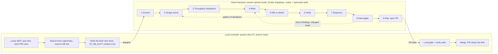

# The pstack workflow for ai4good — the live way of work (workflow v2)

**This file is LIVE.** It describes how ai4good runs an item through open-pstack, as the
machinery stands on main today. Any change to the pstack flow — a matrix row, a sheet role, a
station's rules, a gate splice, a hook — updates this file in the same commit. The change log at
the end records each one. It began as the education record of 2026-08-27..29 (session
`ebf2407e`) and replaced it on 2026-08-29 (founder: "this should be a live file where we capture
the way of work using this workflow").

Sources: ericlitman/open-pstack v1.2.0 as installed in the plugin cache
(`~/.claude/plugins/cache/open-pstack/pstack/1.2.0/`), read file by file. Founder rulings are
dated and quoted where they exist.

---

## 1. Status of the installation (2026-08-29)

| piece | state |
|---|---|
| plugin `pstack@open-pstack` v1.2.0 | installed, enabled in project settings |
| pstack session-start hook (poteto-mode mandate) | **live** — founder keeps it (2026-08-29) |
| model sheet `~/.claude/pstack-models.md` | **not written yet** — `/pstack:setup-pstack` pending |
| fourth matrix family | founder chose **grok-4.6 through the codex router** (2026-08-29); the matrix row edit in `provider-dispatch.md` is pending |
| sheet shape for the first write | open: shipped defaults (recommended) or escalation-ready |
| our v1 hooks | stamp and local banner PARKED; branch guard live (skips cloud); cloud banner live (remote only) |
| verify skill `verify-ai4good` | not generated yet |

## 2. The shape: local controller, cloud mechanic

The controller owns the board, the branch, the slot, the brief, the gate and the merge. The
mechanic owns everything between the brief and the pull request. Discovered work never rides
along: it accumulates in the report, the controller judges it as a filing candidate, the founder
files items.

## 3. The nine stations — sequence, actor, sheet role, loop

| # | station | who acts | sheet role → shipped default | loops and exits |
|---|---|---|---|---|
| 1 | Ground (`/how`) | 2–4 disjoint explorers → one explainer → opt-in critics (6-lens rubric: abstraction fit, data model, boundary discipline, evolution readiness, complexity vs value, consistency) | `how explorer` grok@xhigh; `how explainer` fable@max; `how critics` fable, sol, grok, opus | critics run only when the request asks for problems; lead rules Act on / Consider / Noted / Dismissed |
| 2 | Design arena (`/architect` + `/arena`) | runners fan out with rationales; cross-judges score against a 3–6-criterion rubric hidden from candidates; design-red-flags screen (shallow module, information leakage, temporal decomposition, pass-through); lead reads all, picks a base, grafts | `architect runners` fable, sol, grok, opus; `arena cross-judge pool` same four (judge ≠ parent's provider ≠ front-runner's) | convergence = ship the design; divergence = reframe and re-arena |
| 3 | Throughput checkpoint | the lead alone: four written todos, `n/a: <reason>` kept | none — lead model | — |
| 4 | Write | ONE delegated writer per unit in a dedicated isolated-write worktree; leaf, no nested agents; red-green: writes the failing test from the lead's acceptance criteria, watches it fail, implements | `feature, refactoring` grok@xhigh; `bug-fix`, `perf-issue`, `hillclimb` sol@max; `hardest tasks` fable@max | writer reports BLOCKED / deviations / timeboxed partial; lead escalates (section 6) |
| 5 | Diff vs sketch | the lead alone: every deviation is sketch wrong, requirement missed, or overreach | none — lead model | a pattern of deviations → scrap loop → back to 2 |
| 6 | Verify | the lead drives `verify-ai4good` on the real surface; cloud = HTTP + database side-effect evidence, headless Playwright where the sandbox has it | none — lead model | prove before handover; no proof = not done |
| 7 | Sequence | the lead alone: each commit builds and verifies alone | none — lead model | — |
| 8 | Interrogate | read-only panel, identical rubric each; lead synthesizes consensus, dedupes, rules | `interrogate reviewers` fable, sol, grok, opus (list length = fan-out) | no native re-clearance: our splice adds "a changed head voids the verdict; re-panel" |
| 9 | Ship (`opening-a-pr`) | the lead: deslop, no-comments, unslop; conventional commits; Why / Scope / Tradeoffs / Blast Radius / Verification; never draft; opening ≠ babysit | `judgment and prose` fable@max | babysit is NOT used here — a second close path (rejected) |

Roles that stay on the parent: `why investigators, synthesizer` and `reflect tooling, judgment,
divergent, synthesizer` are `inherit-parent` (they need the MCP surface). `swarm workers`
default grok@xhigh. Janitorial verbs (fix-ci, deslop, recall) ride the lead unpinned. There is
no verifier role in pstack; the verifier rule lives as a CLAUDE.md line (section 5).

## 4. The model matrix, as it will be configured

Shipped matrix (provider-dispatch.md) and our one change:

| family | provider | model | default effort | selectable | note |
|---|---|---|---|---|---|
| fable | claude | claude-fable-5 | max | low medium high xhigh max | native `pstack-fable-<effort>` agents |
| sol | codex | gpt-5.6-sol | max | low medium high xhigh max | external runner |
| grok | **codex** | **opencode-go-responses/grok-4.6** | xhigh | low medium high xhigh | **our swap**: no Grok CLI here; the codex router serves grok-4.6 (founder 2026-08-29) |
| opus | claude | claude-opus-5 | xhigh | low medium high xhigh max | native `pstack-opus-<effort>` agents |

Why the swap is required: `setup-pstack` live-probes all four families and **a failed probe
writes nothing**; `grok` is not installed on this machine. The runner takes the model as a free
string, so a router slug works through the codex lane. Other router models available for later
trials: `opencode-go/deepseek-v4-pro` (high, max), `opencode-go/kimi-k3` (low, high, max),
`opencode-go/glm-5.3` (high, max), `gpt-5.6-luna` and `gpt-5.6-terra` (low..max).

How roles wire to models: `~/.claude/pstack-models.md` is the role→descriptor sheet
(`provider:model@effort`), written by `setup-pstack` and included from the USER-level
`~/.claude/CLAUDE.md` with one line. The project CLAUDE.md is never touched. Unknown role rows
are "inconsistent state", so custom rules go in CLAUDE.md lines, not the sheet. A new model
later = edit the matrix row, rerun setup, re-probe.

## 5. Role selection — the escalation-ready target sheet

Designed 2026-08-28 for this fleet; applied on a rerun once one item has run on the defaults:

- Writers pinned at `@high`, not max — effort headroom is the first escalation rung.
- `hardest tasks: claude:claude-fable-5@max` — the named escalation target.
- Panels 3-lane and cross-vendor: fable / sol / grok. No two lanes from one family.
- Opus in `arena cross-judge pool` only, never a writer lane.
- CLAUDE.md lines: "verifier is sonnet-class and a different family than the writer"; a tier
  map (docs / mechanical / standard / sensitive → panel width) only after a founder ruling.

## 6. Escalation paths

Workers cannot ask questions; escalation is post-hoc through reports:

1. In-lane: the writer's own red-green loop and retries.
2. REPORT: `BLOCKED`, a deviations list, or a timeboxed partial — never silent.
3. Lead: respawn fresh, raise effort, move the unit to `hardest tasks`, re-arena the design,
   or scrap the loop.
4. Human: irreversible acts, unsettleable calls, batched at gates.

Retry-by-mode: two retries, then abandon and replan.

## 7. Testing a candidate model for a sheet role

1. Role-level answer-keyed replay from receipts, candidate in one seat.
2. Arena head-to-head: candidate and incumbent, one cross-family judge.
3. Full end-to-end dual run only as final confirmation — TWO CLOUD SESSIONS (not worktrees:
   database slots and CPU contend), scored per station from receipts, blinded per the eval
   playbook (no eval/test/judge/candidate words visible, organic prompts, sanitized dirs, one
   blinded cross-family judge, single pass, verification from transcripts).

A false green disqualifies at any price; cost decides only between models that told the truth.

## 8. Lead-context and cache discipline

- `CLAUDE_CODE_PROMPT_CACHE_TTL=1h` and `CLAUDE_CODE_SUBAGENT_PROMPT_CACHE_TTL=1h` in the
  project `.claude/settings.json` env block (inert until client 2.1.242).
- The cloud lead dies at item close; at every phase boundary it writes a canon file —
  compact-proof and crash-resume in one. Autocompact stays on. The pstack session-start hook
  re-injects the mandate after a compact.
- The controller cannot remote-compact; the move is canon-then-fresh-session, never wakes.

## 9. Where our gates splice in

- Gate 1 equivalent: the design arena plus an interrogate pass over the PLAN with our plan
  rubric.
- Gate 2 equivalent: interrogate over the diff, plus the rubric line "a changed head voids the
  verdict; re-panel".
- The evidence bar (named checks, timestamps, the slot) is written into the brief; the
  controller re-runs the suite locally before merge.

## 10. Bring-up checklist and open rulings

Done: plugin installed; auto-fire hook kept; CLAUDE.md lean (coordinator prose in SKILL.md);
stamp and header parked; branch guard cloud-safe; cloud banner kept.

Pending, in order: edit the grok matrix row (section 4) → `/pstack:setup-pstack` (four effort
questions, four probes, confirm, smoke panel) → CLAUDE.md verifier line → generate
`verify-ai4good` once, as a repo product → pilot one item.

Open founder rulings: who gates the merge (recommended: local), the evidence bar's exact text in
the brief, one PR per item vs stacks.

## 11. Change log

- 2026-08-29 — file created from the education record; matrix swap decided (grok-4.6 via the
  codex router); stamp, local banner and reply header parked; branch guard wrapped for cloud.
