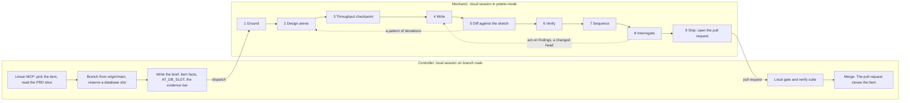

# The pstack workflow for ai4good

This file describes how ai4good runs one board item through open-pstack. This is workflow v2.
The file is live: it describes the machinery as it stands on main today. If you change any part
of the pstack flow, update this file in the same commit. Section 11 lists every change.

One document, three kinds of content, kept apart by section: sections 2 to 4 are reference and
only describe. Sections 5 to 9 explain the choices behind the reference. Section 10 is the
bring-up procedure.

Source of the pstack facts: open-pstack v1.2.0 as installed in
`~/.claude/plugins/cache/open-pstack/pstack/1.2.0/`, read file by file in session `ebf2407e`
on 2026-08-27 to 2026-08-29. Founder rulings carry a date and, where a message exists, a quote.

Names used throughout. The **controller** is the local Claude Code session on this PC, on branch
`main`. The **mechanic** is the cloud Claude Code session that runs poteto-mode. Inside the
mechanic, pstack calls the top-level model the **lead**. A **sheet role** is one row of
`~/.claude/pstack-models.md`. A **family** is one row of the model matrix.

---

## 1. Installation status on 2026-08-29

| piece | state |
|---|---|
| plugin `pstack@open-pstack` v1.2.0 | installed and enabled in `.claude/settings.json` |
| pstack session-start hook | live. The founder keeps it (2026-08-29). |
| model sheet `~/.claude/pstack-models.md` | not written. `/pstack:setup-pstack` is pending. |
| fourth matrix family | grok-4.6 through the codex router (founder choice, 2026-08-29). The row edit in `provider-dispatch.md` is pending. |
| sheet shape for the first write | open. Shipped defaults are recommended. |
| the v1 hooks | stamp and local banner parked. Branch guard live and skipped on cloud. Cloud banner live on remote only. |
| verification skill `verify-ai4good` | not generated |

## 2. The shape: a local controller and a cloud mechanic

The controller owns the board, the branch, the database slot, the brief, the gate, and the
merge. The mechanic owns everything between the brief and the pull request. The cloud
environment runs the Supabase pool in Docker and holds codex and opencode credentials.

Work that the mechanic discovers does not ride along. The mechanic lists it in its report. The
controller judges each entry as a filing candidate. The founder files items.

## 3. The nine stations

Each row gives the station, who acts, the sheet role with its shipped default model, and the
station's loop or exit. "Lead model" means the lead does the work itself and no sheet role
applies.

| # | station | who acts | sheet role and shipped default | loop or exit |
|---|---|---|---|---|
| 1 | Ground (`/how`) | Two to four explorers with disjoint slices, then one explainer. Critics run only when the request asks for problems. | `how explorer` grok@xhigh. `how explainer` fable@max. `how critics` fable, sol, grok, opus. | The lead rules each critic finding: Act on, Consider, Noted, or Dismissed. |
| 2 | Design arena (`/architect`, `/arena`) | Runners fan out, each with a rationale. Cross-judges score against a rubric of three to six criteria that the runners never see. The design-red-flags screen runs on every candidate. The lead reads every candidate end to end, picks a base, and grafts the best parts of the others. | `architect runners` fable, sol, grok, opus. `arena cross-judge pool` fable, sol, grok, opus. The judge's provider differs from the parent's and from the front-runner's. | If the candidates converge, ship the design. If they diverge, reframe the task and run the arena again. |
| 3 | Throughput checkpoint | The lead writes four todos. A todo that does not apply stays as `n/a: <reason>`. | Lead model. | None. |
| 4 | Write | One delegated writer per unit, in its own worktree, in isolated-write mode. The writer is a leaf and spawns nothing. The writer first writes the failing test from the lead's acceptance criteria, watches it fail, then implements. | `feature, refactoring` grok@xhigh. `bug-fix`, `perf-issue`, `hillclimb` sol@max. `hardest tasks` fable@max. | The writer reports `BLOCKED`, a list of deviations, or a partial result at its time limit. The lead escalates (section 6). |
| 5 | Diff against the sketch | The lead reads the diff against the design. Each deviation is one of: the sketch was wrong, a requirement was missed, or the writer overreached. | Lead model. | A pattern of deviations sends the item back to station 2. |
| 6 | Verify | The lead drives `verify-ai4good` on the real surface. On cloud the evidence is HTTP responses and database side effects. Headless Playwright is used where the sandbox provides it. | Lead model. | No proof means not done. |
| 7 | Sequence | The lead orders commits so that each one builds and verifies alone. | Lead model. | None. |
| 8 | Interrogate | A read-only panel. Every reviewer gets the same rubric. The lead merges the consensus, removes duplicates, and rules on each finding. | `interrogate reviewers` fable, sol, grok, opus. The list length is the fan-out count. | pstack has no re-clearance loop. Our rubric adds one line: "A changed head voids the verdict. Re-panel." |
| 9 | Ship (`opening-a-pr`) | The lead runs deslop, no-comments, and unslop, writes conventional commits, and fills the sections Why, Scope, Tradeoffs, Blast Radius, and Verification. The pull request is never a draft. Opening a pull request and babysitting it are two verbs. | `judgment and prose` fable@max. | Babysit is not used here. It is a second way to close work, which the way of work forbids. |

Roles that stay on the parent: `why investigators, synthesizer` and `reflect tooling, judgment,
divergent, synthesizer` are `inherit-parent`, because those skills need the MCP surface.
`swarm workers` defaults to grok@xhigh. The verbs fix-ci, deslop, and recall run on the lead
with no pin. pstack has no verifier role. The verifier rule is a line in the user-level
`CLAUDE.md` (section 5).

The critic rubric has six lenses: abstraction fit, data model, boundary discipline, evolution
readiness, complexity against value, and consistency. A critic uses the lenses that apply.

## 4. The model matrix as it will be configured

The shipped matrix lives in `provider-dispatch.md`. One row changes.

| family | provider | model | default effort | selectable efforts | route |
|---|---|---|---|---|---|
| fable | claude | claude-fable-5 | max | low, medium, high, xhigh, max | native agents `pstack-fable-<effort>` |
| sol | codex | gpt-5.6-sol | max | low, medium, high, xhigh, max | external runner |
| grok | codex | opencode-go-responses/grok-4.6 | xhigh | low, medium, high, xhigh | external runner. This is our change (founder 2026-08-29). |
| opus | claude | claude-opus-5 | xhigh | low, medium, high, xhigh, max | native agents `pstack-opus-<effort>` |

The sheet `~/.claude/pstack-models.md` maps each role to one or more descriptors of the form
`provider:model@effort`. `/pstack:setup-pstack` writes the sheet and adds one line,
`@~/.claude/pstack-models.md`, to the user-level `~/.claude/CLAUDE.md`. The project `CLAUDE.md`
is never touched. A role name that the sheet does not document is "inconsistent state" and
stops setup.

Other router models available for later trials: `opencode-go/deepseek-v4-pro` (high, max),
`opencode-go/kimi-k3` (low, high, max), `opencode-go/glm-5.3` (high, max), `gpt-5.6-luna` and
`gpt-5.6-terra` (low to max). This list is partial. `~/.codex/codex-router/merged-models.json`
holds the full catalog.

## 5. Why the grok row changes, and how roles get their models

`/pstack:setup-pstack` probes all four families live before it writes anything. If one probe
fails, setup writes nothing. This machine has no Grok CLI, so the shipped grok row fails its
probe. The codex router serves grok-4.6 under the slug `opencode-go-responses/grok-4.6`, and
`pstack-runner` takes the model as a free string. So the row keeps its model and changes its
provider to codex. Every role that names grok keeps its meaning.

To add a model later, edit its matrix row, rerun setup, and let setup probe it. Custom rules
that pstack does not model, such as a verifier rule or a tier map, go in the user-level
`CLAUDE.md` as plain lines. They do not go in the sheet.

## 6. The target sheet, and why it is shaped for escalation

The target sheet was designed on 2026-08-28. Apply it on a rerun of setup after one item has
run on the shipped defaults.

- Writers run at `@high`, not `@max`. The unused effort is the first escalation step.
- `hardest tasks` is `claude:claude-fable-5@max`. It is the named escalation target.
- Every panel has three lanes from three vendors: fable, sol, and grok. Two lanes from one
  family do not add an independent view.
- Opus appears in `arena cross-judge pool` only. It is never a writer lane.
- Two lines in the user-level `CLAUDE.md`: "The verifier is a sonnet-class model from a different
  family than the writer." A tier map (docs, mechanical, standard, sensitive, each with a panel
  width) waits for a founder ruling, because it loosens the process.

Escalation happens after the fact, through reports, because a worker cannot ask a question.
The steps, from cheapest:

1. In the lane: the writer's own red-green loop and its retries.
2. The report: `BLOCKED`, a list of deviations, or a partial result at the time limit. Never
   silence.
3. The lead: respawn fresh, raise the effort, move the unit to `hardest tasks`, run the arena
   again, or scrap the loop.
4. A human: irreversible actions, calls that the lead cannot settle, batched at the gates.

After two retries of one unit, abandon it and replan.

## 7. How to test a candidate model for a sheet role

Run the cheapest test first. Stop when the candidate fails.

1. Replay one finished station with the candidate in that one seat. The receipts hold the
   inputs. Grade the output against the known-good answer.
2. Run an arena with the candidate and the incumbent as two lanes and one judge from a third
   family.
3. As the last confirmation, run one item end to end twice, in two cloud sessions. Do not use
   two worktrees on one machine, because the database slots and the CPU contend. Score each
   station from its receipts. Blind the run as the eval playbook requires: no words like eval,
   test, judge, or candidate anywhere visible, organic prompts, sanitized directories, one
   blinded judge from another family, one pass, and verification read from the transcripts.

A false green disqualifies a candidate at any price. Cost decides only between candidates that
told the truth.

## 8. Context and cache discipline for the mechanic

- The project `.claude/settings.json` sets `CLAUDE_CODE_PROMPT_CACHE_TTL=1h` and
  `CLAUDE_CODE_SUBAGENT_PROMPT_CACHE_TTL=1h` in its `env` block. The settings take effect from
  client 2.1.242.
- The mechanic ends when the item closes. At every phase boundary the lead writes a canon file.
  The canon file survives a compact and lets a fresh session resume after a crash. Autocompact
  stays on. The pstack session-start hook injects its mandate again after each compact.
- The controller cannot compact the mechanic from outside. When the mechanic's context is
  full, write the canon file and start a fresh session. Do not send wake-up messages to keep a
  cache warm.

## 9. Where our two gates fit

- Gate 1, the plan review, is the design arena plus one interrogate pass over the plan with our
  plan rubric.
- Gate 2, the diff review, is interrogate over the diff with one added rubric line: "A changed
  head voids the verdict. Re-panel."
- The brief carries the evidence bar: the named checks, the timestamps, and the database slot.
  Before the merge, the controller runs the suite again locally.

## 10. How to finish the bring-up

Done: the plugin is installed, the session-start hook is kept, the project `CLAUDE.md` is lean,
the stamp and the reply header are parked, the branch guard skips cloud sessions, and the cloud
banner is kept.

Do these steps in order:

1. In `provider-dispatch.md`, change the grok row to provider `codex` and model
   `opencode-go-responses/grok-4.6`.
2. Run `/pstack:setup-pstack`. Answer the four effort questions, let the four probes run,
   confirm the rendered sheet, and let the smoke panel run.
3. Add the verifier line to the user-level `~/.claude/CLAUDE.md`.
4. Run `/pstack:create-verification-skill` once and commit `.claude/skills/verify-ai4good/` as
   a repo product.
5. Run one item through the controller and the mechanic.

Three rulings are open and belong to the founder: who gates the merge (the recommendation is the
controller), the exact text of the evidence bar in the brief, and one pull request per item
against stacked pull requests.

## 11. Changes to this file

- 2026-08-29. Created from the education record. Recorded the grok row change, the parked
  stamp, local banner, and reply header, and the cloud-safe branch guard. Rewritten to the
  technical-writing standard the same day.
