# The pstack workflow for ai4good

This file describes how ai4good runs one board item through open-pstack. This is workflow v2.
The file is live: it describes the machinery as it stands on main today. If you change any part
of the pstack flow, update this file in the same commit. Section 11 lists every change.

One document, three kinds of content, kept apart by section: sections 2 to 4 are reference and
only describe. Sections 5 to 9 explain the choices behind the reference. Section 10 is the
bring-up procedure.

Source of the pstack facts: [open-pstack](https://github.com/ericlitman/open-pstack) v1.2.0 as
installed in [`~/.claude/plugins/cache/open-pstack/pstack/1.2.0/`](file:///C:/Users/nirdr/.claude/plugins/cache/open-pstack/pstack/1.2.0/),
read file by file in session `ebf2407e` on 2026-08-27 to 2026-08-29. Founder rulings carry a
date and, where a message exists, a quote.

Every file reference is a link. Repository files link by relative path. Files outside the
repository link to this PC's copy with a `file:///` address.

Names used throughout. The **controller** is the local Claude Code session on this PC, started
on branch `main`. The **mechanic** is the same session after the hand-off, running poteto-mode
in the item's worktree, or a cloud session when asked for. Inside the mechanic, pstack calls
the top-level model the **lead**. A **sheet role** is one row of
[`~/.claude/pstack-models.md`](file:///C:/Users/nirdr/.claude/pstack-models.md). A **family** is
one row of the model matrix.

---

## 1. Installation status on 2026-08-29

| piece | state |
|---|---|
| plugin `pstack@open-pstack` v1.2.0 | installed and enabled in [`.claude/settings.json`](../../settings.json) |
| pstack session-start hook ([`hooks/hooks.json`](file:///C:/Users/nirdr/.claude/plugins/cache/open-pstack/pstack/1.2.0/hooks/hooks.json)) | live. The founder keeps it (2026-08-29). |
| model sheet [`~/.claude/pstack-models.md`](file:///C:/Users/nirdr/.claude/pstack-models.md) | not written. `/pstack:setup-pstack` is pending. |
| fourth matrix family | grok-4.6 through the codex router (founder choice, 2026-08-29). The row edit in [`provider-dispatch.md`](file:///C:/Users/nirdr/.claude/plugins/cache/open-pstack/pstack/1.2.0/skills/poteto-mode/references/provider-dispatch.md) is pending. |
| sheet shape for the first write | open. Shipped defaults are recommended. |
| the v1 hooks | stamp and local banner parked. Branch guard ([`guard-branch-switch.ps1`](../../../loop/work/guard-branch-switch.ps1)) live and skipped on cloud. Cloud banner ([`session-start-banner.sh`](../../hooks/session-start-banner.sh)) live on remote only. |
| verification skill [`verify-ai4good`](../verify-ai4good/) | not generated |
| controller skill `/controller` | written ([`.claude/skills/controller/SKILL.md`](../controller/SKILL.md)). Not yet run on an item. |

## 2. The shape: one session, controller then mechanic

The chart shows every internal step of every phase. Every step that runs on a sheet role names
the role and its model as of the first write (the sheet-roles table in section 3 is the
source). "Lead" means the parent model of the session, fable here. Section 3 gives the same
stations as a table. The controller's steps are the numbered steps of its manual.

To check that the chart still draws after an edit, run
[`loop/work/render-mermaid.ps1`](../../../loop/work/render-mermaid.ps1)
`-Markdown .claude/skills/work/pstack-workflow-ai4good.md`. It fails on a syntax error.

```mermaid
flowchart TB
  subgraph CTRL["Controller: local session, branch main, /controller ID"]
    direction TB
    subgraph PA["Phase A: decide what"]
      direction TB
      A1["Resolve the item on Linear: id, label, gitBranchName, state, blockers"]
      A2["Walk parent upward, label every link of the chain"]
      A3["Startability: missing, Done, Cancelled, or blocked stops here"]
      A4["Root with nothing above it: ask the founder once"]
      A1 --> A2 --> A3 --> A4
    end
    subgraph PB["Phase B: start the item"]
      direction TB
      B1["git fetch origin, then git branch BRANCH origin/main"]
      B2["git worktree add .claude/worktrees/ITEM BRANCH"]
      B3["One item at a time on this machine. Another item open here stops the run"]
      B4["Claim: assign, In Progress, Set-HeldItem"]
      B5["Write loop/items/ITEM/brief.md: chain, PRD slice, item text, acceptance tests, the ask, the evidence bar"]
      B6["Commit the brief on the branch, push"]
      B7["Local: EnterWorktree into .claude/worktrees/ITEM, print the hand-off, stop. Cloud: claude --cloud from the worktree, record the session in mechanic.md"]
      B8["The founder types /pstack:poteto-mode with the brief in this same session"]
      B1 --> B2 --> B3 --> B4 --> B5 --> B6 --> B7 --> B8
    end
    subgraph PW["While the mechanic runs"]
      direction TB
      W1["Local: the founder and the lead talk directly in the session. The controller has no part until /controller done"]
      W2["Cloud: gh pr list --head BRANCH finds the pull request. Rulings go with claude -p 'MESSAGE' --cloud SESSION-ID"]
      W3["No timers, no wake-ups. A question from a cloud mechanic reaches the founder verbatim"]
      W1 --> W2 --> W3
    end
    subgraph PC["Phase C: /controller done ID, the board"]
      direction TB
      K1["Confirm on Linear that the item is Done. Not Done after a bounded re-read: repair from the merge commit, record it as a repair"]
      K2["Clear-HeldItem"]
      K3["Fold upward: all children Done or Cancelled closes the parent, stopping below a requirement"]
      K4["Read the pull request's Not done here list. Four filing checks. Recommend; the founder files"]
      K5["session is free. List open siblings, suggest the next /controller"]
      K1 --> K2 --> K3 --> K4 --> K5
    end
    PA --> PB
  end

  subgraph MECH["Mechanic: the same session in the item's worktree, poteto-mode"]
    direction TB
    subgraph S1["1 Ground: /how"]
      direction TB
      G1["Lead (fable) splits the question into 2 to 4 disjoint slices"]
      G2["One explorer per slice, read-only. Role: how explorer = grok@xhigh"]
      G3["Explainer merges the findings into one explanation. Role: how explainer = fable@max"]
      G4{"Request asks for problems?"}
      G5["One critic per entry, each with the explanation, the paths, and the 6-lens rubric. Role: how critics = fable@max, sol@max, grok@xhigh, opus@xhigh"]
      G6["Lead (fable) rules each finding: Act on, Consider, Noted, Dismissed"]
      G1 --> G2 --> G3 --> G4
      G4 -- yes --> G5 --> G6
      G4 -- no --> S2
    end
    subgraph S2["2 Design arena: /architect and /arena"]
      direction TB
      D1["Lead (fable) derives a rubric of 3 to 6 criteria. Candidates never see it"]
      D2["Runners fan out, one design each with its rationale. Role: architect runners = fable@max, sol@max, grok@xhigh, opus@xhigh"]
      D3["Design-red-flags screen on every candidate: shallow module, information leakage, temporal decomposition, pass-through. Lead (fable)"]
      D4["Cross-judges score against the rubric. Role: arena cross-judge pool = fable@max, sol@max, grok@xhigh, opus@xhigh. The judge's provider differs from the parent's and the front-runner's"]
      D5["Lead (fable) reads every candidate end to end, picks a base, grafts the best parts of the others"]
      D6{"Candidates converge?"}
      D7["Lead (fable) reframes the task, runs the arena again"]
      D1 --> D2 --> D3 --> D4 --> D5 --> D6
      D6 -- no --> D7 --> D2
    end
    subgraph S3["3 Throughput checkpoint"]
      direction TB
      T1["Lead (fable) writes todo 1, blocking first steps: gates before fan-out"]
      T2["Todo 2, independent workstreams: disjoint files parallelize, shared writes serialize"]
      T3["Todo 3, shared mutable state: split the target before serializing"]
      T4["Todo 4, smallest safe decomposition. One writer? say why"]
      T1 --> T2 --> T3 --> T4
    end
    subgraph S4["4 Write: one unit at a time"]
      direction TB
      X1["Lead (fable) writes the unit brief: paths it may write, the data shape, the acceptance criteria"]
      X2["Lead creates a dedicated worktree, spawns one writer in isolated-write mode. Role by task type: feature, refactoring = grok@xhigh. bug-fix, perf-issue, hillclimb = sol@max"]
      X3["Writer (the role's model) writes the failing test from the acceptance criteria"]
      X4["Writer watches the test fail"]
      X5["Writer implements until the test passes, commits"]
      X6["Writer reports: done, BLOCKED, deviations, or a partial at the time limit"]
      X7{"Report clean?"}
      X8["Lead (fable) escalates: respawn fresh, raise effort, move the unit to role hardest tasks = fable@max, re-arena, or scrap. Two retries then replan"]
      X1 --> X2 --> X3 --> X4 --> X5 --> X6 --> X7
      X7 -- no --> X8 --> X2
    end
    subgraph S5["5 Diff against the sketch"]
      direction TB
      R1["Lead (fable) reads the writer's diff against the design"]
      R2["Each deviation is one of: sketch wrong, requirement missed, overreach"]
      R3{"A pattern of deviations?"}
      R1 --> R2 --> R3
    end
    subgraph S6["6 Verify on the real surface"]
      direction TB
      V1["Lead (fable) runs verify-ai4good: launch, doctor, drive the feature. No sheet role: pstack has no verifier role"]
      V2["Evidence on cloud: HTTP responses and database side effects. Headless Playwright where the sandbox has it"]
      V3{"Proof in hand?"}
      V4["Not done. Back to the unit"]
      V1 --> V2 --> V3
      V3 -- no --> V4 --> X1
    end
    subgraph S7["7 Sequence"]
      direction TB
      Q1["Lead (fable) rebases into small ordered commits"]
      Q2["Each commit builds and verifies alone"]
      Q1 --> Q2
    end
    subgraph S8["8 Interrogate: /interrogate"]
      direction TB
      I1["Lead (fable) scopes the diff and writes the intent paragraph"]
      I2["One reviewer per entry, read-only, identical rubric. Role: interrogate reviewers = fable@max, sol@max, grok@xhigh, opus@xhigh"]
      I3["Lead (fable) synthesizes: consensus, duplicates removed, disagreements listed, agreement map"]
      I4["Lead (fable) rules each finding: Act on, Consider, Noted, Dismissed"]
      I5{"Any Act on?"}
      I6["Fix through a writer, role by task type as in station 4. The changed head voids the verdict"]
      I1 --> I2 --> I3 --> I4 --> I5
      I5 -- yes --> I6 --> I2
    end
    subgraph S9["9 Ship: opening-a-pr"]
      direction TB
      P1["Lead (fable) runs deslop, no-comments, unslop over the diff and the prose"]
      P2["Conventional commit messages. Role: judgment and prose = fable@max"]
      P3["Pull request body: Why, Scope, Tradeoffs, Blast Radius, Verification with named checks and timestamps, Not done here. Role: judgment and prose = fable@max"]
      P4["No other item's id in the title or body"]
      P5["Open the pull request from the item branch. Never a draft"]
      P1 --> P2 --> P3 --> P4 --> P5
    end
    subgraph S10["10 Close: the lead does the git part"]
      direction TB
      C1{"CI green on the exact head AND the founder said merge?"}
      C2["gh pr merge N --squash. The pull request link closes the item on the board"]
      C3["ExitWorktree keep, then git worktree remove .claude/worktrees/ITEM, delete the remote branch"]
      C4["Invoke /controller done ITEM"]
      C1 -- yes --> C2 --> C3 --> C4
      C1 -- not yet --> C1
    end
    P5 --> C1
    G6 --> S2
    D6 -- yes --> S3
    T4 --> X1
    X7 -- yes --> R1
    R3 -- yes --> D1
    R3 -- no --> V1
    V3 -- yes --> Q1
    Q2 --> I1
    I5 -- no --> P1
  end

  B8 -- "the lead's checkout is the item branch" --> G1
  C4 -- "the board goes back to the controller" --> K1
  K5 -- "next item, same session" --> A1
```

The controller owns the board, the branch, and the brief. The mechanic owns everything from
the brief to the merge. The cloud environment runs the Supabase pool in Docker and holds codex
and opencode credentials.

The controller's manual is [`.claude/skills/controller/SKILL.md`](../controller/SKILL.md). The
mechanic is never a subagent. The founder talks to the lead directly (founder ruling
2026-08-29: "i dont like it that i cant interact with the lead. i want to run the controller it
finshed with the brief and them i run the pstack poteto mode on that session"). Two shapes:

- **Local, the default for the first run.** One session. `/controller <id>` creates the branch
  and the worktree `.claude/worktrees/<item>`, commits the brief, moves the session into the
  worktree with `EnterWorktree`, and stops. The founder types
  `/pstack:poteto-mode Read loop/items/<item>/brief.md and follow it.` in the same session.
  The lead closes the git side (founder 2026-08-29: "I want the lead to do it"): when CI is
  green on the exact head and the founder says "merge", it merges, leaves the worktree with
  `ExitWorktree`, removes it, and deletes the remote branch. Its last closing step invokes
  `/controller done <id>`, and that verb steers the board: confirm Done, clear the held item,
  fold the parent, judge the filing candidates, print `session is free` (founder: "Lead closes
  but linear steering is the controller work"). There is no second local run of the suite.
  The session's move between folders is the one exception to the rule that a session works
  where it was launched.
- **Cloud, on `/controller <id> cloud`.** The session stays in the main folder and runs
  `claude --cloud` from the worktree, because a cloud session clones the remote at the current
  directory's branch. The founder talks to it on claude.ai. The controller sends follow-ups
  with `claude -p "<message>" --cloud <session-id>`.

**One database per machine, no slot pool.** Local and cloud alike set `AT_DB_SLOT=1` (the
project `.claude/settings.json` env block locally, the environment variables on cloud). One
item runs at a time on this PC. Parallel items run as cloud sessions, each VM with its own
database (founder 2026-08-29: "Clear the dB slot mechanism all together"). The v1 slot pool
scripts stay parked with v1.

Work that the mechanic discovers does not ride along. The mechanic lists it in its report. The
controller judges each entry as a filing candidate. The founder files items.

## 3. The nine stations

Each row gives the station, who acts, the sheet roles it uses, and the station's loop or exit.
The models behind each role are in the sheet-roles table below. "Lead" in the role column
means the lead does the work itself and no sheet role applies.

| # | station | who acts | sheet roles | loop or exit |
|---|---|---|---|---|
| 1 | Ground ([`/how`](file:///C:/Users/nirdr/.claude/plugins/cache/open-pstack/pstack/1.2.0/skills/how/SKILL.md)) | Two to four explorers with disjoint slices, then one explainer. Critics run only when the request asks for problems. | `how explorer`, `how explainer`, `how critics` | The lead rules each critic finding: Act on, Consider, Noted, or Dismissed. |
| 2 | Design arena ([`/architect`](file:///C:/Users/nirdr/.claude/plugins/cache/open-pstack/pstack/1.2.0/skills/architect/SKILL.md), [`/arena`](file:///C:/Users/nirdr/.claude/plugins/cache/open-pstack/pstack/1.2.0/skills/arena/SKILL.md)) | Runners fan out, each with a rationale. Cross-judges score against a rubric of three to six criteria that the runners never see. The design-red-flags screen runs on every candidate. The lead reads every candidate end to end, picks a base, and grafts the best parts of the others. | `architect runners`, `arena runners`, `arena cross-judge pool` | If the candidates converge, ship the design. If they diverge, reframe the task and run the arena again. |
| 3 | Throughput checkpoint | The lead writes four todos. A todo that does not apply stays as `n/a: <reason>`. | Lead | None. |
| 4 | Write | One delegated writer per unit, in its own worktree, in isolated-write mode. The writer is a leaf and spawns nothing. The writer first writes the failing test from the lead's acceptance criteria, watches it fail, then implements. | `feature, refactoring`, `bug-fix`, `perf-issue`, `hillclimb`, `hardest tasks` | The writer reports `BLOCKED`, a list of deviations, or a partial result at its time limit. The lead escalates (section 6). |
| 5 | Diff against the sketch | The lead reads the diff against the design. Each deviation is one of: the sketch was wrong, a requirement was missed, or the writer overreached. | Lead | A pattern of deviations sends the item back to station 2. |
| 6 | Verify | The lead drives [`verify-ai4good`](../verify-ai4good/) on the real surface. On cloud the evidence is HTTP responses and database side effects. Headless Playwright is used where the sandbox provides it. | Lead | No proof means not done. |
| 7 | Sequence | The lead orders commits so that each one builds and verifies alone. | Lead | None. |
| 8 | Interrogate ([`/interrogate`](file:///C:/Users/nirdr/.claude/plugins/cache/open-pstack/pstack/1.2.0/skills/interrogate/SKILL.md)) | A read-only panel. Every reviewer gets the same rubric. The lead merges the consensus, removes duplicates, and rules on each finding. | `interrogate reviewers` | pstack has no re-clearance loop. Our rubric adds one line: "A changed head voids the verdict. Re-panel." |
| 9 | Ship ([`opening-a-pr`](file:///C:/Users/nirdr/.claude/plugins/cache/open-pstack/pstack/1.2.0/skills/poteto-mode/playbooks/opening-a-pr.md)) | The lead runs deslop, no-comments, and unslop, writes conventional commits, and fills the sections Why, Scope, Tradeoffs, Blast Radius, and Verification. The pull request is never a draft. Opening a pull request and babysitting it are two verbs. | `judgment and prose` | Babysit is not used here. It is a second way to close work, which the way of work forbids. |

The verbs fix-ci, deslop, and recall run on the lead with no pin. pstack has no verifier role.
The verifier rule is a line in the user-level [`CLAUDE.md`](file:///C:/Users/nirdr/.claude/CLAUDE.md) (section 5).

The critic rubric ([`critique-rubric.md`](file:///C:/Users/nirdr/.claude/plugins/cache/open-pstack/pstack/1.2.0/skills/how/references/critique-rubric.md)) has six lenses: abstraction fit, data model, boundary discipline, evolution
readiness, complexity against value, and consistency. A critic uses the lenses that apply.

### The sheet roles

The sheet [`~/.claude/pstack-models.md`](file:///C:/Users/nirdr/.claude/pstack-models.md) has one row per role. The table gives every documented
role with three values. **pstack default** is the first-run value the plugin ships. **First
write** is what `/pstack:setup-pstack` will write for ai4good: the shipped defaults with the
grok family on the codex router (section 4). The sheet is not written yet. **Target** is the
sheet from section 6, applied on a rerun after one item has run on the first write.

Descriptor shorthand: `fable` is `claude:claude-fable-5`, `sol` is `codex:gpt-5.6-sol`, `grok`
is `codex:opencode-go-responses/grok-4.6`, and `opus` is `claude:claude-opus-5`. A list is a
panel, and the list length is the fan-out count.

| sheet role | station | pstack default | first write | target |
|---|---|---|---|---|
| `feature, refactoring` | 4 | grok@xhigh | grok@xhigh | grok@high |
| `bug-fix` | 4 | sol@max | sol@max | sol@high |
| `perf-issue` | 4 | sol@max | sol@max | sol@high |
| `hillclimb` | 4 | sol@max | sol@max | sol@high |
| `hardest tasks` | 4 | fable@max | fable@max | fable@max |
| `judgment and prose` | 9 | fable@max | fable@max | fable@max |
| `how explorer` | 1 | grok@xhigh | grok@xhigh | grok@high |
| `how explainer` | 1 | fable@max | fable@max | fable@max |
| `how critics` | 1 | fable@max, sol@max, grok@xhigh, opus@xhigh | same | fable@max, sol@max, grok@xhigh |
| `why investigators, synthesizer` | not a station | inherit-parent | inherit-parent | inherit-parent |
| `reflect tooling, judgment, divergent, synthesizer` | not a station | inherit-parent | inherit-parent | inherit-parent |
| `arena runners` | 2 | fable@max, sol@max, grok@xhigh, opus@xhigh | same | fable@max, sol@max, grok@xhigh |
| `arena cross-judge pool` | 2 | fable@max, sol@max, grok@xhigh, opus@xhigh | same | fable@max, sol@max, grok@xhigh, opus@xhigh |
| `swarm workers` | any `/swarm` call | grok@xhigh | grok@xhigh | grok@high |
| `architect runners` | 2 | fable@max, sol@max, grok@xhigh, opus@xhigh | same | fable@max, sol@max, grok@xhigh |
| `interrogate reviewers` | 8 | fable@max, sol@max, grok@xhigh, opus@xhigh | same | fable@max, sol@max, grok@xhigh |

The `why` and `reflect` rows stay `inherit-parent` because those skills need the MCP surface,
which external lanes never get. grok has no `max` in its selectable efforts, so its panel lanes
stay at `xhigh` in the target.

## 4. The model matrix as it will be configured

The shipped matrix lives in [`provider-dispatch.md`](file:///C:/Users/nirdr/.claude/plugins/cache/open-pstack/pstack/1.2.0/skills/poteto-mode/references/provider-dispatch.md)
(source: [GitHub](https://github.com/ericlitman/open-pstack/blob/main/skills/poteto-mode/references/provider-dispatch.md)). One row changes.

| family | provider | model | default effort | selectable efforts | route |
|---|---|---|---|---|---|
| fable | claude | claude-fable-5 | max | low, medium, high, xhigh, max | native agents `pstack-fable-<effort>` |
| sol | codex | gpt-5.6-sol | max | low, medium, high, xhigh, max | external runner |
| grok | codex | opencode-go-responses/grok-4.6 | xhigh | low, medium, high, xhigh | external runner. This is our change (founder 2026-08-29). |
| opus | claude | claude-opus-5 | xhigh | low, medium, high, xhigh, max | native agents `pstack-opus-<effort>` |

The sheet [`~/.claude/pstack-models.md`](file:///C:/Users/nirdr/.claude/pstack-models.md) maps
each role to one or more descriptors of the form `provider:model@effort`.
[`/pstack:setup-pstack`](file:///C:/Users/nirdr/.claude/plugins/cache/open-pstack/pstack/1.2.0/skills/setup-pstack/SKILL.md)
writes the sheet and adds one line, `@~/.claude/pstack-models.md`, to the user-level
[`~/.claude/CLAUDE.md`](file:///C:/Users/nirdr/.claude/CLAUDE.md). The project
[`CLAUDE.md`](../../../CLAUDE.md) is never touched. A role name that the sheet does not document is "inconsistent state" and
stops setup.

Other router models available for later trials: `opencode-go/deepseek-v4-pro` (high, max),
`opencode-go/kimi-k3` (low, high, max), `opencode-go/glm-5.3` (high, max), `gpt-5.6-luna` and
`gpt-5.6-terra` (low to max). This list is partial.
[`~/.codex/codex-router/merged-models.json`](file:///C:/Users/nirdr/.codex/codex-router/merged-models.json)
holds the full catalog.

## 5. Why the grok row changes, and how roles get their models

`/pstack:setup-pstack` probes all four families live before it writes anything. If one probe
fails, setup writes nothing. This machine has no Grok CLI, so the shipped grok row fails its
probe. The codex router serves grok-4.6 under the slug `opencode-go-responses/grok-4.6`, and
[`pstack-runner`](file:///C:/Users/nirdr/.claude/plugins/cache/open-pstack/pstack/1.2.0/skills/poteto-mode/scripts/runner/pstack-runner)
takes the model as a free string. So the row keeps its model and changes its
provider to codex. Every role that names grok keeps its meaning.

To add a model later, edit its matrix row, rerun setup, and let setup probe it. Custom rules
that pstack does not model, such as a verifier rule or a tier map, go in the user-level
[`CLAUDE.md`](file:///C:/Users/nirdr/.claude/CLAUDE.md) as plain lines. They do not go in the sheet.

## 6. The target sheet, and why it is shaped for escalation

The target sheet was designed on 2026-08-28. Its row values are the **target** column of the
sheet-roles table in section 3. Apply it on a rerun of setup after one item has run on the
first write.

- Writers run at `@high`, not `@max`. The unused effort is the first escalation step.
- `hardest tasks` is `claude:claude-fable-5@max`. It is the named escalation target.
- Every panel has three lanes from three vendors: fable, sol, and grok. Two lanes from one
  family do not add an independent view.
- Opus appears in `arena cross-judge pool` only. It is never a writer lane.
- Two lines in the user-level [`CLAUDE.md`](file:///C:/Users/nirdr/.claude/CLAUDE.md): "The verifier is a sonnet-class model from a different
  family than the writer." A tier map (docs, mechanical, standard, sensitive, each with a panel
  width) waits for a founder ruling, because it loosens the process.

Escalation happens after the fact, through reports, because a worker cannot ask a question.
The steps, from cheapest:

1. In the lane: the writer's own red-green loop and its retries.
2. The report: `BLOCKED`, a list of deviations, or a partial result at the time limit. Never
   silence.
3. The lead: respawn fresh, raise the effort, move the unit to `hardest tasks`, run the arena
   again, or scrap the loop.
4. A human: irreversible actions, calls that the lead cannot settle, batched at the gates.

After two retries of one unit, abandon it and replan.

## 7. How to test a candidate model for a sheet role

Run the cheapest test first. Stop when the candidate fails.

1. Replay one finished station with the candidate in that one seat. The receipts hold the
   inputs. Grade the output against the known-good answer.
2. Run an arena with the candidate and the incumbent as two lanes and one judge from a third
   family.
3. As the last confirmation, run one item end to end twice, in two cloud sessions. Do not use
   two worktrees on one machine, because the one database and the CPU contend. Score each
   station from its receipts. Blind the run as the [eval playbook](file:///C:/Users/nirdr/.claude/plugins/cache/open-pstack/pstack/1.2.0/skills/poteto-mode/playbooks/eval.md) requires: no words like eval,
   test, judge, or candidate anywhere visible, organic prompts, sanitized directories, one
   blinded judge from another family, one pass, and verification read from the transcripts.

A false green disqualifies a candidate at any price. Cost decides only between candidates that
told the truth.

## 8. Context and cache discipline for the mechanic

- The project [`.claude/settings.json`](../../settings.json) sets `CLAUDE_CODE_PROMPT_CACHE_TTL=1h` and
  `CLAUDE_CODE_SUBAGENT_PROMPT_CACHE_TTL=1h` in its `env` block. The settings take effect from
  client 2.1.242.
- The mechanic ends when the item closes. At every phase boundary the lead writes a canon file.
  The canon file survives a compact and lets a fresh session resume after a crash. Autocompact
  stays on. The pstack session-start hook injects its mandate again after each compact.
- The controller cannot compact the mechanic from outside. When the mechanic's context is
  full, write the canon file and start a fresh session. Do not send wake-up messages to keep a
  cache warm.

## 9. Where our two gates fit

- Gate 1, the plan review, is the design arena plus one interrogate pass over the plan with our
  plan rubric.
- Gate 2, the diff review, is interrogate over the diff with one added rubric line: "A changed
  head voids the verdict. Re-panel."
- The brief carries the evidence bar: the named checks and their timestamps in the pull
  request's Verification section, and CI green on the final head. Nobody runs the suite a
  second time. The merge gate is CI green on the exact head and the founder's "merge".

## 10. How to finish the bring-up

Done: the plugin is installed, the session-start hook is kept, the project [`CLAUDE.md`](../../../CLAUDE.md) is lean,
the stamp and the reply header are parked, the branch guard skips cloud sessions, and the cloud
banner is kept.

Do these steps in order:

1. In [`provider-dispatch.md`](file:///C:/Users/nirdr/.claude/plugins/cache/open-pstack/pstack/1.2.0/skills/poteto-mode/references/provider-dispatch.md),
   change the grok row to provider `codex` and model `opencode-go-responses/grok-4.6`.
2. Run [`/pstack:setup-pstack`](file:///C:/Users/nirdr/.claude/plugins/cache/open-pstack/pstack/1.2.0/skills/setup-pstack/SKILL.md).
   Answer the four effort questions, let the four probes run, confirm the rendered sheet, and
   let the smoke panel run.
3. Add the verifier line to the user-level [`~/.claude/CLAUDE.md`](file:///C:/Users/nirdr/.claude/CLAUDE.md).
4. Run [`/pstack:create-verification-skill`](file:///C:/Users/nirdr/.claude/plugins/cache/open-pstack/pstack/1.2.0/skills/create-verification-skill/SKILL.md)
   once and commit [`.claude/skills/verify-ai4good/`](../verify-ai4good/) as a repo product.
5. Run one item with [`/controller <id>`](../controller/SKILL.md). It ends inside the item's
   worktree. Type `/pstack:poteto-mode Read loop/items/<item>/brief.md and follow it.` in the
   same session. When CI is green on the pull request, say "merge". The lead merges and
   hands the board to `/controller done`.

Three rulings are open and belong to the founder: whether the lead merges on CI green alone or
waits for the founder's "merge", whether a plan needs a "go" before the first child or an
interrogate pass replaces it, and how a parent with children becomes one feature brief
(parked 2026-08-29). The exact text of the evidence bar in the brief is open too.

## 11. Changes to this file

- 2026-08-29. Created from the education record. Recorded the grok row change, the parked
  stamp, local banner, and reply header, and the cloud-safe branch guard. Rewritten to the
  technical-writing standard the same day.
- 2026-08-29. Added the controller skill. Section 2 now names how the controller starts and
  steers the mechanic (`claude --cloud`, `claude -p --cloud`). The brief no longer carries
  `AT_DB_SLOT`. The cloud VM sets its own.
- 2026-08-29. Added the sheet-roles table: every role with its pstack default, the first
  write for ai4good, and the target. The stations table now names roles only.
- 2026-08-29. Every file reference is a link: relative for repository files, `file:///` for
  this PC's copies, GitHub for the plugin source.
- 2026-08-29. The flow chart shows every internal step of every phase: the controller's four
  phases and the mechanic's nine stations with their loops.
- 2026-08-29. The chart is also an SVG beside this file, rendered by
  `loop/work/render-mermaid.ps1`. Regenerate it after every chart edit.
- 2026-08-29. The mechanic is always a session the founder can talk to: local in its own
  window by default, cloud on request. Never a subagent.
- 2026-08-29. Local mode is ONE session: the controller ends inside the item's worktree
  (`EnterWorktree`), the founder runs poteto-mode there, and `/controller close` leaves it
  (`ExitWorktree`) for the gate. Founder ruling quoted in section 2 and in CLAUDE.md.
- 2026-08-29. The SVG and its links are gone. The mermaid text in this file is the chart
  (founder: "i like the text flowchart in the md"). `render-mermaid.ps1` stays as the syntax
  check only.
- 2026-08-29. Every chart step that runs on a sheet role names the role and its first-write
  model. Lead steps say "Lead (fable)".
- 2026-08-29. The database slot pool is out of v2. One database per machine, `AT_DB_SLOT=1`
  everywhere, one item at a time locally, parallel items as cloud sessions.
- 2026-08-29. The lead closes the item (founder: "I want the lead to do it"). Station 10 in
  the chart. `/controller close` and the second local run of the suite are gone. The gate is
  pstack's verify and interrogate, CI, and the founder's "merge".
- 2026-08-29. The seam between git and the board is a skill call: the lead's last closing
  step invokes `/controller done <id>`, which confirms Done, clears the held item, folds
  upward, and judges the filing candidates (founder: "Lead closes but linear steering is the
  controller work").
- 2026-08-29. Stale lines fixed after a full read: the mechanic is the same session, not a
  cloud one; the mechanic owns the merge; no second suite run; the open rulings now list the
  parked questions (merge on green alone, "go" before the first child, feature briefs).
