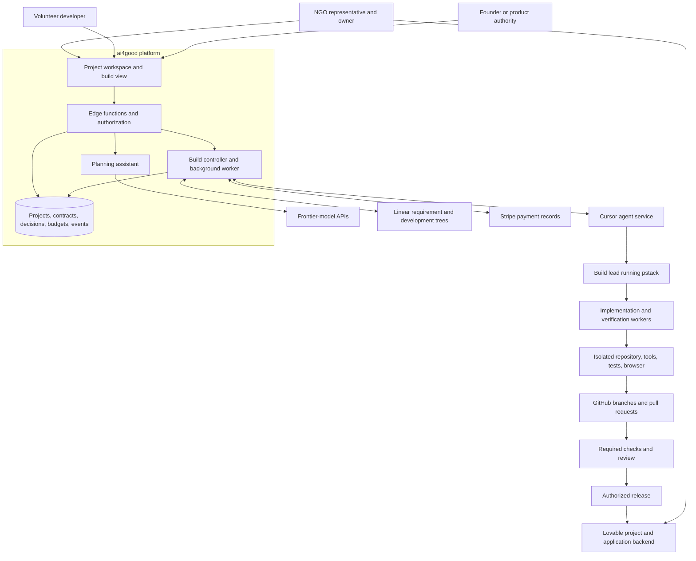
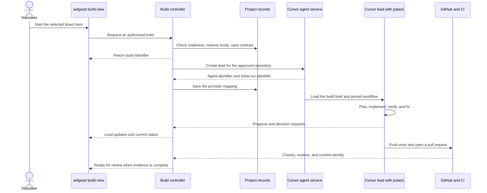
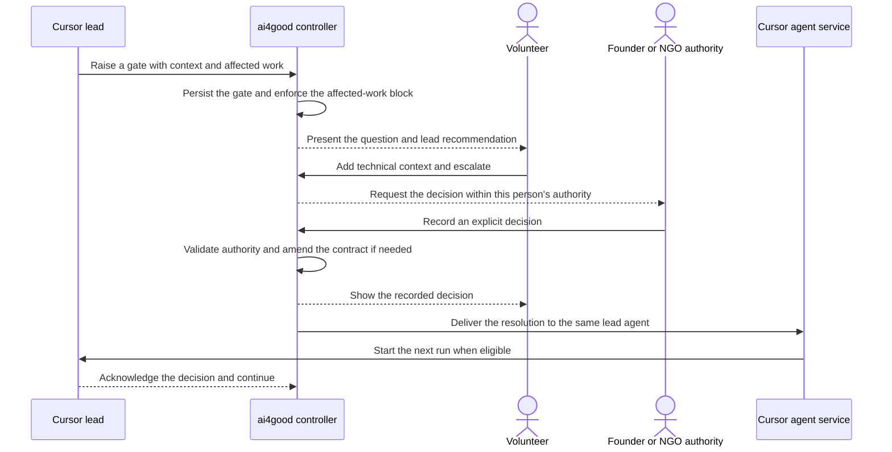
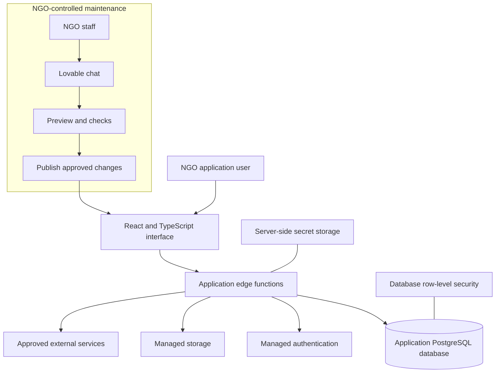

# ai4good platform architecture

Status: proposed architecture for PRD integration.

Prepared: 2026-09-13.

Follow-up decision: the accepted Discovery pilot funding rules are recorded in section 11. They are integrated into the PRD under decision d92; implementation remains open.

Primary source: [Cloud Codex Claude Setup, the shared architecture conversation](https://chatgpt.com/share/6aa68591-5740-83eb-96a9-99988da7f3c7). This document covers all 22 question-and-answer exchanges.

Repository baseline: `main` at `c46236c270a4d69cd97e14ce3c0ca3a6a537ecb0`. The comparison uses the current [MVP PRD](prd-mvp.md) and [architecture notes](architecture-notes.md).

## Contents

- [Purpose and lifecycle](#1-architecture-summary-and-status)
- [Actors, system boundaries, and ownership](#3-human-actors-and-decision-authority)
- [Planning, build execution, and decisions](#6-planning-and-the-build-contract)
- [State, integrations, and budgets](#9-state-and-durable-records)
- [Delivered application, release, and handoff](#12-delivered-application-architecture)
- [Security and provider choices](#15-security-privacy-and-operations)
- [PRD changes and implementation](#17-changes-needed-in-the-existing-prd)
- [Open decisions and sources](#19-decisions-required-before-production-implementation)

## 1. Architecture summary and status

ai4good gives an NGO and its volunteer developer a shared place to define a product, discuss decisions, and supervise its construction. Frontier-model APIs support planning. A developer starts a bounded cloud build from an approved board item. A Cursor lead runs the pstack engineering workflow and reports progress and questions through ai4good.

Cursor builds the frontend and backend in a repository that originates from a Lovable project. The NGO receives a running application that it can change and publish through Lovable chat. Routine operation and maintenance no longer depend on ai4good, Cursor, or pstack.

The board defines the scope of autonomous work. Each build has an approved objective, acceptance criteria, budget authority, repository, and decision authorities. The lead works within those limits. A change outside those limits requires a recorded decision.

This document distinguishes three kinds of statements:

| Status                 | Meaning                                                                                                              |
| ---------------------- | -------------------------------------------------------------------------------------------------------------------- |
| Conversation direction | The user's requests establish the intended experience and system boundaries.                                         |
| Proposed design        | This document supplies a concrete mechanism that the conversation does not fully specify.                            |
| Provider fact          | Official documentation supports the stated capability. Account access and end-to-end behavior still need validation. |

Unless a section identifies a current requirement or provider fact, it describes the proposed design. It does not claim that the platform already implements that design. It does not amend the PRD, project instructions, or existing decisions by itself.

Two provider constraints affect the design immediately:

- Lovable documents that a workspace move breaks the project's GitHub connection. Reconnecting creates a new repository. Handoff therefore needs an explicit repository-continuity plan. [Lovable GitHub integration](https://docs.lovable.dev/integrations/github)
- Cursor distinguishes a durable agent from its execution runs. A decision normally starts another run on the same agent. A cancelled run itself does not resume. [Cursor Cloud Agents API](https://prod.cursor.com/docs/cloud-agent/api/endpoints)

## 2. Product lifecycle

The proposed build system fits within the existing marketplace. It retains NGO vetting, Discovery, human publication review, volunteer matching, and project funding.

| Phase                    | Main actor                                                      | Result                                                                                         |
| ------------------------ | --------------------------------------------------------------- | ---------------------------------------------------------------------------------------------- |
| Intake and Discovery     | NGO representative with the planning assistant                  | A scoped need, data-handling constraints, and a maintainability assessment.                    |
| Publication and matching | Platform founder or authorized administrator, then volunteer    | A reviewed project and an assigned volunteer.                                                  |
| Product planning         | NGO representative and volunteer                                | A versioned PRD, screen designs where relevant, acceptance criteria, and recorded decisions.   |
| Board preparation        | ai4good with volunteer review                                   | Requirement items and development items with dependencies and readiness evidence.              |
| Provisioning             | ai4good through an authorized operator or supported integration | A Lovable project, connected repository, backend choice, and tested cloud environment.         |
| Build authorization      | Assigned volunteer within project policy                        | A frozen build contract and a reserved budget.                                                 |
| Cloud engineering        | Cursor lead and pstack workers                                  | Implemented changes, verification evidence, and a pull request.                                |
| Review and release       | Authorized reviewer and release authority                       | A checked merge, a tested platform deployment, and release evidence.                           |
| Handoff                  | NGO owner, supported by the volunteer                           | Verified control of the application, data, billing, and chat maintenance.                      |
| NGO operation            | NGO staff                                                       | Ordinary changes through Lovable. Larger work can return to ai4good under a new authorization. |

The conversation moves more planning into ai4good before engineering starts. The current PRD instead puts PRD authoring in the volunteer's repository after kickoff. Section 17 identifies the required changes.

Screen approval is relevant to items that change visible behavior. A backend-only item within an eligible application can use an explicit "no screen change" designation.

## 3. Human actors and decision authority

The NGO is an organization with named human representatives. It is not an AI persona that can invent policy.

| Actor                     | Uses                                                     | Responsibility and authority                                                                            |
| ------------------------- | -------------------------------------------------------- | ------------------------------------------------------------------------------------------------------- |
| NGO representative        | ai4good during planning and build, Lovable after handoff | Explains the need, answers operational questions, reviews intended behavior, and learns maintenance.    |
| NGO budget and data owner | ai4good approvals and the destination platform           | Approves spending commitments, data use, production access, and ownership acceptance.                   |
| Volunteer developer       | ai4good build view, with GitHub evidence available       | Prepares work, starts builds, supervises the lead, resolves technical questions, and reviews results.   |
| Platform founder          | ai4good administration and escalations                   | Owns platform policy, eligibility, exceptions, and decisions beyond the volunteer's assigned authority. |
| Designated product owner  | ai4good decision gates                                   | Resolves changes to agreed product behavior or scope. This can be an NGO representative or the founder. |
| Application user          | The deployed NGO application                             | Uses the delivered tool without access to the development system.                                       |

One person can hold several roles. The project records each role assignment explicitly. A platform administrator does not automatically gain authority to approve an NGO's spending or sensitive-data use.

The normal question path is lead, volunteer, then the required authority. ai4good routes the question and records the answer. The volunteer cannot clear a gate that exceeds the volunteer's permissions.

## 4. Systems and where they run

The architecture separates the ai4good platform, the engineering environment, and the delivered NGO application.



### ai4good platform

The browser presents project discussions, approved documents, the board, build progress, decision gates, and budgets. Edge functions authorize every application action. The browser does not query the database directly or call Cursor with a service credential.

A durable background worker launches builds, processes provider events, delivers decisions, reconciles usage, and recovers interrupted operations. A database-backed work queue is sufficient for the first version. The design does not require a separate event-broker product.

An interactive HTTP request must not own an hours-long build. The edge function records the request and returns its build identifier. Background work continues after the user closes the browser.

### Cursor and pstack

The Cursor lead owns engineering within one build contract. It loads a pinned pstack version, the project rules, and the configured model roles. It plans work, delegates implementation, collects reviews, resolves routine failures, and prepares the pull request.

Cursor supplies the agent service and a development environment. Cloud setup supports repository preparation and development tools. The target uses Cursor-managed execution first. Self-hosting remains an option if a proven requirement warrants it. [Cursor Cloud Agents](https://prod.cursor.com/docs/cloud-agent), [cloud environment setup](https://prod.cursor.com/docs/cloud-agent/setup)

The model instructions and pstack workflow are agent context. Commands, builds, tests, and browser checks execute in the development environment. The pstack plugin is not a separate service that ai4good must keep running locally.

A subagent is not necessarily a separate virtual machine. The selected delegation mechanism determines isolation. Each concurrent writer needs an independent checkout or worktree. Read-only reviewers can share an immutable revision.

### Lovable and the application runtime

Lovable is the initial project source and the intended maintenance destination. Cursor edits application code through GitHub. Ordinary frontend and backend authoring does not require Lovable MCP.

Provisioning, configuration, backend deployment, publishing, and transfer remain platform operations. They need a supported interface or an authorized human action, even when Cursor writes all application code.

## 5. Records and ownership

ai4good owns authorization and project governance. Each connected system remains authoritative for the facts it produces.

| Record                                      | Authority                                       | ai4good responsibility                                                                       |
| ------------------------------------------- | ----------------------------------------------- | -------------------------------------------------------------------------------------------- |
| NGO, membership, role assignments           | ai4good                                         | Validate access and retain audit evidence.                                                   |
| Approved PRD, designs, decisions            | Versioned project records                       | Preserve approved revisions and their relationship to work.                                  |
| Requirement and development task state      | Linear under current PRD rules                  | Maintain the projection, authorize pulls and completion, and reconcile unauthorized changes. |
| Build contract and budget reservation       | ai4good                                         | Validate, version, and enforce the approved work.                                            |
| Agent identity and run status               | Cursor                                          | Retain provider identifiers and normalize observed state.                                    |
| Lead progress messages                      | Cursor lead                                     | Present a useful account of work, clearly distinct from completion evidence.                 |
| Commits, reviews, and merges                | GitHub                                          | Verify the relevant repository and exact commit.                                             |
| Acceptance evidence                         | Referenced tests, artifacts, and review records | Check completeness and bind evidence to the tested revision.                                 |
| Payments and billed usage                   | Stripe and the relevant billing provider        | Reconcile the financial ledger against provider records.                                     |
| Published release and backend configuration | Destination platform                            | Record and verify the deployed result.                                                       |
| Ownership acceptance                        | NGO owner                                       | Record completed checks and the explicit acceptance.                                         |

The existing Linear design has two trees. The requirement tree supplies the NGO's progress view. The development tree contains engineering work. This proposal keeps that distinction unless the PRD explicitly changes it. See [task management](requirements/req-026.md).

A new build record does not replace the Linear task. It records an attempt to implement authorized work. Several attempts can belong to the same development item and parent requirement.

A lead message cannot mark a requirement complete. Completion still requires linked work to merge and acceptance evidence to pass.

## 6. Planning and the build contract

The planning assistant uses approved frontier-model APIs through ai4good's backend. It helps the NGO and volunteer refine the need, PRD, designs, acceptance criteria, and board decomposition.

Draft content and approved content are separate revisions. The assistant can propose a change. An authorized action establishes approval. A conversational suggestion does not silently change an active build's scope.

The build controller checks readiness before launch:

1. The project and assigned volunteer can start work under the current lifecycle rules.
2. The relevant requirement has an authorized pull and its dependencies are satisfied.
3. The PRD passes the agreed completeness gate.
4. The selected work has testable acceptance criteria and approved designs where needed.
5. The repository, backend, and cloud environment pass provisioning checks.
6. The project has available funds and the requester has spending authority.
7. The build names the people who can resolve technical, product, budget, and release decisions.
8. No incompatible build already owns the same work.

The controller then freezes a build contract. The following fields define the proposed logical record. They are not a Cursor request schema.

| Contract field                                            | Purpose                                                        |
| --------------------------------------------------------- | -------------------------------------------------------------- |
| Project, requirement, and development item                | Bind work to the approved project and requirement tree.        |
| Contract version and content digest                       | Identify the exact authorization.                              |
| PRD revision and design revisions                         | Prevent silent changes to the build's inputs.                  |
| Goal, allowed scope, and exclusions                       | Define what the lead can change.                               |
| Acceptance criteria and verification commands             | Define observable success.                                     |
| Dependencies and relevant decisions                       | Supply required context.                                       |
| Repository identity, starting commit, and branch policy   | Bound code access and preserve attribution.                    |
| Platform compatibility contract                           | Define the supported application runtime.                      |
| Allowed models, pstack version, and role configuration    | Make the engineering setup reproducible.                       |
| Budget authorization, concurrency limit, and retry policy | Bound resource use.                                            |
| Tool permissions and allowed environments                 | Separate development access from production authority.         |
| Decision authorities and escalation routes                | Direct questions to the correct people.                        |
| Review, merge, release, and handoff conditions            | Prevent an agent result from becoming an unauthorized release. |

The build environment receives a readable brief generated from this record. The authoritative record remains in ai4good. Editing the brief inside the repository does not expand the build's authority.

If an approved answer changes scope, ai4good creates a contract amendment. The amendment names its approver and the superseded revision. Dependent work resumes only after the controller applies the amendment.

## 7. Build initiation and engineering



The lead mirrors the current pstack working experience. The developer receives concise progress, findings, and questions. Routine test failures stay within the engineering loop.

The lead can choose implementation details within the contract. It cannot increase spending, remove acceptance criteria, introduce unsupported infrastructure, or give itself release authority.

The first implementation uses one Cursor lead per active build. pstack handles its internal workers and reviewers. ai4good does not duplicate pstack's entire scheduler.

The conversation briefly proposes a second persistent coordinator inside ai4good. Later exchanges place the pstack lead in Cursor and ask ai4good to mirror it. This document uses that later arrangement. A planning assistant can explain build records, but it does not issue competing engineering instructions.

The project already has a [model configuration](../../.claude/pstack-models.md). The cloud integration must preserve approved provider, model, and effort choices. It must test their availability in the selected environment. A missing model produces a setup failure or an explicit alternative proposal, never a silent substitution.

## 8. Questions, escalation, and continuation

A decision gate is a durable record. Chat provides context and discussion around that record.

Each gate contains the question, affected work, options, recommendation, impact, required authority, contract revision, and blocking status. Its resolution contains the decision, decision-maker, time, rationale, and any contract amendment.

| Decision                  | Normal resolver                                                  | Examples                                                                      |
| ------------------------- | ---------------------------------------------------------------- | ----------------------------------------------------------------------------- |
| Routine engineering       | Cursor lead                                                      | Fix a test, investigate a failure, or adjust code within the approved design. |
| Technical tradeoff        | Volunteer                                                        | Select an implementation approach within scope and budget.                    |
| Product or scope change   | Designated product owner, with founder escalation where required | Change a user journey, remove a requirement, or change a role's behavior.     |
| Budget or data authority  | Named NGO owner                                                  | Increase a spending commitment or approve production-data access.             |
| Platform policy exception | Platform founder                                                 | Consider a request outside eligibility or platform operating rules.           |
| Merge or release          | Named authority in the contract                                  | Authorize the specific checked change or deployment.                          |



The lead can continue independent work while a gate remains open. It cannot perform the affected action or finish the build while a required gate remains unresolved.

If all remaining work depends on the answer, the lead checkpoints and ends its current turn. The controller records that the build waits for a decision. The system does not spend model tokens repeatedly asking whether an answer has arrived.

The controller queues a decision while the lead has an active run. It delivers the answer after that run ends, or after a controlled cancellation. Cursor allows one active run per agent. [Cursor Cloud Agents API](https://prod.cursor.com/docs/cloud-agent/api/endpoints)

The UI distinguishes "decision recorded" from "lead received decision." A provider outage can delay delivery without losing the decision.

A free-text discussion does not resolve a gate until an authorized participant confirms a concrete answer. Silence, a timeout, and the assistant's recommendation never count as approval.

If a lead session is unavailable, recovery uses the saved contract, decisions, pushed work, and evidence. A replacement session has explicit lineage. The UI does not claim that it retained context which the provider lost.

## 9. State and durable records

Project state, task state, build state, and handoff state describe different things. They must not share one overloaded status field.

The current project lifecycle has nine states and no paused state. This proposal keeps those states during implementation planning. A project can remain `in_progress` while one build waits for a decision. See [project lifecycle](requirements/req-005.5.md).

The proposed build states are:

| Build state          | Meaning                                                  | Required transition evidence                           |
| -------------------- | -------------------------------------------------------- | ------------------------------------------------------ |
| Queued               | The controller accepts the contract and reserves funds.  | An authorized start action.                            |
| Starting             | The controller prepares or locates the provider job.     | A durable dispatch record.                             |
| Running              | The lead performs authorized engineering work.           | Observed provider execution.                           |
| Waiting for decision | No remaining authorized work can continue.               | An unresolved blocking gate and a checkpoint.          |
| Waiting for funds    | The controller prevents further spending.                | The applicable budget control.                         |
| Verifying            | The workflow checks the implementation.                  | A reported stage with referenced test activity.        |
| Ready for review     | The change satisfies the review-entry conditions.        | Required evidence and the current pull-request commit. |
| Merged               | GitHub confirms the authorized merge.                    | Merge identity plus the required approval and checks.  |
| Failed               | An unrecoverable error or retry limit ends this attempt. | A failure record and preserved work.                   |
| Cancelled            | The controller confirms that execution has stopped.      | Provider cancellation or termination evidence.         |

A running build can also have open gates. The UI shows those gates separately. This avoids creating a new state for every combination of stage and blocker.

Cancellation has a requested status before confirmation. A button click alone does not establish that remote workers stopped. A successful agent run likewise does not establish that a task merged or a project completed.

The proposed handoff states are not started, preparing, ready, transferring, verifying ownership, accepted, and blocked. These states belong to a handoff record. The proposed project-completion rule requires handoff acceptance as well as completed requirements. This changes the existing PRD.

The following logical records support the flow. Existing tables should be extended where their meaning fits. Each row does not require a separate service.

| Record             | Important relationships and contents                                                          |
| ------------------ | --------------------------------------------------------------------------------------------- |
| Project            | NGO, volunteer assignment, lifecycle, platform target, and external resource identifiers.     |
| Artifact revision  | PRD or design content, author, approval state, version, and content digest.                   |
| Board binding      | External task identity, requirement ancestry, dependencies, and authorized pull.              |
| Build contract     | Immutable approved inputs, policy, budget authorization, and amendments.                      |
| Build              | Contract, requesting volunteer, state, stage, active provider attempt, and timestamps.        |
| Provider attempt   | Provider, agent identifier, run identifier, predecessor, status, and last received event.     |
| Worker observation | Parent build, role, model, provider identity where available, and reported status.            |
| Decision gate      | Affected work, required authority, answer, contract revision, and delivery state.             |
| Build event        | Unique source event, build, sequence, event type, time, and permitted payload.                |
| Evidence           | Criterion, artifact location, test result, reviewer, source revision, and verification time.  |
| Budget reservation | Project, spending category, build, reserved amount, and settlement state.                     |
| Usage record       | Provider identifiers, category, requirement attribution, and reported token categories.       |
| Financial entry    | Provider billing reference, payment or consumption amount, and balanced corrections.          |
| Deployment         | Environment, source revision, migration state, live URL, and release evidence.                |
| Handoff            | Resource checklist, source and destination ownership, repository mapping, and NGO acceptance. |

The relationship is project, requirement, development item, build contract, build attempts, then evidence. Every attempt retains its history. A retry does not overwrite the failed attempt.

## 10. Integration and monitoring

### Application operations

The browser uses ai4good operations, not arbitrary provider requests. The following names describe responsibilities rather than committed endpoint paths.

| Operation                  | Checks and result                                                                                                |
| -------------------------- | ---------------------------------------------------------------------------------------------------------------- |
| Start build                | Validate assignment, readiness, repository, policy, and funds. Return the existing build for a repeated request. |
| Read build                 | Validate project access. Return current state, public lead updates, gates, and evidence links.                   |
| Send guidance              | Validate build access and scope. Record and queue guidance for the lead.                                         |
| Escalate gate              | Preserve the question and volunteer context. Route it to the required authority.                                 |
| Resolve gate               | Validate authority and contract revision. Record one answer and queue its delivery.                              |
| Stop build                 | Prevent new work, request cancellation, and track remote termination.                                            |
| Authorize merge or release | Validate the concrete revision, evidence, and required human authority.                                          |
| Accept handoff             | Verify the resource checklist and record NGO acceptance.                                                         |

The Cursor adapter uses the documented agent, run, stream, cancellation, model, usage, and artifact operations. Cursor v1 currently has no webhooks. The integration therefore uses its event stream plus status reconciliation. [Cursor Cloud Agents API](https://prod.cursor.com/docs/cloud-agent/api/endpoints)

GitHub webhooks supply code and review facts. The task integration supplies Linear facts. The controller authenticates incoming events, rejects cross-project identifiers, and handles duplicate delivery.

### Three observation sources

The build view combines different evidence without confusing their authority:

| Source                                    | Establishes                                                              | Does not establish                                              |
| ----------------------------------------- | ------------------------------------------------------------------------ | --------------------------------------------------------------- |
| Provider status                           | Whether a run starts, runs, ends, or fails.                              | Whether the implementation meets the PRD.                       |
| Lead and pstack reports                   | Current engineering stage, progress, questions, and worker observations. | Permission to spend more, merge, or mark requirements complete. |
| Independent artifacts and platform checks | Tested behavior, checked commits, reviews, and deployment results.       | A change in product scope without approval.                     |

Proposed event types include stage changed, worker observed, gate raised, decision delivered, evidence submitted, and pull request found. These are ai4good's integration events. They are not claims that Cursor emits native pstack events with those names.

A small reporting bridge supplies missing pstack-specific events. Its credential can report only for the assigned build. It cannot resolve gates, change budgets, mark requirements complete, or publish an application.

Cursor documents cloud response and subagent hooks. It also documents turns where hooks do not run. Hooks therefore support reporting, but they cannot be the sole authorization or monitoring control. [Cursor hooks](https://prod.cursor.com/docs/hooks)

### Recovery behavior

The controller records commands before sending them to a provider. It processes retries through a durable queue. A network timeout after job creation must lead to reconciliation, not an automatic second funded build.

The adapter must prove duplicate-create handling in the chosen API configuration. An uncertain creation remains pending until the controller finds the job or establishes that creation failed.

The receiver stores each event once and advances a per-attempt checkpoint. Repeated and late events cannot reopen a completed gate or move a terminal build backward.

Cursor streams support reconnect checkpoints and finite retention. If the stream has expired, the controller reads terminal state and reports any remaining evidence gap. [Cursor Cloud Agents API](https://prod.cursor.com/docs/cloud-agent/api/endpoints)

If status becomes stale, the UI shows the last confirmed time. The controller suspends new spending when it cannot verify the safety of continued execution. It preserves contracts, decisions, and pushed work during recovery.

## 11. Funding, usage, and budget limits

The NGO funds a project. The budget follows that project rather than a portable personal subscription.

ai4good distinguishes spending categories within one financial system:

| Category           | Covers                                                                                   |
| ------------------ | ---------------------------------------------------------------------------------------- |
| Planning           | Discovery, PRD discussion, design assistance, and related model work.                    |
| Engineering        | The Cursor lead, workers, reviews, verification, and authorized retries.                 |
| Platform operation | ai4good infrastructure and shared administration, with an explicit funding policy.       |
| Destination costs  | Lovable credits, hosting, runtime AI, and connected services under the applicable owner. |

No fixed planning-to-engineering percentage follows from the conversation. The project owner chooses allocations. A transfer between allocations requires the configured budget authority.

Cursor service accounts use the team's usage pool. ai4good must still attribute that pooled consumption to the correct project. Availability of a service account does not establish the commercial terms for this external-volunteer service. [Cursor service accounts](https://prod.cursor.com/docs/account/enterprise/service-accounts)

### Discovery pilot: free turns first, then paid dollars

Status: accepted direction from the follow-up conversation. This section records the intended behavior, not a shipped implementation.

The pilot uses two units. One free credit covers one completed AI reply. Paid fuel is a USD balance.
Free credits have no dollar conversion. Buying fuel preserves access to the remaining free allowance.

| Pilot allowance | Limit |
| --- | --- |
| Free turns per project each day | 10 |
| Free turns per project during the beta | 50 |
| Initial cohort | 20 NGOs, with one sponsored project each |
| Total free beta allowance | 1,000 turns across the cohort |

All NGO members share the project's limits. Paid turns do not reduce either free counter.
The daily counter resets at 00:00 UTC, following the existing reset time. The UI shows the next reset in local time.
Unused daily capacity does not accumulate. The remaining beta allowance persists between visits.
Buying fuel, reopening Discovery, or recreating a project does not issue another beta grant.

The backend selects the funding source before each turn:

1. If daily and beta allowances remain, reserve one free turn. The completed reply uses one free credit and costs the NGO zero dollars.
2. Otherwise, use the project's paid fuel if it can cover the authorized turn. Label the composer as paid before the NGO submits.
3. If neither source is available, preserve the draft. Show the next free reset when applicable and the option to buy fuel.

The funding source remains fixed for that turn. A free turn never becomes partly paid because it generates more tokens.
When the daily allowance resets, eligible turns use it first again, even when paid fuel remains.
If the beta allowance is exhausted, a daily reset does not create more free turns.

Internal model calls and automatic retries belong to the same turn. They do not consume extra free credits.
Failed turns release their free reservation. Reading, manual edits, reviews, approvals, and file uploads consume no free turns.
Existing exemptions for bounded scope regeneration remain explicit exceptions to the turn charge.
An atomic reservation prevents concurrent requests from claiming the same last free turn.

Free turns use a platform-funded Discovery budget. Paid turns use the project's fuel budget.
Provider reconciliation must preserve this separation. A funded project must never pay for its free turns.
Exhausting paid fuel must not disable an otherwise eligible free turn.

### Paid Discovery accounting

The API reports token usage. The backend applies the rates for the model, service configuration, and rate version used by each call.
The categories are uncached input, cache reads, cache writes, and output. Different cache-write durations use their applicable rates.
The backend normalizes provider fields into non-overlapping categories. For Claude, ordinary input excludes cache reads and writes.
[Claude usage fields](https://platform.claude.com/docs/en/build-with-claude/prompt-caching#tracking-cache-performance).

```text
AI cost in USD = sum of each call's token-category costs + separately billed tools
Platform fee in USD = AI cost in USD * the configured fee rate
Paid debit in USD = AI cost in USD + platform fee in USD
```

The current fee remains 15%, locked for the turn and shown separately. It is charged at consumption, not at top-up.
Paid fuel appears as dollars, such as "$10.00 remaining". It never appears as an invented number of paid credits.
For example, $0.040 of AI usage plus a $0.006 fee debits $0.046. The backend preserves fractions of a cent.

The backend reserves an authorized paid amount before dispatch. It prices reported usage after each call and posts each consumption once.
The turn record links the project, gate, funding source, provider request identifiers, raw usage, rates, fee, and resulting debit.
A repeated completion event cannot create another debit. Missing final usage remains pending instead of being treated as zero.
The UI shows the resulting turn charge and refreshed balance when usage is available.
The backend reconciles these provisional debits with provider billing. It records visible adjustments instead of charging the same consumption twice.

The Discovery panel shows today's remaining free turns, remaining beta turns, and the paid USD balance for Discovery.
It also identifies whether the next turn is free or paid. Other gates' gauges remain outside this panel.
Free turn quotas do not convert into paid dollars when a gate closes. Remaining paid allocations follow the gate carryover rule.

This decision supersedes three earlier Discovery proposals: dollar-valued free credits, the $2 subsidy with 150 free credits, and paid-only routing for funded projects.
The canonical PRD now records these Discovery pilot rules in REQ-002 and REQ-004. Implementation and acceptance verification remain open.
REQ-006, REQ-009, and REQ-034 now record the paid Discovery metering exception. Gateway attribution remains separate from billing.
These changes apply to platform-owned Discovery calls. They do not change the build gateway's accounting rules.

### Build reservation and settlement

Before a build starts, the controller reserves an authorized amount. Concurrent starts use a transaction so they cannot reserve the same available funds.

The money ledger records provider-billed consumption. Reservations express authority to spend. They are not charges. When billing settles, the controller releases the unused reservation and records any correction with its provider reference.

Unsettled usage remains reserved after a cancellation or apparent completion. The controller does not immediately make those funds available to another build while final charges remain unknown.

For engineering builds, the proposal preserves the current distinction between money and attribution. Token records show reported tokens. They do not become final dollar charges through a local token-price calculation. See [requirement attribution](requirements/req-034.md). Platform-owned Discovery calls follow the separate accounting rule above.

Cursor documents usage by agent and run. The pilot must prove how billed cost links to that usage, including workers and retries. [Cursor Cloud Agents API](https://prod.cursor.com/docs/cloud-agent/api/endpoints)

The NGO sees settled cost, pending consumption where supported, reservations, and remaining authorized funds as separate values. Missing billing evidence appears as pending or unavailable. It does not appear as a precise invented amount.

Detailed development-run usage is a proposed addition. The current PRD exposes requirement-level token attribution to the NGO. Any finer public display needs a deliberate requirement change.

### A budget field is not a hard stop

A prompt containing a maximum budget cannot enforce that budget. Neither can a dashboard that polls delayed usage.

Before using real NGO funds, the integration must establish a provider-enforced spending limit or another verified mechanism with a known worst-case liability. The calculation must cover in-flight requests, reporting delay, cancellation delay, and delegated workers.

If a strict per-build cap cannot be enforced, the platform cannot promise one. The founder must approve a bounded platform-funded overrun policy, or the provider arrangement must change. The NGO must never receive an automatic charge above its commitment.

The controller limits concurrent work and stops further dispatch before available authority is exhausted. It confirms that cancellation reaches the entire funded build. A top-up does not clear a policy, revocation, or data-access block.

The Discovery pilot rules above revise the proposed free allowance, funding order, and per-turn accounting. The platform share and minimum funding remain governed by the PRD. Other fuel rules remain unchanged unless this document identifies a specific follow-up decision.

Lovable incubation creates a separate funding question. The existing PRD requires the NGO to pay Lovable directly and forbids debiting Lovable costs from fuel. Platform-funded incubation needs an explicit revised policy.

## 12. Delivered application architecture

Each NGO application has its own code and backend resources. Its production data does not live in the ai4good coordination database.



The UI calls edge functions for application data and business actions. It never queries the database directly. Functions authenticate requests, authorize resource access, validate input, and perform business operations. Database row-level security provides a further control. Secrets stay server-side. Authentication itself uses the supported provider flow. [Lovable security model](https://docs.lovable.dev/tips-tricks/security-best-practices)

The application preserves its Lovable-generated project structure and supported build configuration. React and TypeScript do not imply a particular router or server framework. The current ai4good repository already uses TanStack Start.

The preferred new-project target is Lovable Cloud because the maintenance goal includes backend operation. A connected Supabase project is an explicit alternative with additional ownership duties. These are distinct configurations. Existing Supabase projects cannot be assumed to move into Cloud automatically. [Lovable Cloud](https://docs.lovable.dev/features/cloud)

A Vercel and v0 option remains an alternative discussed in the source. v0 documents work on an existing GitHub repository. It would need its own runtime, backend, billing, and handoff contract. This proposal does not add a second delivery implementation or migrate the ai4good platform to Next.js. [v0 Git import](https://v0.app/docs/git-import)

### The Lovable compatibility contract

Every generated project receives a versioned compatibility document, proposed as `docs/ai4good/LOVABLE_CONTRACT.md`. Project instructions require the lead, workers, and reviewers to read it. A corresponding Lovable knowledge entry carries the maintenance constraints after handoff.

| Area               | Required rule                                                                    | Verification                                                             |
| ------------------ | -------------------------------------------------------------------------------- | ------------------------------------------------------------------------ |
| Frontend           | Preserve the supported project structure, design tokens, and build process.      | Build and exercise the actual screens in a browser.                      |
| Application access | Route application data and business actions through edge functions.              | Inspect requests and test the function boundary.                         |
| Authorization      | Check identity and resource access on the server. Protect database rows.         | Test anonymous, wrong-user, and wrong-organization requests.             |
| Secrets            | Keep credentials out of browser bundles, public files, and agent reports.        | Inspect built assets and referenced configuration.                       |
| Backend            | Use functions and libraries compatible with the selected runtime.                | Run the functions in that runtime.                                       |
| Database           | Keep schema changes and access policies reproducible.                            | Apply migrations to a clean test database and test protected operations. |
| Runtime services   | Require only services covered by the approved handoff model.                     | Compare actual dependencies against the resource inventory.              |
| Git connection     | Preserve the approved repository relationship until the planned handoff.         | Verify a code change reaches the connected Lovable project.              |
| Maintainability    | Keep code and operational instructions understandable to the destination editor. | Have Lovable make and verify a representative maintenance change.        |

The default excludes a required custom persistent server, unmanaged queue worker, Redis cluster, Kubernetes deployment, or other service the NGO cannot operate. A development container does not violate this rule. The restriction concerns the delivered runtime.

A library is not rejected merely because it also supports Node.js. The relevant check is whether its actual runtime dependencies work in the approved function environment.

If a requirement needs unsupported infrastructure, the lead raises a compatibility gate. The normal response is to redesign or reduce the feature. A different delivery model requires a founder decision and a PRD change. The current MVP declines work that cannot meet conversational-maintenance fit.

Instructions alone are insufficient. CI and independent review check the contract. Platform access controls protect operations that agent-editable files cannot enforce.

## 13. Verification, merge, and deployment

Verification covers application behavior, the approved design, and destination-platform operation.

The evidence set includes acceptance results, relevant unit and integration tests, browser checks, security checks, independent review, and the tested commit. UI evidence includes responsive behavior, error states, and keyboard access where applicable.

A new commit invalidates evidence that depended on the previous revision. The controller rechecks the current pull-request head before accepting review readiness or a merge authorization.

The current project rule requires both green CI on the exact head and explicit founder authorization to merge. The lead does not steer the board. The product integration must encode any future delegated merge authority explicitly. A build-start action does not grant merge authority. See [project instructions](../../AGENTS.md) and [current CI configuration](../../.github/workflows/ci.yml).

The release sequence has separate results:

1. Required checks and review establish that the proposed code can merge.
2. The authorized actor merges the checked revision.
3. The controller verifies the merged source in the connected Lovable project.
4. The release process applies the required backend changes through a supported path.
5. The verifier checks the application against the intended backend environment.
6. The release authority publishes the tested application.
7. A live check confirms the released behavior and records the deployment.

Lovable publishes a snapshot. Later source changes require another publish action to reach the live site. Git synchronization therefore cannot be treated as proof of production deployment. [Lovable publishing](https://docs.lovable.dev/features/publish)

A merged migration file is also not proof that a database applied it. The integration must verify deployed functions, schema, policies, secrets, and authentication configuration separately. The pilot must establish how externally authored backend changes reach Lovable Cloud without using Lovable as the coding agent.

Backend changes need a safe release order. If a schema change is destructive, the contract requires the appropriate approval and a tested recovery plan. A source-code rollback does not undo data loss.

Lovable compatibility checks run at agreed milestones and before handoff. The verifier checks that the project loads, previews, publishes, and remains editable through chat. A local successful build alone cannot establish those properties.

## 14. Handoff and NGO operation

The conversation chooses platform-led provisioning followed by transfer to the NGO. Handoff transfers operational control of a running application. Sharing a project link or giving editor access does not complete that transfer.

### Repository continuity needs an explicit choice

Lovable supports project moves between workspaces. Its current GitHub documentation says that such a move disconnects GitHub and that reconnection creates a new repository. Repository transfers between GitHub owners also break synchronization. Repository renames alone now retain synchronization, which corrects an earlier claim in the conversation. [Lovable workspace](https://docs.lovable.dev/features/workspace), [Lovable GitHub integration](https://docs.lovable.dev/integrations/github)

Two handoff designs need evaluation before implementation:

| Design                                                                     | Consequence                                                                                                       | Unproven part                                                                                                    |
| -------------------------------------------------------------------------- | ----------------------------------------------------------------------------------------------------------------- | ---------------------------------------------------------------------------------------------------------------- |
| Move the project from a shared ai4good workspace to the NGO workspace.     | Plan a new GitHub connection and active repository at handoff. Preserve the original repository as build history. | Full backend transfer, destination connection, retained history, and permissions need an end-to-end test.        |
| Create a dedicated workspace for one NGO and transfer workspace ownership. | Avoid a project move as the intended handoff mechanism.                                                           | Confirm billing, Git authorization, backend ownership, and synchronization continuity in this exact arrangement. |

Lovable documents workspace ownership transfer, but that fact alone does not prove the second design preserves every integration. [Lovable workspace ownership](https://docs.lovable.dev/features/workspace)

The first design most closely follows the final conversation. Its new repository must be a controlled continuation of the same application. ai4good records the old and new repository identities and their effective dates. Previous build evidence continues to reference its original repository.

The handoff preserves full source history and release evidence separately if the new connection does not carry them. It compares source content before and after reconnection. It does not assume that a new repository retains commit identifiers.

The second design may reduce handoff work, but it remains a proposal. Neither design changes the existing rule that branches and worktrees need an explicit founder decision before deletion.

### Handoff evidence

The resource inventory names an owner and a verification result for every required resource.

| Resource                      | Evidence required before acceptance                                                          |
| ----------------------------- | -------------------------------------------------------------------------------------------- |
| Lovable workspace and project | The NGO's named owner can administer the intended project.                                   |
| GitHub repository and history | The active connection works. The NGO has the agreed access. Build history remains available. |
| Database and access policies  | The correct data is present. Protected operations enforce the expected access.               |
| Edge functions                | Deployed functions match the accepted release and use the intended backend.                  |
| Authentication                | NGO administration, login, recovery, and redirect configuration work.                        |
| Storage                       | File access and upload behavior work under the intended permissions.                         |
| Domain and DNS                | The NGO controls the required domain and the live address resolves correctly.                |
| Secrets and integrations      | The application uses NGO-authorized credentials and accounts.                                |
| Billing                       | The NGO understands and controls ongoing platform and service costs.                         |
| Recovery                      | A usable backup and restoration procedure exists for the chosen services.                    |
| Chat maintenance              | NGO staff complete a representative change, preview it, and publish it.                      |
| Former build access           | Platform and volunteer access ends or remains only under an explicit support agreement.      |

The handoff first freezes the release and records outstanding work. It then transfers resources, verifies them, and obtains NGO acceptance. A failed resource check leaves handoff blocked with a named owner and next action.

A Lovable workspace move can change collaborator access and reset project access to the destination default. The handoff therefore checks visibility and collaborators again. [Lovable project settings](https://docs.lovable.dev/features/projects/settings)

The NGO maintenance test uses a harmless representative change, such as changing a contact label. It also confirms a backend-related change when backend maintenance is part of the promised scope. The NGO completes the test without relying on the volunteer's personal credentials.

After acceptance, ordinary operation and chat maintenance use NGO-owned resources. ai4good can retain coordination history and final evidence. It is not on the application's request path. Any embedded runtime AI uses the NGO's approved runtime funding arrangement, not a former build credential.

## 15. Security, privacy, and operations

The platform stores master provider credentials in its trusted backend. It does not place them in browser code, build briefs, public repositories, or developer-accessible execution environments.

Runtime credentials have the narrowest available scope. A build receives only the project resources it needs. A short-lived credential can still be readable by code in that environment, so expiry alone is not isolation.

The backend checks organization, project, build, repository, and action authority on every request. Public source code does not make project discussions, decisions, attachments, or billing public.

The developer sees the engineering lead and detailed evidence. The NGO sees approved product context, requirement progress, its questions, and its spending. The founder sees only the projects and operations within the founder's administrative authority.

The current repository permits only limited NGO membership. Additional budget-owner or product-owner roles in this proposal need an explicit membership design. They must not appear as an accidental consequence of shared chat.

### Stored content

The current PRD prohibits storage of raw build request and response bodies. The proposed lead mirror therefore requires a precise content policy before implementation. It cannot be introduced as an unrestricted copy of every worker transcript.

The proposed default stores approved project documents, intentional user-facing lead messages, decision discussions, structured progress, and selected verification artifacts. Usage records contain metadata and token counts only. Raw model reasoning, shell payloads, and complete worker transcripts are not default product records.

This default still extends the current build-content posture and requires a PRD amendment. The amendment must define audience, consent, retention, redaction, and deletion behavior. Sensitive NGO production data remains outside build prompts and fixtures unless an authorized requirement changes that policy.

Attachments and repository content are task data. They cannot grant permission, resolve a gate, raise a budget, or override the build contract.

### Operational behavior

The controller must recover after process restarts. Pending dispatches, unanswered gates, usage settlement, and handoff steps remain durable. Notification delivery uses a recorded queue and duplicate protection.

The first operating view tracks queued and active builds, stale provider status, failed decisions, unsettled spending, failed releases, and blocked handoffs. It links each problem to the affected project and responsible person.

If a volunteer leaves, the controller stops or safely suspends that volunteer's active builds and removes authorization. The project retains its history and remaining funds under the rematch rules. A successor receives a new authorization with the existing evidence.

The operational plan needs recovery procedures for provider outages, credential compromise, duplicate dispatch, delayed billing, failed backend deployment, and incomplete handoff. Existing availability and recovery targets remain requirements until the PRD revises them. Cloud build capacity and vendor charges require a new infrastructure budget.

## 16. Provider choice and unresolved integration work

Cursor is the initial engineering provider in the final conversation. Lovable is the initial application destination. A small execution adapter keeps provider identifiers and request formats out of the product's core records.

The adapter boundary covers start, observe, deliver guidance, stop, retrieve evidence, and reconcile usage. It does not promise that every provider exposes identical capabilities.

OpenAI Agents API is a future execution option discussed in the source. Official documentation describes managed Codex sessions, tools, and selectable execution environments. Supporting it would require a separate validated adapter. It does not automatically reproduce the selected pstack model mix. [OpenAI Agents API overview](https://developers.openai.com/api/docs/guides/agents-api/overview)

The proposal does not require volunteers to buy a particular local IDE subscription. Personal IDE use can remain optional. NGO-funded engineering enters through ai4good's controlled build operation. Shared personal logins, pre-authenticated development boxes, and broad provider keys in workspaces are not part of this design.

Self-hosted workers are a deployment option, not a prerequisite. They do not remove provider-side model processing or establish that all data stays on the worker. A self-hosted option needs its own access, retention, network, and operating-cost review.

Documentation establishes several building blocks. It does not establish this complete integration. The following tests remain necessary:

| Integration                            | Evidence still required                                                                                             |
| -------------------------------------- | ------------------------------------------------------------------------------------------------------------------- |
| Cursor and the selected pstack version | A launched cloud lead loads the correct skills and completes the intended workflow.                                 |
| Model roles                            | Every configured role uses its approved provider, model, and effort. Unsupported roles fail visibly.                |
| Subagents                              | The required delegation works through this API-launched environment, with known isolation and termination behavior. |
| Progress mirror                        | User-facing lead updates and decision gates arrive reliably without storing unrestricted model or tool content.     |
| Budget enforcement                     | The entire build has a proven liability bound and reconciles to provider billing.                                   |
| Cancellation                           | Parent and delegated work stop, with remaining usage settled correctly.                                             |
| Lovable backend                        | An externally authored function and migration reach the intended Cloud backend through a supported release path.    |
| Lovable handoff                        | The chosen transfer design preserves application behavior and establishes NGO control.                              |
| Commercial access                      | The provider arrangement covers ai4good's intended volunteer and NGO service.                                       |

No paid cloud build, account transfer, or deployment was performed while preparing this document. Provider checks were documentation checks.

## 17. Changes needed in the existing PRD

The current PRD remains the implementation baseline until this proposal is integrated. Section 11 records accepted Discovery funding changes that supersede older design decisions and still need PRD integration. The older architecture notes contain prior design discussions, including superseded fuel mechanisms.

The checked-out repository supplies an existing foundation. [Package configuration](../../package.json) identifies TanStack Start, React, TypeScript, and the Supabase toolchain. [Edge functions](../../supabase/functions) cover account and organization operations and project reads. [Migrations](../../supabase/migrations) include accounts, organizations, memberships, projects, audit records, and notification records.

This inventory is not evidence that the proposed cloud build system is implemented or deployed. The target adds contracts, provider attempts, gates, build supervision, release evidence, and handoff records around that foundation.

| Existing requirement or document                                                                                           | Current position                                                                                             | Required integration change                                                                                                                                 |
| -------------------------------------------------------------------------------------------------------------------------- | ------------------------------------------------------------------------------------------------------------ | ----------------------------------------------------------------------------------------------------------------------------------------------------------- |
| Executive summary, build user story, technical partners                                                                    | Claude Code is the volunteer entry point. Anthropic is the fixed model provider.                             | Introduce ai4good as the planning and supervision interface, with Cursor and pstack as the initial cloud executor.                                          |
| [Discovery allowance](requirements/req-004.md), [fuel](requirements/req-006.md), and [usage attribution](requirements/req-034.md) | The PRD now uses 10 daily and 50 beta free turns per enrolled project, followed by metered paid USD. Implementation is reopened. | Implement and verify the integrated free-first policy, the agreed Discovery interface, and separation of sponsored costs from NGO fuel. |
| [Discovery](requirements/req-004.md) and [project PRD](requirements/req-036.md)                                            | The volunteer authors the PRD after kickoff. An automated score unlocks decomposition.                       | Define shared planning, artifact ownership, design readiness, and the relationship between human decisions and the completeness score.                      |
| [Project lifecycle](requirements/req-005.5.md)                                                                             | Nine project states. Operational blockers do not create extra lifecycle states.                              | Add separate build and handoff records. Revise the completion transition only after the new handoff rule is approved.                                       |
| [Fuel](requirements/req-006.md), [gateway](requirements/req-009.md), and [blockers](requirements/req-024.md)               | The volunteer uses an Anthropic virtual key. A provider-specific monitor controls fuel access.               | Specify pooled Cursor consumption, reservations, settlement, and verified stop behavior. Preserve bounded NGO commitments.                                  |
| [Volunteer matching](requirements/req-007.md) and [rematch](requirements/req-027.md)                                       | One assigned volunteer receives local tool and project access.                                               | Define cloud supervision authority and the stop-and-reassign behavior for active builds.                                                                    |
| [GitHub integration](requirements/req-008.md)                                                                              | The repository remains in the platform organization permanently. No transfer occurs.                         | Reconcile that rule with the chosen Lovable handoff design and any new active repository. Preserve prior evidence and history.                              |
| [Task management](requirements/req-026.md)                                                                                 | Linear holds requirement and development trees. Pull and verified completion control requirement status.     | Add bounded build authorization without creating a competing task-status authority. Define parallel-build ownership.                                        |
| [Scope additions](requirements/req-025.md)                                                                                 | Scope changes follow the existing volunteer and NGO protocol.                                                | Bind approved changes to contract amendments and revalidate dependent work.                                                                                 |
| [Project page](requirements/req-010.md), [messages](requirements/req-015.md), and [notifications](requirements/req-016.md) | The platform presents project status, questions, and notifications.                                          | Add lead progress, durable gates, escalation routing, decision delivery, and stale-status behavior.                                                         |
| [Lovable integration](requirements/req-021.md)                                                                             | The NGO creates and funds its workspace. Claude Code drives UI work through Lovable.                         | Specify ai4good-led provisioning, direct repository engineering, compatibility checks, and destination ownership. Resolve incubation funding.               |
| [Project completion](requirements/req-012.md) and the [roadmap](roadmap.md)                                                | Formal handoff, a live-URL gate, and a maintenance walkthrough are deferred.                                 | Bring the necessary handoff checks into scope. Require a running release and demonstrated NGO maintenance before final acceptance.                          |
| [Volunteer skill](requirements/req-028.md)                                                                                 | The local Claude Code skill is optional and can be disabled.                                                 | Define a mandatory cloud build contract and pinned workflow. Preserve any optional local workflow as a separate policy choice.                              |
| [Project assistant](requirements/req-033.md)                                                                               | Only the NGO gets a read-only assistant after kickoff.                                                       | Define shared planning access and a separate volunteer build conversation. State which assistant actions can propose changes or submit authorized requests. |
| [Reference files](requirements/req-032.md) and [attribution](requirements/req-034.md)                                      | Attachments have access rules. Attribution is requirement-level, token-based, and excludes raw build bodies. | Define build-context export and lead-message retention. Decide internal run-level records while preserving honest requirement-level totals.                 |
| [Operations](requirements/req-030.md) and [moderation](requirements/req-031.md)                                            | Controls target the existing gateway and project workflow.                                                   | Cover Cursor credentials, remote execution, event recovery, failed releases, and incomplete ownership transfers.                                            |
| [Project instructions](../../AGENTS.md) and [shared Claude instructions](../../CLAUDE.md)                                  | Non-trivial UI work must use Lovable MCP.                                                                    | Change this rule explicitly when adopting direct Cursor UI construction. Keep both instruction files aligned.                                               |
| Non-functional requirements                                                                                                | Existing cost, capacity, reliability, and recovery assumptions.                                              | Reassess those assumptions for long-running jobs, event streams, provider charges, and the new handoff process.                                             |

The isolated files under `requirements/` say that they are extracts from the PRD. PRD integration must update the authoritative text and refresh those extracts together. Acceptance specifications and expected-test manifests must then follow the revised requirements.

## 18. Implementation sequence and acceptance evidence

The following sequence builds verifiable parts. It is a proposed plan, not a set of completed tasks or a change to the board.

| Step                                | Work                                                                                                                          | Exit evidence                                                                                        |
| ----------------------------------- | ----------------------------------------------------------------------------------------------------------------------------- | ---------------------------------------------------------------------------------------------------- |
| 1. Validate the provider path       | Test one approved sample application through Cursor, pstack, Lovable backend deployment, and the proposed ownership transfer. | A complete record of capabilities, failures, billing attribution, and handoff behavior.              |
| 2. Integrate the requirements       | Resolve the decisions in section 19 and revise the affected PRD text.                                                         | Consistent requirements, authority rules, acceptance specifications, and project instructions.       |
| 3. Add build records                | Implement contracts, artifact versions, reservations, gates, provider attempts, and event history.                            | Duplicate starts and unauthorized access cannot create or alter work.                                |
| 4. Connect planning to the board    | Add approved revisions and readiness checks around the existing requirement model.                                            | A selected item resolves to a complete, versioned contract.                                          |
| 5. Run one cloud build              | Implement the Cursor adapter, background dispatch, progress mirror, and provider reconciliation.                              | Work continues after browser closure and survives a controller restart.                              |
| 6. Complete the human loop          | Add volunteer questions, escalation, explicit decisions, and delivery to the lead.                                            | A gate blocks affected work, the correct person resolves it, and the same lead continues.            |
| 7. Enforce verification and release | Bind tests and review to code, enforce merge authority, and verify backend deployment and publishing.                         | A newer commit invalidates old evidence. The accepted live application matches the approved release. |
| 8. Complete handoff and rematch     | Implement the ownership checklist, maintenance test, offboarding, and abandoned-build recovery.                               | NGO operation succeeds without build credentials. A successor can resume authorized unfinished work. |
| 9. Expand the pilot                 | Increase project count and concurrency within tested budgets.                                                                 | Billing, isolation, cancellation, and support load remain within approved limits.                    |

The end-to-end acceptance set must include these failure cases:

- A user from another NGO cannot read a private build or resolve its gate.
- Two identical start requests create one funded build.
- Two competing starts cannot reserve the same project funds.
- A provider timeout after creation does not cause a second build.
- A controller restart retains pending decisions and resumes event processing.
- A repeated or late event cannot duplicate a charge or reverse completion.
- A volunteer cannot approve an NGO budget increase without that role.
- A gate answer for an old contract cannot authorize the changed contract.
- A blocked action cannot proceed merely because the agent reports approval.
- A stop request confirms termination of delegated work and settles delayed usage.
- A budget stop prevents further authorized spending under the proven control.
- A passing test on an old commit cannot authorize a newer commit.
- A finished cloud run without merge evidence cannot complete its requirement.
- A successful frontend build cannot conceal a missing migration or function deployment.
- A workspace transfer cannot count as handoff while Git sync or ownership remains broken.
- NGO staff can change, preview, and publish the accepted application without the volunteer's credentials.

New acceptance identifiers must use the repository's existing `atTest` registration and expected manifests. These proposed checks do not create new acceptance identifiers in this document.

## 19. Decisions required before production implementation

These are open decisions, not assumed approvals. They do not block review of this architecture document.

| Decision                                                                        | Required authority or evidence                                                              |
| ------------------------------------------------------------------------------- | ------------------------------------------------------------------------------------------- |
| Who supplies Cursor access and which commercial arrangement covers volunteers?  | Founder selection supported by provider confirmation.                                       |
| How is each NGO's maximum financial liability enforced across all workers?      | A tested spending limit or an approved, bounded platform-funded overrun policy.             |
| How does provider billing reconcile to a project, build, and run?               | A real billing sample that covers parent work, delegation, retries, and cancellation.       |
| Which Lovable ownership-transfer design becomes standard?                       | An end-to-end comparison of workspace move and workspace ownership transfer.                |
| Must the same GitHub repository survive handoff?                                | Explicit ownership and history requirements, reconciled with Lovable's connection behavior. |
| Is Lovable Cloud mandatory for new applications?                                | A supported backend release path and a demonstrated NGO maintenance flow.                   |
| Who pays Lovable costs before handoff?                                          | An explicit change to the current direct-payment rule if ai4good funds incubation.          |
| Who approves product scope, merges, releases, budget changes, and data access?  | Named roles and assignments. The founder's current merge rule remains until changed.        |
| What lead conversation content may ai4good retain and show?                     | A precise amendment to the current no-build-bodies policy, with access and retention rules. |
| Does ai4good retain the current Linear model?                                   | Confirmation of requirement-tree authority and the allowed development-tree views.          |
| Which pstack capabilities and model routes work in API-launched Cursor jobs?    | A tested, pinned configuration with visible handling of unavailable roles.                  |
| Which backend changes can the NGO maintain through chat without technical help? | Representative frontend, function, schema, and recovery tests on the selected destination.  |

## 20. Source coverage

The [shared conversation](https://chatgpt.com/share/6aa68591-5740-83eb-96a9-99988da7f3c7) evolves through several alternatives. This document preserves the final direction and identifies earlier proposals that did not become the target.

| Conversation exchanges | Subject                                                                                | Treatment here                                                                                         |
| ---------------------- | -------------------------------------------------------------------------------------- | ------------------------------------------------------------------------------------------------------ |
| 1 through 6            | Hidden credentials, subscriptions, team seats, gateways, and hosted execution.         | Backend-held service access. No shared personal login or provider credential in a workspace.           |
| 7 through 9            | Cloud-funded work, OpenAI alternatives, and multi-agent workflows.                     | Cursor first, optional future adapter, and a project budget rather than a volunteer allowance.         |
| 10                     | Shared planning, board readiness, initiation, monitoring, and planning/build spending. | Planning revisions, build contracts, asynchronous dispatch, and separate spending categories.          |
| 11 through 12          | Lead mirroring and the location of pstack.                                             | One Cursor engineering lead, mirrored through ai4good, with pstack in the cloud execution arrangement. |
| 13 through 14          | Founder intervention, volunteer supervision, NGO authority, and board governance.      | Durable gates, explicit role authority, escalation, and continuation of the same lead.                 |
| 15 through 18          | UI construction, alternative destinations, and a complete application runtime.         | Direct repository engineering, edge-function boundaries, and destination-managed operation.            |
| 19 through 21          | Lovable MCP, initial provisioning, and NGO transfer.                                   | No MCP dependency for routine coding. Platform operations and ownership transfer remain explicit work. |
| 22                     | Compatibility knowledge and verification.                                              | A versioned compatibility contract with code, runtime, and maintenance checks.                         |

Official documentation links sit beside the provider facts they support. The main corrections to the conversation concern Cursor run continuation, Lovable publication, and GitHub connection behavior during transfer.

The proposed data records, retry handling, authority checks, and implementation sequence are architectural synthesis. They are not quotations, existing implementation claims, or additional founder rulings.
