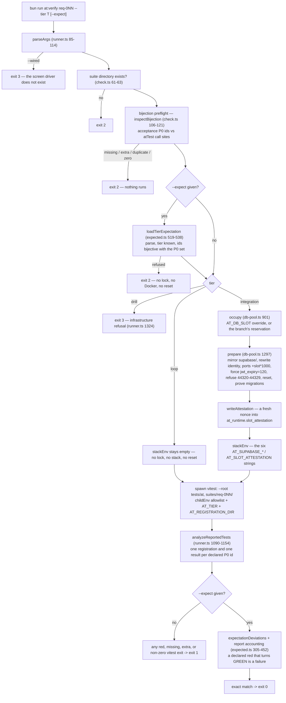
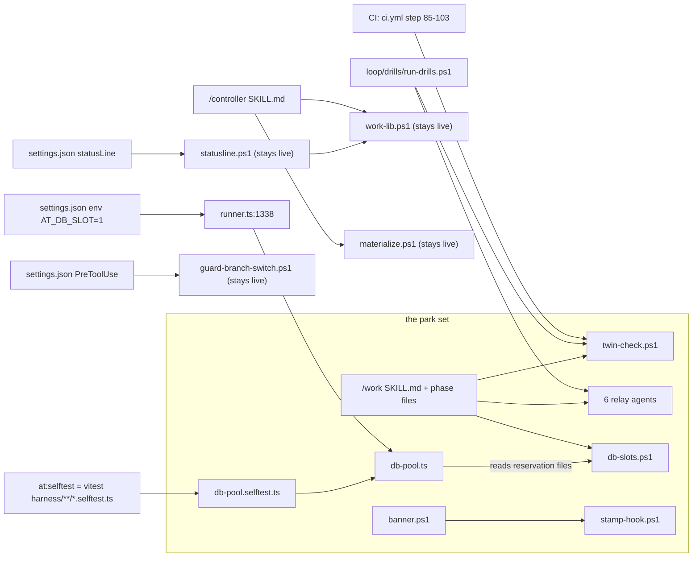

# The v1 ceremony and the acceptance harness: how they work, and what holds what up

*Written against the tree at commit `f81062e` in the `harness-map` worktree. That commit is the
state **before** the parking work landed. The last section says how the work actually resolved on
`main`, because that is now checkable and hiding it would be dishonest.*

---

## Overview

This repository carries two machines that are easy to confuse, because one of them calls the other.

The **acceptance harness** (`tests/at/`) answers one question: *does requirement N pass its written
acceptance tests, and does the result match what we already said it would be?* It is a runner
(`tests/at/harness/runner.ts`), a set of graded suites (`tests/at/suites/req-001/`,
`tests/at/suites/req-016/`), and a declaration file per requirement
(`tests/at/expected/req-001.json`, `req-016.json`) that pins the exact set of greens and reds. The
harness runs at two live tiers. **Loop** runs against in-memory fixtures and needs no database.
**Integration** runs against a real Supabase stack: real GoTrue, real deployed edge functions, real
Postgres, a real mail catcher.

The **v1 ceremony** is the process machinery that drove a work item to a merge: seven spawnable
agents in `.claude/agents/`, a coordinator manual in `.claude/skills/work/SKILL.md`, seventeen
PowerShell scripts in `loop/work/`, and a continuous-integration workflow in
`.github/workflows/ci.yml` that guards some of it. A newer, much smaller process (`/controller`,
then `/pstack:poteto-mode`, then `/controller done`) already runs beside it.

The two machines meet at exactly one seam: `bun run at:verify`. The ceremony reserved a database
slot and required a green verify at both tiers before a merge. The harness, in return, refused to
run integration unless the ceremony had reserved a slot for the branch. The parking question —
remove the slot machinery, remove the v1 relay, remove the twin-guard step, freeze the harness, and
keep three declared states green — is really a question about that seam and about which live callers
still reach into the code being removed. Read on if you need to work in either machine, or if you
need to know what a removal costs.

---

## Key concepts

**Requirement and AT id.** A requirement is `req-001` (accounts and sign-in) or `req-016`
(notifications). Its acceptance tests live as prose in `.taskmaster/docs/acceptance/at-req-001.md`.
Each test has an id like `AT-001.12` and a priority marker. Only `(P0)` ids are graded: 37 of them
for req-001, 12 for req-016.

**Tier.** `loop`, `integration`, or `drill`. The tier reaches the test process only as the
environment variable `AT_TIER`, and it has **no default** (`registry.ts:146`). An unset tier makes
every id pending, on purpose.

**Bijection.** Every P0 id in the acceptance file has exactly one `atTest('AT-…')` call site in a
`*.test.ts` file under the suite, and no call site claims an id the acceptance file does not carry.
`tests/at/harness/check.ts` proves this, and the runner proves it again as a preflight.

**Declaration manifest.** `tests/at/expected/req-0NN.json` lists, per tier, which ids are green and
which are red — and for each red, *why*, in one of two shapes. `--expect` makes the run compare
itself against that file. This is what makes a known-red suite a usable gate.

**Red kinds.** Two, and only two. `pending` with a phase (`sut-missing`, `harness-missing`,
`tier-unset`) means the code under test does not exist yet. `capability-pending` with a list of
names means the harness cannot honestly provide something this id needs. `expected.ts:287-289`
rebuilds the expected first line of the failure from the manifest and compares it.

**Capability ledger and provenance.** `tests/at/harness/index.ts` builds an object (`AtHarness`)
holding every seam a test may touch: `clock`, `fixtures`, `vendors`, `sentinels`, `faults`,
`static`, `config`, `oracles`, `sut`. Each seam carries a computed verdict — `real`, `stand-in`, or
a refusal — that the caller cannot write itself. A test that touches an unbacked seam throws
`CapabilityPending`, which the manifest can then declare.

**Adapter.** The thing that actually implements a requirement's system under test.
`tests/at/suites/req-001/_fixture.ts` is the loop adapter (Map storage plus the shipped decision
modules). `tests/at/suites/req-001/_live.ts` is the integration adapter (HTTP to Auth and edge
functions, `Bun.SQL` to Postgres, Mailpit for links). **req-016 has no `_live.ts`.**

**Slot and the pool.** `tests/at/harness/db-pool.ts` maintains two standing Supabase stacks named
`ai4good-slot-1` and `ai4good-slot-2`, each a copy of this tree's `supabase/` directory with a
rewritten identity. The integration tier reached a database only through it.

**The repo stack.** The single local Supabase stack that `supabase/config.toml` describes:
`project_id = "poancmeitlmxejofwzuu"`, API 44321, database 44322, Studio 44323, mail catcher 44324.
This is the stack the brief calls "the one stack". The pool exists specifically to **never** touch
it.

**The v1 relay.** Seven agents: `conductor` (owns the clock), `orchestrator` and its twin
`orchestrator-opus` (own all judgment), `executor` (writes code), `reviewer-runner` (launches one
external reviewer), `distiller` (extract-only contract), `mechanical` (housekeeping and merges).
Only `mechanical` is used by the newer process.

**The twin guard.** `orchestrator.md` and `orchestrator-opus.md` are one role in two files. They
must stay identical apart from frontmatter and two declared paragraphs.
`loop/work/twin-check.ps1` proves it. CI runs it at `ci.yml:85-103`.

---

## How it works

### 1. One `at:verify` run, end to end

`package.json` maps `at:verify` to `bun tests/at/harness/runner.ts`. Everything below happens in
`main()` (`runner.ts:1233`).



Three things about this pipeline are worth holding on to.

**The preflights run before anything expensive.** A bad manifest or a broken bijection exits 2 with
no lock taken, no Docker touched, and no database reset. That ordering is deliberate: the cheap
proof of "we are grading the right list" comes before the costly proof of "the list passes".

**The tier reaches the child only as an environment variable.** `childEnv` (`runner.ts:169`) is an
allowlist, not a filter — it drops `.env.local` secrets and passes `--no-env-file` to the child. The
child never sees `AT_DB_SLOT`; only the parent runner reads it, at `runner.ts:1338`, and that is the
single read in the whole harness. A test process therefore cannot occupy a slot.

**Exit codes carry meaning.** 0 is a match or an all-green run. 1 is a test or declaration failure.
2 is usage, bijection, or declaration refusal — *nothing was graded*. 3 is infrastructure. 4 is
"vitest produced no usable report". CI prints all five meanings in its error line
(`ci.yml:214`).

### 2. Inside vitest: how an id gets its colour

The child runs `vitest run --root tests/at --config tests/at/vitest.config.ts suites/req-0NN/`. Each
`atTest('AT-0NN.MM', …)` in a `*.test.ts` file registers exactly one vitest `it()` and appends a
JSONL registration line the runner reads back.

A test body may be a plain function, or a map like `{ default, integration }`. `chooseTierBody`
(`registry.ts:794`) picks the `integration` entry when `AT_TIER=integration`, otherwise `default`.
**Every id runs at both tiers.** There is no integration-only test file. "Only at integration" always
means "this *procedure* is the integration map entry" — for example
`tests/at/suites/req-001/_integration.ts` holds the alternate procedures for confirm-then-sign-in,
real JWT waits, and live absence probes.

When a body calls `open()`, `registry.ts` calls `createHarness({ requirement, tier })`
(`index.ts:463`), and the two tiers diverge:

| | Loop | Integration |
|---|---|---|
| clock | `ControlledClock`, starts 2026-01-01, has `advance` | `AttestedRealClock`, no control seam |
| adapter | `suites/<req>/_fixture.ts` | `suites/<req>/_live.ts` **if it exists** |
| mail | in-memory email simulator | `createLiveEmail` against Mailpit |
| database | none | attested first, by nonce round trip |
| stand-ins | allowed, stamped `stand-in` | refused — `aboveLoopStubbedRefusal` (`registry.ts:807`) |

The refusal is the load-bearing part. Above loop, `buildLiveLedger` (`index.ts:337-447`) does four
things in order: read the five `AT_SUPABASE_*` coordinates from the environment; call `attestSlot`
so the database proves it answered with *this run's* nonce; build the real clock and the live mail
reader; then load `_live.ts` and grant `real` only over its closed `backedSutMethods` list. Any
method not on that list becomes a proxy that throws `CapabilityPending('sut.accounts.<method>')`.

If `_live.ts` is missing — which is exactly req-016's situation — the builder falls back to the loop
fixture, every adapter-derived seam stays `stand-in`, and `registry.ts` refuses **before the body
runs** with `CapabilityPending: fixtures.worlds, sut.notifications`. That is why all twelve req-016
integration ids are declared red, and why they are honestly red rather than silently green.

### 3. What the three declared states actually are

Verified against the two manifests:

| Requirement | Tier | Green | Red |
|---|---|---|---|
| req-001 | loop | 21 | 16, all `pending / sut-missing` |
| req-001 | integration | 16 | 21 = 5 `capability-pending` + 16 `sut-missing` |
| req-016 | loop | 11 | 1 — `AT-016.01`, `capability-pending: H3 static provider scan` |
| req-016 | integration | 0 | 12, all `capability-pending: fixtures.worlds, sut.notifications` |

The five req-001 integration `capability-pending` reds are the paths this environment cannot prove
live: `sut.accounts.registerWithGithub` (AT-001.02), `sut.accounts.registerWithProvider` (AT-001.03
and AT-001.04), `vendors.github-public-statistics` (AT-001.05), and
`sut.accounts.sendDiscoveryMessage` (AT-001.10).

*(Explorer note: one findings file reported 21/15 and 15/5/15 for req-001. I read both manifests
directly. The correct numbers are the table above, and they sum to 37, which matches the 37 P0 ids
in the acceptance file.)*

`AT-016.01` is the only loop red in the whole tree, and its cause is narrow: `index.ts:500` installs
`static: pendingCapability<StaticScan>('H3 static provider scan')` unconditionally. Sentinels,
faults, and the email simulator all work at loop for req-016. Only the source scan is absent. It is
easy to misread that red as "the whole planted-marker machinery is unimplemented". It is not.

### 4. The ceremony around the harness

The v1 relay drove one item like this: the founder typed `/work AI4DEV-NN` in the main session; the
coordinator ran `loop/work/twin-check.ps1` as step zero and stopped on drift; it created the branch,
reserved a database slot with `Reserve-DbSlot` from `loop/work/db-slots.ps1`, and spawned a
worktree-isolated `conductor`; the conductor then ran four or five `orchestrator` sittings — plan,
draft, fix, audit, merge — with `reviewer-runner` launching external reviewers between them; the
`executor` ran `at:verify` at **both** tiers, the integration run consuming the reserved slot; the
merge sitting quoted both exact-match results; `mechanical` merged; the coordinator released the
slot.

CI never took part in that. `.github/workflows/ci.yml` checks out the pull request **head** sha (not
the synthetic merge commit), runs the twin guard, decides whether the diff reaches code, then runs
`typecheck`, `at:selftest`, `at:check` per suite, and `at:verify … --tier loop --expect` per
manifest, then the ownership guard and the reference guard. **CI never runs the integration tier and
never sets `AT_DB_SLOT`.** Integration green has always been a local claim.

### 5. The dependency map — the part that decides what a park costs

This is the graph that answers "what depends on what". Arrows point from caller to callee. Anything
inside the box is on the park list; anything outside it is a live caller that must be dealt with in
the same change.



Reading it out:

- **`db-pool.ts` cannot simply be deleted.** `runner.ts:44` imports `evidence`, `occupy`, `prepare`
  and `stackEnv` from it at module load. Remove the file and the runner fails to *load*, which
  breaks the **loop** tier too — and therefore CI, which only runs loop. The integration entry has
  to be replaced in the same change, not after it.
- **`at:selftest` is a directory include, not a list.** `vitest.config.ts` includes
  `harness/**/*.selftest.ts`. Parking `db-pool.selftest.ts` shrinks the selftest set by 33 tests
  automatically. Nothing needs editing to make that happen, and nothing warns you that it happened.
- **The twin guard has three callers, not one.** Dropping the CI step at `ci.yml:85-103` leaves the
  `/work` pre-flight and `loop/drills/run-drills.ps1`. Park the agents and leave the drills, and the
  drills go red. Park the drills and leave the guard, and the guard has nothing to guard.
- **`stamp-hook.ps1` and `banner.ps1` are already unwired.** Their own comments still claim to be
  `UserPromptSubmit` and `SessionStart` hooks. `.claude/settings.json` registers neither. The live
  `SessionStart` is `.claude/hooks/session-start-banner.sh`, which exits immediately unless
  `CLAUDE_CODE_REMOTE=true`. Parking them changes no live behaviour.
- **The two live hooks point at absolute paths in the main checkout.** `settings.json:22` and
  `settings.json:40` both name `C:\Users\nirdr\Downloads\ai4good\loop\work\…`. Parking a copy inside
  a worktree changes nothing for a session launched from the main checkout until the change merges.
- **`AT_DB_SLOT=1` is injected into every session** by `settings.json:5`. It is the override that
  makes `occupy` skip the reservation check.

### 6. Why "point integration at 44321" is an inversion, not a redirect

This is the single most surprising fact in the subsystem, and both the runner and the pool state the
opposite rule in their headers.

`AT_DB_SLOT=1` does **not** mean "the stack on port 44321". Slot ports are computed arithmetically:
listener ports move by `from + slot * 1000` (`db-pool.ts:349`) and the inspector port by
`from + slot * 10` (`db-pool.ts:345`). Slot 1 of a 44321 API is therefore **45321**, on project
`ai4good-slot-1`.

The 44321 block is the repo stack, and the pool is built to refuse it. `PERSONAL_PORT_LOW = 44320`
and `PERSONAL_PORT_HIGH = 44329` (`db-pool.ts:73-74`) are checked in three places: when validating a
generated slot config (`db-pool.ts:480`), when emitting child environment variables
(`db-pool.ts:1386`), and before running SQL (`db-pool.ts:1550`). The `drill` tier is refused
outright for the same reason (`runner.ts:1320-1330`): "It used to reset the stack described by the
repository's own supabase/config.toml, which is the founder's personal stack, and that stack is
untouchable."

That rule has a cause. On 2026-08-09 a tracked `.env` carried
`SUPABASE_PROJECT_ID=poancmeitlmxejofwzuu`, a slot reset inherited it, and the reset hit the
founder's real project. `supabaseInvocation` (`runner.ts:587-644`) exists because of that day: it
states the target identity positively and strips every other `SUPABASE_*` variable from the child.

So making the integration tier target 44321 does not relax a guard. It **reverses the premise the
guard encodes**. That is a founder decision about what 44321 is for, not a refactor. The identity
proofs themselves are still wanted — loopback addresses, the configured ports, `iss=supabase-demo`,
no hosted project reference (`localStackProblems`, `runner.ts:754-807`) — and those already take a
config argument, so they work against the repo config unchanged. What does **not** carry over is
`proveSlotTarget`: its container-name instrument (`ownContainerNames`, `foreignContainerNames`,
`slotDbContainers`) is keyed on the literal string `ai4good-slot-N`. A 44321 path needs a new
identity read that looks for `supabase_*_poancmeitlmxejofwzuu` instead. Dropping the container check
and keeping only the port and issuer checks would be weaker than today's rule — and ports alone were
exactly what failed to be identity in the 2026-08-09 incident.

### 7. The two things that would silently break req-001 integration

Both are real, both are in the suite rather than the harness, and neither shows up as a compile
error.

**The session lifetime.** `generateSlotConfig` forces `jwt_expiry = 120` on every slot
(`SLOT_JWT_EXPIRY_SECONDS`, `db-pool.ts:407`). The tree's own `supabase/config.toml:174` says
`jwt_expiry = 3600`. `tests/at/suites/req-001/_integration.ts:65` hard-codes
`SLOT_JWT_EXPIRY_MS = 120_000` to match the generator — it does not import it. AT-001.12 then waits
`SLOT_JWT_EXPIRY_MS + 15_000` = 135 seconds for a token to expire (`_integration.ts:487`), and
AT-001.13 polls for `SLOT_JWT_EXPIRY_MS + 30_000` = 150 seconds for an automatic refresh
(`_integration.ts:559`), inside a 240-second budget (`INTEGRATION_TIMEOUT_MS`,
`_integration.ts:83`). Against the repo stack as shipped, the token lives for an hour. Both ids
become hangs and then false reds. Two declared greens depend on someone pinning 120 seconds on the
repo stack, or on rewriting those waits.

**Test isolation.** The live world's teardown is only `sql.close()`. `_live.ts` does no per-test
database wipe, and its header says why: `prepare()` already reset the slot. Isolation at integration
is the reset plus namespaced email addresses. Remove `prepare()` without putting a reset in its
place and the ids start sharing Auth users and rows.

A third item is smaller but real: `createLiveEmail` refuses to build unless it receives an
attestation branded `'slot'` (`SLOT_ATTESTATION_BRAND` in `capabilities.ts`). The brand string is
cosmetic; the **round trip** is not. `attestSlot` is the only positive proof that the database which
answered is the one this run reset. `localStackProblems` can in principle be satisfied by
well-chosen strings; a nonce written after reset and read back through
`AT_SUPABASE_DB_URL` cannot. Keep the round trip even if the word "slot" goes.

---

## Where things live

```
tests/at/
  harness/
    runner.ts              at:verify — args, preflights, tier dispatch, vitest spawn, grading
    check.ts               at:check — the P0-id bijection; acceptanceP0Ids reads .taskmaster/
    expected.ts            --expect — manifest schema, red shapes, deviation and accounting checks
    registry.ts            atTest / bindSuite / TIER / chooseTierBody / aboveLoopStubbedRefusal
    index.ts               createHarness, buildCapabilityLedger, buildLiveLedger, loadAdapter
    capabilities.ts        provenance verdicts, CapabilityPending, the attestation brand
    contracts.ts           AtHarness and every shared seam type
    suite-adapters.ts      compile-time list of suites (req-001, req-016 only)
    db-pool.ts             the slot pool — occupy, prepare, port overlay, personal-block refusal
    attestation.ts         mint / write / read-back of the run nonce
    live-email.ts          Mailpit reader for the integration tier
    clock.ts fixtures.ts sentinels.ts faults.ts vendors.ts guards.ts   the loop seams
    oracles.ts             the pinned semantic judge — NO suite calls it, store is empty
    *.selftest.ts          what `at:selftest` runs (a directory include, not a list)
  suites/req-001/          _bind _contract _fixture _live _integration _pending _source-scan + 6 tests
  suites/req-016/          _bind _contract _fixture _oracles taxonomy + 4 tests (no _live.ts)
  expected/req-001.json    the declaration manifests — the P0 floor
  expected/req-016.json
  vitest.config.ts         include: suites/**/*.test.ts and harness/**/*.selftest.ts

.taskmaster/docs/acceptance/at-req-001.md, at-req-016.md    the P0 ids, in prose
supabase/config.toml       the repo stack: poancmeitlmxejofwzuu, 44321/44322/44323/44324, jwt 3600

.claude/agents/            conductor orchestrator orchestrator-opus executor reviewer-runner
                           distiller mechanical
.claude/skills/work/       the /work manual, WORKFLOW.md, shared-invariants.md, conductor/phase-*.md
.claude/skills/controller/ the newer entry verb
.claude/settings.json      AT_DB_SLOT=1, the status line, the branch-switch guard (absolute paths)
loop/work/                 17 files; only work-lib, materialize, statusline, guard-branch-switch
                           have a live caller
loop/drills/run-drills.ps1 binds the agents, the phase files, and twin-check
.github/workflows/ci.yml   twin guard (85-103), prose fast lane, typecheck, selftest, check,
                           loop --expect (195-236), ownership guard, reference guard
```

---

## Gotchas

1. **`--expect` is symmetric, and that is the point.** A declared red that turns *green* is a
   failure. An improvement without a manifest edit fails the build. It also checks arithmetic: the
   failed-test count must equal the declared red count, the passed count must equal the declared
   green count, and there must be no pending or todo tests. This is what lets a suite that is 43%
   red be a CI gate.

2. **`at:check` sees only `atTest('AT-…'` call sites in `*.test.ts`.** Bodies in `_integration.ts`
   are invisible to the bijection, because the file does not match the glob. The id lives at the
   call site in the test file; the integration file only supplies the procedure.

3. **Two unrelated things are called "oracles".** `tests/at/harness/oracles.ts` is the pinned
   `claude-opus-5` semantic judge. `tests/at/suites/req-016/_oracles.ts` is pure pair-counting
   arithmetic. Only the second is used by any test. The judge has zero suite callers, an empty
   recording store, and a recorder that was never run — but `createHarness` still *constructs* it on
   every `open()` (`index.ts:205`), so removing it without touching that construction site breaks
   both suites.

4. **A green at loop is not a green product.** `tests/at/suites/req-016/_fixture.ts` says in its own
   header that it is derived from `taxonomy.ts` by construction and is not the product. Loop req-016
   grades the machinery and the oracles against a conformant stand-in.

5. **The reference guard binds; the parked prose does not.**
   `.claude/skills/work/shared-invariants.md` still recommends `ref` / `part of` / `towards` for
   naming other items in a pull request. `ci.yml:305-391` fails on **any** item id the branch does
   not own, with one sanctioned exception: a single line of the exact shape `Closes AI4DEV-nn`. The
   two documents disagree, and CI is the one with teeth.

6. **A tree that predates a guard is skipped loudly, never failed.** The twin-guard step checks for
   the script's existence first (`ci.yml:94-98`) because on 2026-08-11 `pwsh` died on the missing
   file and failed an innocent pull request.

7. **A known hole in `--expect`.** A hook throw inside a file that already has a failed test is
   invisible to the accounting (`expected.ts:371-376`). Both current loop declarations live with it.

8. **`AT_TIER` deliberately has no default.** Running a suite with bare vitest gives every id
   `tier-unset` on its first `open()` rather than quietly grading it at loop.

---

## Honest gaps

The four explorers between them read essentially the whole harness and the whole ceremony, but
**none of them executed anything**. Every colour claim above is from the manifests plus the code
paths, not from a fresh `at:verify` run. In particular, nobody measured whether the repo stack is
currently up, whether the running GoTrue's `jwt_expiry` really is 3600, or whether Mailpit answers
on 44324.

Three questions were left genuinely open rather than answered:

- Whether the repo stack gets a standing `jwt_expiry = 120`, or whether `_integration.ts` stops
  waiting two minutes. AT-001.12 and AT-001.13 depend on the answer either way.
- Whether the integration tier still wipes the stack on every run. Without `prepare()`'s reset,
  nothing else isolates the ids.
- Whether `loop/drills/` belongs in the park set. The brief lists agents and `loop/work/` scripts
  and does not mention drills — but `run-drills.ps1` asserts the agents, the phase files and the
  twin check are tracked machinery, so it goes red if they move and it stays.

---

## How it actually resolved

The parking work has since landed on `main` — commits `7d897b7` and `aa9a2a4`, under the item
`AI4DEV-86 (v1 ceremony out, CI aligned)`. Reading `loop/parked/v1/README.md` on `main` confirms the
shape this map predicted, and settles two of the three open questions above:

- `db-pool.ts` and its selftest are parked. The integration tier now targets the stack that this
  tree's own `supabase/config.toml` describes, and resets it on every run. The parked README states
  the inversion plainly: the parked files "still carry the personal-stack refusals this tree no
  longer believes".
- A new module, `tests/at/harness/live-stack.ts`, holds the identity read and the Mailpit probe. Its
  `containerNames` check replaced `proveSlotTarget`, and the README records the residual honestly:
  the own-container match is a suffix match, so a project whose id ends in `_poancmeitlmxejofwzuu`
  would count as this project.
- The six relay agents, the `/work` skill tree, the drills, `db-slots.ps1`, `twin-check.ps1` (with
  its CI step), and the already-unwired stamp and banner scripts all moved under `loop/parked/v1/`.
  `mechanical` stayed live. Four `loop/work/` scripts stayed live, each because it has a caller:
  `work-lib.ps1`, `materialize.ps1`, `statusline.ps1`, `guard-branch-switch.ps1`.
- The harness shrank further than this map anticipated. `capabilities.ts`, `attestation.ts`,
  `oracles.ts` and the type probes were parked too. A single boolean `live` on the harness now
  drives the above-loop refusal, and `registry.ts` throws `CapabilityPending` naming
  `fixtures.worlds` and `sut.<key>` when the tier is above loop and `live` is false. The red kinds
  and the manifests under `tests/at/expected/` did not move — which is what kept the three declared
  states green.

The cost is written down where someone will find it: the loop tier can no longer tell a real seam
from a stand-in, and above loop a suite with no live adapter is refused by a boolean rather than by a
computed verdict.
