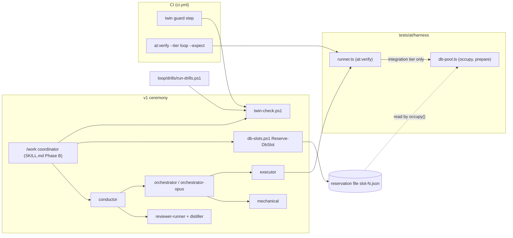
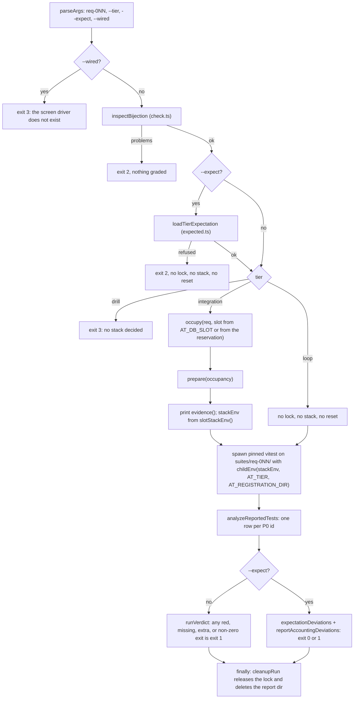

# How the v1 ceremony and the acceptance-test harness work, and what depends on what

Written for AI4DEV-86 (v1 ceremony out, CI aligned) from the four explorer findings, checked
against the code in this worktree. Line numbers are from this worktree at the time of writing.

## Overview

Two systems share this repository's verification path.

The **acceptance-test harness** under `tests/at/` turns acceptance criteria into per-id verdicts.
An acceptance file lists P0 ids. A suite registers one `atTest` per id. `bun run at:verify
req-0NN --tier <tier>` runs the suite under vitest and grades every id green, red, or missing. A
`--expect` manifest declares which ids are green and exactly how each red fails, and CI compares
every loop-tier run to that declaration. The integration tier does the same work against a real
Supabase stack. Today that stack is always a **slot**: a standing copy of the local stack that
the pool (`db-pool.ts`) rebuilds before every run. The pool exists so that the founder's
personal stack on the 44321 block is never touched.

The **v1 ceremony** is the machinery that used to drive an item from pickup to merge: seven
agent contracts in `.claude/agents/`, the `/work` skill with its phase files, a set of
PowerShell scripts in `loop/work/`, and a CI step that guards two of the agent files against
drift. The ceremony touches the harness at three seams. The coordinator reserves a slot that
the runner later occupies. The executor and the merge ruling require `at:verify --expect` at
both tiers. CI runs the twin guard beside the loop-tier verify. The v2 way of work
(`/controller`, poteto-mode, the `mechanical` agent) already runs beside v1 and uses none of the
ceremony except `mechanical`.

The item parks the ceremony and the slot machinery, freezes the rest of the harness, aligns CI,
and repoints the integration tier at the one stack. This document explains each piece far
enough to do that, and ends with the dependency map (section 9).

## Key Concepts

- **AT id and P0.** `AT-001.12` is one acceptance criterion. `.taskmaster/docs/acceptance/at-req-001.md`
  marks the ids that count with `(P0)`. `check.ts` `acceptanceP0Ids()` reads them with one regex
  (line 52). req-001 has 37 P0 ids; req-016 has 12.
- **Bijection.** `at:check` requires the P0 set and the set of `atTest('AT-…'` call sites in
  `tests/at/suites/req-0NN/*.test.ts` to match exactly: no missing, no extra, no duplicate ids
  (`check.ts` 93–121). Bodies in `_integration.ts` are invisible to it. The call site in the test
  file is the id.
- **Tier.** `loop`, `integration`, or `drill` (`registry.ts` 134). The runner passes it to the
  child as `AT_TIER`. There is no default: an unset tier is `null`, and the first `open()` throws
  `AtPending(..., 'tier-unset')`.
- **Manifest.** `tests/at/expected/req-0NN.json` declares, per tier, the green ids and the red
  ids with their exact failure kind. With `--expect`, a run must match it exactly. A declared red
  that turns green is a failure.
- **Red kinds.** `pending` with a phase (`harness-missing | sut-missing | tier-unset`), thrown as
  `AtPending`; and `capability-pending` with a list of names, thrown as `CapabilityPending`.
- **Harness and ledger.** `createHarness()` (`index.ts` 463) builds an `AtHarness`: clock,
  fixtures, sentinels, faults, vendors, oracles, config, static, sut. Each member comes off a
  capability ledger where provenance is computed (`real`, `stand-in`, or a refusal), never
  declared by a caller.
- **Fixture adapter and live adapter.** `suites/req-0NN/_fixture.ts` is the loop-tier stand-in.
  `suites/req-0NN/_live.ts` is the integration adapter; only req-001 has one. A live adapter
  exports `backedSutMethods`, the closed list of methods granted `real`.
- **Slot.** Pool stack N is project `ai4good-slot-N` with every listener port moved by `N * 1000`
  (`db-pool.ts` 349). Slot 1's API port is 45321. The pool is two slots by default (`POOL_SIZE`,
  lines 117–137).
- **Reservation and occupancy.** The coordinator reserves a slot for an item
  (`loop/work/db-slots.ps1`, one JSON file per slot). The runner occupies it for one run with a
  lock file. Two states, two owners.
- **The one stack.** `supabase/config.toml`: `project_id = "poancmeitlmxejofwzuu"`, API 44321,
  DB 44322, Studio 44323, Mailpit 44324, analytics 44327, shadow DB 44320, pooler 44329
  (disabled), `jwt_expiry = 3600`. `bun run db:start` and `bun run db:reset` manage it. The pool
  calls this the personal stack and refuses its ports (44320–44329) and its project id by
  constant.
- **Attestation.** After the reset, the runner writes a fresh nonce into
  `at_runtime.slot_attestation`. The child reads it back through the coordinates it was handed
  (`attestation.ts`). The result is a `LiveAttestation` branded `'slot'`. Every `real` grant
  above loop carries it.
- **Identity proofs.** `localStackProblems()` (`runner.ts` 754) checks loopback host, the
  configured ports, `iss=supabase-demo`, and no hosted `ref`. `supabaseInvocation()` (630) states
  `SUPABASE_PROJECT_ID` positively and strips every other `SUPABASE_*`. `proveSlotTarget()`
  (`db-pool.ts` 1194) adds container names. `personalBlockProblems()` (457) refuses the personal
  ports and project id.
- **v1 roles.** conductor, orchestrator, orchestrator-opus, executor, reviewer-runner, distiller,
  mechanical. **v2:** `/controller` writes a brief and moves the session into the worktree; the
  founder runs poteto-mode; `mechanical` types the git commands; `/controller done` steers the
  board.

## How It Works

### 1. The v1 ceremony, and where it touches the harness

The founder types `/work AI4DEV-NN` in the main session. The coordinator reads
`.claude/skills/work/SKILL.md` and runs Phase B (`SKILL.md` 201–244):

0. Run `loop/work/twin-check.ps1`. `TWINS DRIFTED` or `STALE GUARD` stops the item before any
   spawn.
1. to 4. Resolve the Linear item, walk `parent`, check startability, create the branch from
   `origin/main`.
5. `Reserve-DbSlot -Item <id> -Branch <branch>` from `loop/work/db-slots.ps1`. Two slots; a full
   pool rejects the item at start.
6. Claim the item on the board.
7. Spawn `Agent(subagent_type: "conductor")` with the item id, the branch, and the reserved slot.

The conductor (`.claude/agents/conductor.md`, sonnet, worktree isolation) owns the clock and the
sequence. It reads a phase file on every phase entry (`.claude/skills/work/conductor/phase-*.md`,
nine files) and spawns sittings. An `orchestrator` (fable) plans, rules on gates, and amends. An
`executor` (opus) writes code and runs `bun run at:verify <req> --tier loop --expect`, then
`--tier integration --expect` on the reserved slot. `reviewer-runner`s launch external reviewer
processes and distil them per `distiller.md`. The merge sitting runs as `orchestrator-opus` and
requires both-tier exact match in its ruling. `mechanical` runs `gh pr merge`. The merge closes
the Linear item. The coordinator sweep runs `Release-DbSlot` and removes the worktree.



Three facts in this graph matter for parking. The reservation file is the only data that crosses
from the ceremony into the harness, and `occupy()` reads it (`db-pool.ts` 931–943).
`twin-check.ps1` has three callers, not one: CI, `/work` step 0, and
`loop/drills/run-drills.ps1` line 303. The executor is the only role that runs the integration
tier; CI never does.

### 2. The v2 way of work beside it

`/controller <id>` (`.claude/skills/controller/SKILL.md`) resolves the item, creates the branch
and a worktree under `.claude/worktrees/<item>`, writes `loop/items/<item>/brief.md`, and moves
the session into the worktree with `EnterWorktree`. The founder then runs
`/pstack:poteto-mode`. The lead does the work through pstack stations, hands tool-heavy steps
to `mechanical`, merges when CI is green on the exact head and the founder says "merge", leaves
the worktree, and invokes `/controller done`.

v2 says "there is no slot pool in v2" (`controller/SKILL.md` 69, quoting the founder on
2026-08-29: "Clear the dB slot mechanism all together"). It still leans on four v1 pieces:

- `Set-HeldItem` and `Clear-HeldItem` from `loop/work/work-lib.ps1` (step 7).
- Materialisation "as `/work` describes it".
- The cloud brief template tells a fresh VM to run `bun tests/at/harness/db-pool.ts setup`
  (line 157). This item's own brief says never to run that command.
- `AT_DB_SLOT=1` in `.claude/settings.json` `env`, which v2 reads as "the one database". Today
  the runner reads that value as pool slot 1 (section 5).

### 3. CI, step by step

`.github/workflows/ci.yml` has one job, `verify`, on every pull request to `main` and every push
to `main`:

1. Check out the pull request **head** SHA, not the synthetic merge commit (line 68).
2. **Twin guard** (85–103): run `loop/work/twin-check.ps1` when it exists in the tree; skip
   loudly when it does not. This is the step the item drops.
3. **Prose fast lane** (114–143): read the changed-file list from the API. If no file touches
   `src/`, `supabase/`, `tests/`, `.github/`, `package.json`, `bun.lock*`, `tsconfig*`, or
   `vitest*`, skip the suite. An unreadable list takes the slow path.
4. `bun install --frozen-lockfile`, then `bun run typecheck` (`tests/at/typecheck.ts`, both
   tsconfigs).
5. `bun run at:selftest`: vitest over `harness/**/*.selftest.ts`. Thirteen files today.
   `db-pool.selftest.ts` is one of them and is the only selftest that imports the pool.
6. `bun run at:check <req>` for every directory `tests/at/suites/req-*/`. Zero directories is a
   failure.
7. `bun run at:verify <req> --tier loop --expect` for every `tests/at/expected/req-*.json`, and
   a failure for any suite directory without a manifest (219–236).
8. **Ownership guard** (242–303): a pull request may not change both `src/` (Lovable) and
   `supabase|tests|loop|.claude|.github` (Claude). `src/routeTree.gen.ts` is exempt.
9. **Reference guard** (305–391): any `AI4DEV-` or `AI4PM-` id the branch does not own fails,
   except one line of the exact shape `Closes AI4DEV-nn`.

CI has no Docker, no database, no `AT_DB_SLOT`, and no `AT_JUDGE_API_KEY`. It never runs the
integration tier. Every acceptance verdict CI produces is a loop-tier `--expect` match.

### 4. The runner: `bun run at:verify`

`tests/at/harness/runner.ts` `main()` (1233–1465):



Details that matter:

- **The child environment is an allowlist** (`ENV_ALLOWLIST`, 129–166): platform basics, temp
  and home, Docker discovery. The runner adds exactly: the stack coordinates, `AT_REPO_ROOT` if
  set, `AT_TIER`, `AT_REGISTRATION_DIR`. The child runs with `bun --no-env-file`, so `.env` is
  never re-read. `AT_DB_SLOT` and `AT_JUDGE_API_KEY` never reach the child.
- **Binaries come from `INSTALL_ROOT`, data from `REPO_ROOT`** (`check.ts` 38). `AT_REPO_ROOT`
  redirects acceptance files, suites, and manifests to a disposable tree; the black-box selftests
  use it.
- **Exit codes:** 0 match or all green; 1 test or declaration deviation; 2 usage, bijection, or
  manifest refusal (nothing graded); 3 infrastructure; 4 no usable vitest report.
- **Integration is the only path that touches a database, and it does so only through the
  pool.** The integration branch (1332–1370) is the only production caller of `occupy`,
  `prepare`, `evidence`, and `stackEnv`. Line 1338 is the only read of `AT_DB_SLOT` in the
  runner.
- **Locks.** `acquireStackLock(config, requirement, { takeover })` (397) creates
  `at-verify-<projectId>-<apiPort>.lock` under `%LOCALAPPDATA%\ai4good-build\at-locks`
  (`stackLockPath` 308, `lockDir` 290). The runner's default takeover policy is
  `stale-or-dead`. The pool passes `dead-pid-only` and keys the lock on `slotClaimKey(slot)`,
  which is `{ projectId: 'ai4good-slot-N', apiPort: 0 }` (`db-pool.ts` 199), so the file is
  `at-verify-ai4good-slot-N-0.lock`. No lock is taken today on `poancmeitlmxejofwzuu` + 44321.
- **The no-target reset already aims at the one stack.** `resetLocalDatabase()` with no
  arguments (984) runs `supabase db reset --local` from the repo root with an environment that
  carries no `SUPABASE_*` at all (`supabaseInvocation(undefined, …)`, 631). The integration path
  never calls that overload. It always goes through `resetSlotDatabase()` →
  `resetLocalDatabase(slotTarget(slot), read)`.

### 5. The slot pool: reservation, occupancy, prepare

`tests/at/harness/db-pool.ts` is about 1,800 lines and one unit. Its doctrine is at the top
(lines 1–39): two standing slots; the 44321 stack is the founder's personal stack, outside the
pool and untouchable; state is never inherited; identity is permanent, everything else is data.

**Occupy** (`occupy()`, 901–998). With `AT_DB_SLOT=N` set (the override path): assert N is a
slot number, derive the item from the branch, and refuse if the slot's reservation names a
different item. Without it: derive the item from `git rev-parse --abbrev-ref HEAD`
(`itemFromBranch`, 799), look up
`%LOCALAPPDATA%\ai4good-build\db-slots\reservations\slot-N.json`, and refuse with a message
that names `Reserve-DbSlot` when none exists. There is no fallback onto a free slot. Then: the
slot directory must already hold a `supabase/config.toml` (from `db-pool.ts setup`);
`refusePersonal` scans it; the runner takes the lock; the reservation is re-read after the claim.

**Prepare** (`prepare()`, 1297–1360), in this order:

1. Read the repo's `supabase/config.toml`. `generateSlotConfig()` (409) rewrites `project_id` to
   `ai4good-slot-N`, moves every listener port in 44000–44999 by `+ N*1000` (`portMappings`,
   318; inspector 8083 by `+ N*10`), and forces `jwt_expiry = 120` (`SLOT_JWT_EXPIRY_SECONDS`,
   407).
2. `refusePersonal` on the generated text, then `pathClosureProblems`.
3. `mirrorItemTree()` (666): delete the slot's `supabase/`, copy the repo's `supabase/` without
   `config.toml`, `.temp`, and `.branches`; write the generated config.
4. If the config hash differs from the `.last-start.json` marker, stop and start the slot's
   stack (the auth container reads its config at start).
5. `proveSlotTarget()` (1194): run `supabase status -o json` through
   `supabaseInvocation(slotTarget(slot))`; refuse on any foreign container name or the personal
   project id in the output; parse the status; run `localStackProblems(status,
   readLocalConfig(slotDir))`. For destructive acts, also require a container named for
   `ai4good-slot-N` (`ownContainerNames`, 1110) and `docker ps` showing
   `supabase_db_ai4good-slot-N` (`proveSlotDbContainer`).
6. `waitForReady` → `resetSlotDatabase()` (1250; it repeats the identity read inside, then calls
   `resetLocalDatabase(slotTarget, read)`) → `waitForReady` → `proveMigrationsReplayed()` (disk
   timestamps against `supabase_migrations.schema_migrations`; five migrations today).
7. `mintAttestationNonce()` and `writeAttestation(slotTarget(slot), read, nonce)`
   (`attestation.ts` 100). The write refuses unless `read.provenProjectId === target.projectId`.
   It creates schema `at_runtime` and table `slot_attestation`, and keeps one row, always.

**Evidence and env** (`evidence()` 1438, `stackEnv()` 1373). The runner prints
`at:verify — db slot N (ai4good-slot-N, api <port>) — reset OK — migrations: E expected, A
applied`. `stackEnv` emits six values and nothing else: `AT_SUPABASE_URL`, `AT_SUPABASE_DB_URL`,
`AT_SUPABASE_ANON_KEY`, `AT_SUPABASE_SERVICE_ROLE_KEY`, `AT_SLOT_ATTESTATION`,
`AT_SUPABASE_MAIL_URL`. It throws if the API or DB URL port is in 44320–44329 (1386) or the
project id is the personal one (1390).

**The PowerShell half** (`loop/work/db-slots.ps1`) does file operations only: `Reserve-DbSlot`,
`Release-DbSlot`, listing. It uses the same base-directory chain as the harness (LOCALAPPDATA,
then XDG_CACHE_HOME, then temp). It reads no TOML.

### 6. Inside the child: registry, harness, ledger

`suites/req-0NN/_bind.ts` calls `bindSuite({ requirement, sut })` from `registry.ts`. The types
come from `suite-adapters.ts`, a compile-time map with exactly `req-001` and `req-016`. Each
`atTest('AT-0NN.MM', title, body)` in a `*.test.ts` registers one vitest `it()` titled
`AT-0NN.MM — title` and appends a JSONL registration to `AT_REGISTRATION_DIR`. A body is either
one function (it runs at every tier) or a map `{ default, integration }`. `chooseTierBody()`
(794) picks the tier's entry, then `default`, then `loop`.

`open()` → `openWorld()` (664–717) → `createHarness({ requirement, tier })`:

- **Loop** (`buildCapabilityLedger`, 177–229): a `ControlledClock` (starts 2026-01-01), a
  `FixtureWorldStore`, the config registry over `AT_CONFIG`, an email provider sim,
  `loadAdapter()` importing `suites/<req>/_fixture.ts`, sentinels and faults from the adapter's
  seams, `createOracleCapability({ tier: 'loop' })` (a replay transport over an empty recordings
  directory), and one `sut.<key>` per adapter key, stamped stand-in on the adapter-derived
  route.
- **Above loop** (`buildLiveLedger`, 337–447): the order is load-bearing.
  `liveCoordinatesFromEnv()` reads the five `AT_SUPABASE_*` values. `attestSlot()` reads the
  nonce back through `AT_SUPABASE_DB_URL` and refuses on no URL, no nonce, no answer, not
  exactly one row, or a different nonce (`attestation.ts` 157–208). Then:
  `createAttestedRealClock(attestation)`, config, worlds, `createLiveEmail({ catcherUrl:
  AT_SUPABASE_MAIL_URL, attestation })` (probes Mailpit `/api/v1/info`; refuses without the
  `'slot'` brand, `live-email.ts` 100). Then `loadLiveAdapterModule()`: if
  `suites/<req>/_live.ts` exists, `createLiveAdapter({ slot: coordinates, vendors, config,
  worlds })` runs and `real` is granted only over `backedSutMethods`; every other method refuses
  by name through `pendingMethodProxy`. If `_live.ts` does not exist (req-016), the loop fixture
  is loaded instead, and `fixtures.worlds` and `sut.notifications` stay stand-in.

Back in `openWorld()`: `aboveLoopStubbedRefusal(TIER, await h.stubbedCapabilities())` (705,
807) throws `CapabilityPending([...names])` before the body runs whenever the tier is above loop
and anything on the ledger is a stand-in. `h.static` is always
`pendingCapability('H3 static provider scan')` (`index.ts` 500).

```mermaid
sequenceDiagram
  participant R as runner.ts (parent)
  participant P as db-pool.ts
  participant S as slot stack (Docker)
  participant V as vitest child
  participant I as index.ts buildLiveLedger
  participant A as req-001/_live.ts
  R->>P: occupy(req, slot)
  P->>P: read the reservation, take at-verify-ai4good-slot-N-0.lock
  R->>P: prepare(occupancy)
  P->>S: mirror the tree, write the generated config, restart if the hash changed
  P->>S: status -o json (proveSlotTarget)
  P->>S: db reset --local (resetSlotDatabase, identity read inside)
  P->>S: proveMigrationsReplayed
  P->>S: write the nonce into at_runtime.slot_attestation
  P-->>R: PrepareResult: status, migrations, attestation
  R->>V: spawn with AT_SUPABASE_*, AT_SLOT_ATTESTATION, AT_TIER=integration
  V->>I: createHarness on every open()
  I->>S: select nonce (attestSlot)
  I->>S: GET /api/v1/info on Mailpit (createLiveEmail)
  I->>A: createLiveAdapter(slot, vendors, config, worlds)
  A->>S: auth/v1 and functions/v1 over HTTP; Bun.SQL on dbUrl
  V-->>R: JSON report
  R->>R: grade per id, compare to the manifest, release the lock
```

### 7. The `--expect` contract and what the two manifests say

`expected.ts` `loadTierExpectation()` (519–538) reads the manifest, checks the `requirement`
field against the run, the known tiers, the red kinds, and bijection with the acceptance P0 set.
A failure is exit 2 before any lock or stack. After the run, `expectationDeviations()` compares
the green set, the red set, and each red's exact rebuilt first line (`CapabilityPending:
CAPABILITY PENDING — a, b` or `AtPending: <id> PENDING [<phase>] —`).
`reportAccountingDeviations()` (378) then requires vitest's own counts to add up: failed equals
declared reds, passed equals declared greens, no pending or todo, no file-level import or hook
failure.

The manifests, verified from the files (one explorer's count was off by one; the file is the
source):

| Suite | Tier | Green | Red | Red shape |
|---|---|---|---|---|
| req-001 | loop | 21 | 16 | all `pending / sut-missing` (`_pending.ts` `notLanded`) |
| req-001 | integration | 16 | 21 | 5 `capability-pending` (`sut.accounts.registerWithGithub`; `sut.accounts.registerWithProvider` twice; `vendors.github-public-statistics`; `sut.accounts.sendDiscoveryMessage`) plus the same 16 `sut-missing` |
| req-016 | loop | 11 | 1 | AT-016.01 `capability-pending: H3 static provider scan` |
| req-016 | integration | 0 | 12 | every id `capability-pending: fixtures.worlds, sut.notifications` |

The done contract asks for req-001 and req-016 green at loop with `--expect`, and req-001 green
at integration. req-016 at integration is declarably all red and stays so; nothing in the item
changes that.

### 8. What the suites import from the harness

| Suite file | Harness imports (runtime unless marked) |
|---|---|
| `req-001/_bind.ts` | `bindSuite` from `registry.ts`; re-exports `AtPending`, `TIER`, `TIERS` |
| `req-001/_contract.ts` | types from `contracts.ts` |
| `req-001/_fixture.ts` | types `ControlledClock`, `FixtureWorld`, `FixtureWorldStore` |
| `req-001/_live.ts` | type `LiveVendors` from `live-email.ts` |
| `req-001/_integration.ts` | `CapabilityPending` from `capabilities.ts`; type `AtContext` |
| `req-001/*.test.ts` | `atTest` via `_bind.ts`; `h.clock.advance` in the AT-001.12 and AT-001.13 loop bodies, and nothing else on `h` |
| `req-016/_fixture.ts` | types from `clock.ts`, `faults.ts`, `fixtures.ts`, `sentinels.ts`, `vendors.ts` |
| `req-016/*.test.ts` | `atTest` via `_bind.ts`; `h.sentinels.plant`, `h.faults.at` and `processRestart`, `h.clock.freezeAt` and `advance`, `h.vendors.email.*`, `h.static.providerClientImporters` |
| `req-016/_oracles.ts`, `taxonomy.ts` | none |

No suite imports `db-pool.ts`, `attestation.ts`, or `oracles.ts`. No suite calls
`h.oracles.judge`. `oracles.ts` is constructed on every `open()` (`index.ts` 205, 376, 406) and
nothing more. The recordings directory holds only a README. `record-oracles.ts` is the only live
writer, has never run, and says `NEVER IN CI`.

`_live.ts` receives five strings and a `LiveVendors`. It fetches `${apiUrl}/auth/v1/...` and
`/functions/v1/...`, opens `Bun.SQL(dbUrl)` for operator reads and writes, and reads
confirmation and recovery links from Mailpit through `vendors.email.messagesFor`. Its world
teardown only closes SQL; it relies on `prepare()` having reset the database before the run.
`_integration.ts` hard-codes `SLOT_JWT_EXPIRY_MS = 120_000` (65) to match the pool's
`SLOT_JWT_EXPIRY_SECONDS = 120`, waits 135 s in AT-001.12, polls up to 150 s in AT-001.13, and
runs both under `INTEGRATION_TIMEOUT_MS = 240_000` (83).

### 9. What depends on what: the map for parking

```mermaid
flowchart TD
  subgraph settings[".claude/settings.json"]
    ENV["env AT_DB_SLOT=1"]
    SL["statusLine (absolute path into the main checkout)"]
    GB["PreToolUse hook (absolute path into the main checkout)"]
  end
  subgraph scripts["loop/work"]
    WL["work-lib.ps1"]
    ST["statusline.ps1"]
    GS["guard-branch-switch.ps1"]
    SH["stamp-hook.ps1"]
    BN["banner.ps1"]
    MZ["materialize.ps1"]
    DS["db-slots.ps1"]
    TW["twin-check.ps1"]
  end
  subgraph harness["tests/at/harness"]
    RN["runner.ts"]
    DP["db-pool.ts"]
    DPS["db-pool.selftest.ts"]
    AT["attestation.ts"]
    LE["live-email.ts"]
    CP["capabilities.ts (SLOT_ATTESTATION_BRAND)"]
    CK["clock.ts"]
    IX["index.ts"]
    LL["live-ledger.selftest.ts"]
  end
  subgraph suites["tests/at/suites/req-001"]
    LV["_live.ts"]
    IN["_integration.ts (SLOT_JWT_EXPIRY_MS = 120000)"]
  end
  subgraph ceremony["v1 ceremony and the v2 entry"]
    WK["/work SKILL.md"]
    CT["/controller SKILL.md"]
    DR["loop/drills/run-drills.ps1"]
    AG[".claude/agents (7 files)"]
    CI["ci.yml twin guard step"]
  end
  ENV --> RN
  SL --> ST --> WL
  GB --> GS
  SH --> WL
  BN --> SH
  MZ --> WL
  RN -- "import, line 44" --> DP
  DP -- "import (a safe cycle)" --> RN
  DP --> AT
  DPS --> DP
  AT --> CP
  LE --> CP
  CK --> CP
  IX --> AT
  IX --> LE
  IX --> CK
  IX -- "loads when present" --> LV
  LV -. "type LiveVendors" .-> LE
  IN -. "same number, not imported" .-> DP
  LL --> AT
  LL --> LE
  LL --> IX
  WK --> TW
  WK --> DS
  DS -. "reservation files" .-> DP
  WK --> AG
  CT -- "Set-HeldItem, Clear-HeldItem" --> WL
  CT -- "cloud template names db-pool.ts setup" --> DP
  CI --> TW
  DR --> TW
  DR --> AG
```



Reading the map against the brief's six scope bullets:

**Slot machinery out of `tests/at`.** `db-pool.ts` and `db-pool.selftest.ts` are one unit; the
selftest is the only selftest that imports the pool. `runner.ts` imports the pool at line 44 and
uses it only in the integration branch (1332–1369), so the runner cannot load once the file is
gone unless that import and that branch change together. `attestation.ts` is slot-shaped in its
names (`AT_SLOT_ATTESTATION`, `slot_attestation`, `attestSlot`), but its round trip is what
`index.ts` requires before any `real` grant; parking it whole kills every integration green.
`live-email.ts` computes no slot ports; it takes `AT_SUPABASE_MAIL_URL` and requires the
`'slot'` brand. The brand string is defined in `capabilities.ts` (86) and checked in `clock.ts`,
`live-email.ts`, and `attestation.ts`; it is a name, not a functional dependency on the pool.
`live-ledger.selftest.ts` drives `attestSlot`, `createLiveEmail`, and `buildLiveLedger` through
selftest seams with no database, so it survives the pool's removal and breaks only on renames.
`loop/work/db-slots.ps1` writes the reservation files that `occupy()` reads; nothing else reads
them.

**What a slot-free integration run against the one stack still needs.** Every building block
exists in `runner.ts` today, unused on the integration path:

1. A lock on the one stack: `acquireStackLock(readLocalConfig(REPO_ROOT), requirement,
   { takeover: 'dead-pid-only' })`. The file would be `at-verify-poancmeitlmxejofwzuu-44321.lock`.
2. A status read with no target: `readStackStatus()` over `supabaseInvocation(undefined,
   ['status', '-o', 'json'])`, which runs from the repo root with no `SUPABASE_*` in the
   environment. That is the wall against the tracked `.env`, whose first line is
   `SUPABASE_PROJECT_ID="poancmeitlmxejofwzuu"`.
3. `localStackProblems(status, repoConfig)`: loopback, 44321, 44322, 44324, `iss=supabase-demo`,
   no hosted `ref`. These are the identity proofs the brief keeps.
4. `waitForReady`, `resetLocalDatabase()` with no target, `waitForReady`,
   `proveMigrationsReplayed(status, REPO_ROOT)`.
5. The nonce write. `writeAttestation(target, read, nonce)` demands a `ProvenSlotRead` whose
   `provenProjectId` equals the target's project id. Today only `proveSlotTarget()` produces one,
   from container names of the form `*ai4good-slot-N*`. A 44321 path needs either its own
   identity read that looks for `poancmeitlmxejofwzuu` in the CLI's container names, or a
   decision to accept `localStackProblems` alone as the proof for the write. The second is
   weaker than today's destructive-path rule; the pool's own comment records that ports alone
   were not identity in the 2026-08-09 incident (1234–1235).
6. Six environment values for the child, emitted by something other than `stackEnv()`, because
   `stackEnv()` refuses ports 44320–44329 by construction.
7. An evidence line that names the project id, the API port, the reset, and the migration
   counts, without a slot number.
8. A session lifetime the suite can wait out. The repo config says `jwt_expiry = 3600`; only the
   pool's generator pins 120. Against the one stack as shipped, AT-001.12 and AT-001.13 wait for
   an expiry that arrives after their four-minute budget. Either the one stack's config pins 120
   (a standing change to `supabase/config.toml`, which also changes what the loop-tier
   `_fixture.ts` models, 3600) or `_integration.ts` changes its waits and its budget.

`AT_DB_SLOT=1` pairs with none of this. Today it selects pool slot 1, API 45321, and the pool
refuses 44321 by constant. The brief's environment line that puts `AT_DB_SLOT=1` next to the
44321 block names two different stacks in current code. The done-contract line, "no slot code on
the path", is the one that binds.

**v1 agents parked.** The spawn names live in the agent files' frontmatter. Who names them:
`/work` SKILL.md (the conductor spawn, the credit-out and merge fallbacks), `WORKFLOW.md`, the
nine phase files, `shared-invariants.md` ("never launch a reviewer from any role but
reviewer-runner"), `twin-check.ps1` default paths, the CI twin-guard comment, and
`loop/drills/run-drills.ps1` (twin guard 303, tracked-machinery 306–323, phase files 325–358,
no-park 360–370). `mechanical` stays; `/controller` and this item's brief name it.

**v1 scripts parked.** Live callers after the CI twin-guard step is gone:

| Script | Live caller |
|---|---|
| `twin-check.ps1` | `/work` step 0 and `run-drills.ps1` 303 |
| `stamp-hook.ps1` | none in settings; only `banner.ps1`, itself unwired (the live SessionStart hook is `.claude/hooks/session-start-banner.sh`) |
| `attribution-report.ps1`, its selftest, `attribution-epoch.txt` | manual only |
| `watch-items.ps1` | manual only |
| `work-lib.ps1` | **`statusline.ps1` line 108 (live in settings)**, `stamp-hook.ps1`, `materialize.ps1`; and `/controller` prose (`Set-HeldItem`, `Clear-HeldItem`) |
| `materialize.ps1` | `/work` and `/controller` prose |
| `db-slots.ps1` | `/work` prose; `occupy()` reads its files |
| `statusline.ps1`, `guard-branch-switch.ps1` | live in settings, absolute paths into the main checkout; they stay |
| `banner.ps1`, `ci-status.ps1`, `context-gauge.ps1`, `sheet-check.ps1`, `render-mermaid.ps1` | not in settings or CI |

**Old `/work` prose parked.** `CLAUDE.md` section 5 still opens with "One lifecycle exists,
with one entry point: `/work`". The three standing rules (attribution from the branch; a session
works where it was launched; the merge closes an item) already live in that section and in
`SKILL.md` "The standing rules". The brief keeps them. `/controller` still cites `/work` as the
fallback manual and for materialisation.

**Harness freeze.** The frozen parts and their suite consumers: sentinels and faults (req-016
only, through `_fixture.ts` seams), the email sim (req-016), fixture worlds (both suites), the
clock (both), the config registry (req-016 AT-016.08), capabilities (`CapabilityPending` in
`_integration.ts`), the judge (no consumer). Every `open()` constructs the oracle, so removing
`oracles.ts` means touching `index.ts` at three sites; leaving it frozen costs nothing at run
time. `AT_JUDGE_API_KEY` is parent-only by allowlist and is needed nowhere in CI.

**CI aligned.** Drop the twin-guard step. `at:selftest` shrinks by `db-pool.selftest.ts`.
Typecheck, `at:check`, loop `--expect`, the fast lane, the ownership guard, and the reference
guard are untouched. Integration green stays a local check, because CI has no database.

## Where Things Live

| Path | What |
|---|---|
| `package.json` | `at:verify`, `at:check`, `at:selftest`, `typecheck`, `db:start`, `db:stop`, `db:reset` |
| `tests/at/harness/runner.ts` | `at:verify`: args, preflights, tier dispatch, vitest spawn, grading, locks, the CLI seam, identity checks, reset |
| `tests/at/harness/check.ts` | `at:check`: P0 ids, registered ids, bijection; `REPO_ROOT` and `INSTALL_ROOT` |
| `tests/at/harness/expected.ts` | manifest load and the `--expect` comparison |
| `tests/at/harness/registry.ts` | `atTest`, `bindSuite`, `TIER`, `openWorld`, `aboveLoopStubbedRefusal`, `AtPending` |
| `tests/at/harness/index.ts` | `createHarness`, `buildCapabilityLedger`, `buildLiveLedger`, `loadAdapter` |
| `tests/at/harness/db-pool.ts`, `db-pool.selftest.ts` | the slot pool (park as a unit) |
| `tests/at/harness/attestation.ts` | the nonce write and read-back |
| `tests/at/harness/live-email.ts` | the Mailpit reader, integration `vendors.email` |
| `tests/at/harness/capabilities.ts`, `clock.ts`, `contracts.ts`, `suite-adapters.ts` | provenance, clocks, shared types, the compile-time suite list |
| `tests/at/harness/sentinels.ts`, `faults.ts`, `vendors.ts`, `fixtures.ts`, `guards.ts`, `oracles.ts`, `record-oracles.ts`, `atconfig.ts`, `config.ts` | the frozen capability modules |
| `tests/at/harness/*.selftest.ts` (13 files) | what `at:selftest` runs |
| `tests/at/expected/req-001.json`, `req-016.json`, `README.md` | the manifests |
| `tests/at/suites/req-001/`, `req-016/` | the two suites; `_live.ts` and `_integration.ts` exist for req-001 only |
| `tests/at/vitest.config.ts`, `tests/at/typecheck.ts` | the vitest include list; the both-tsconfig type check |
| `.taskmaster/docs/acceptance/at-req-*.md` | the acceptance files (30 exist; 2 have suites) |
| `supabase/config.toml`, `supabase/migrations/*.sql` | the one stack's identity; five migrations |
| `.env` (tracked) | `SUPABASE_PROJECT_ID="poancmeitlmxejofwzuu"` |
| `.github/workflows/ci.yml` | the CI job |
| `.claude/settings.json` | `AT_DB_SLOT=1`, hooks, status line |
| `.claude/agents/*.md` | the seven v1 roles |
| `.claude/skills/work/` | `SKILL.md`, `WORKFLOW.md`, `shared-invariants.md`, `reviewers.md`, `lessons.md`, `conductor/phase-*.md`, `pstack-model-selection.md` |
| `.claude/skills/controller/SKILL.md` | the v2 entry |
| `loop/work/` | the PowerShell scripts listed above |
| `loop/drills/run-drills.ps1` | the drill harness that binds the agents, the phase files, and the twin check |
| `%LOCALAPPDATA%\ai4good-build\db-slots\` and `at-locks\` | reservations, slot trees, lock files (outside every worktree) |
| `AGENTS.md` (root) | an older way-of-work document that still names TaskMaster, `/pm-next`, `/pm-done` |

## Gotchas

1. **44321 is not slot 1.** Slot N's ports are `from + N*1000`, so slot 1's API is 45321.
   `personalBlockProblems`, `stackEnv`, and `withSlotSql` refuse 44320–44329 and the personal
   project id. Targeting the one stack inverts the pool's founding rule, and the runner's header
   (10–13) and the pool's header (8–12) still state that rule as load-bearing.
2. **`jwt_expiry` 120 lives only in the parked generator.** The repo config says 3600. AT-001.12
   and AT-001.13 are integration-green today because of the pool's pin. See section 9, point 8.
3. **Live tests are isolated by the reset, not by the world.** `_live.ts` teardown closes SQL and
   nothing else; emails are namespaced per world. Without a reset before the run, Auth users and
   rows from the last run collide with this one.
4. **The attestation is not the identity proof, and neither replaces the other.**
   `localStackProblems` passes on typed strings. `attestSlot` proves the database answered with
   this run's nonce. `buildLiveLedger` refuses to build without the round trip; `createLiveEmail`
   and `createAttestedRealClock` refuse without the brand.
5. **`writeAttestation` needs a positive project proof.** Only `proveSlotTarget` produces one
   today, keyed on `ai4good-slot-N` container names. This is the one gap a 44321 path has to
   fill with new code, however thin.
6. **`--expect` is exact in both directions.** A red that turns green fails. An untagged `it()`
   that fails is caught by the count arithmetic. Known residual gap (`expected.ts` 371–376): a
   hook that throws in a file that also has a declared red is invisible.
7. **`AT_TIER` has no default.** A bare `vitest` run of a suite reports every id `tier-unset`.
8. **`at:check` reads only `atTest(` in `*.test.ts`.** `_integration.ts` bodies do not count;
   the call site in the test file is the id.
9. **CI never runs integration and never needs the judge key.** The 44321 green is a local (or
   cloud VM) command. It is not a CI step, and aligning CI does not add one.
10. **Settings paths are absolute into the main checkout.** A session in this worktree runs
    `C:\Users\nirdr\Downloads\ai4good\loop\work\statusline.ps1` and `guard-branch-switch.ps1`
    from main, not from the worktree, until merge and until those paths change. `statusline.ps1`
    dot-sources `work-lib.ps1` at line 108 with no guard. Parking `work-lib.ps1` as the brief
    lists it breaks the status line unless the dot-source changes with it.
11. **The stamp hook and the banner are already unwired.** Their comments claim
    `UserPromptSubmit` and `SessionStart`. The live `SessionStart` is
    `.claude/hooks/session-start-banner.sh`, which exits 0 unless `CLAUDE_CODE_REMOTE=true`.
12. **Twin-check has three callers.** Dropping the CI step leaves `/work` step 0 and
    `run-drills.ps1` 303. The drills also assert that every agent file is tracked, that every
    phase file exists and is named in `conductor.md`, and that no contract defines PARK. Parking
    the agents and phase files without touching the drills makes the drills red.
13. **Two documents disagree on pull-request wording.** `shared-invariants.md` line 79 says to
    use `ref` / `part of` / `towards`. The CI reference guard fails any foreign id in any
    wording. The guard binds.
14. **A third way-of-work document exists.** Root `AGENTS.md` still describes TaskMaster,
    `/pm-next`, and `/pm-done` (lines 65–110). It is not in the brief's park list.
15. **The controller's cloud template contradicts this brief.** `controller/SKILL.md` 157 tells a
    fresh VM to run `db-pool.ts setup`; the brief says never to run it.
16. **The tracked `.env` is why the CLI wall exists.** `SUPABASE_PROJECT_ID` in `.env` overrides
    `config.toml`'s project id. On 2026-08-09 a slot reset with that value in the environment
    destroyed the founder's database. `supabaseInvocation` states the identity positively and
    strips other `SUPABASE_*`; the no-target form carries none at all. A 44321 path resets that
    project on purpose, so the wall then protects against a hosted URL or a stray second
    variable, not against reaching the personal stack.
17. **Lock takeover policies differ.** The runner's default is `stale-or-dead`; pool occupancy is
    `dead-pid-only` so a long verify is not stolen. A lock on the one stack should keep
    `dead-pid-only`.
18. **Drill and `--wired` are hard refusals** (exit 3). `--expect` with `--wired` is a usage
    error (exit 2).
19. **`INSTALL_ROOT` vs `REPO_ROOT`.** Binaries come from the checkout; acceptance files, suites,
    and manifests follow `AT_REPO_ROOT`. The black-box selftests plant disposable trees this way.
20. **The `'slot'` brand string** in `capabilities.ts` outlives the pool if nothing renames it.
    It is a naming leftover, not a dependency.

### Open questions the explorers left, which this document does not close

- Nobody executed `at:verify`, `at:selftest`, or `twin-check.ps1` for these findings. Colours
  come from the manifests and the code paths.
- Nobody measured the running 44321 stack: whether it is up, whether the running GoTrue has
  `jwt_expiry` 3600, whether Mailpit answers on 44324.
- Whether the founder treats 44321 as a personal stack that must not be reset, or as the shared
  verify database. The brief says the latter; the runner and pool headers say the former. That
  is the design-station conflict.
- Whether `loop/drills/` is in the park set. The brief lists agents and `loop/work/` scripts;
  the drills bind both.
- Whether `reviewers.md`, `lessons.md`, and the nine `conductor/phase-*.md` files count as "old
  `/work` skill prose".
