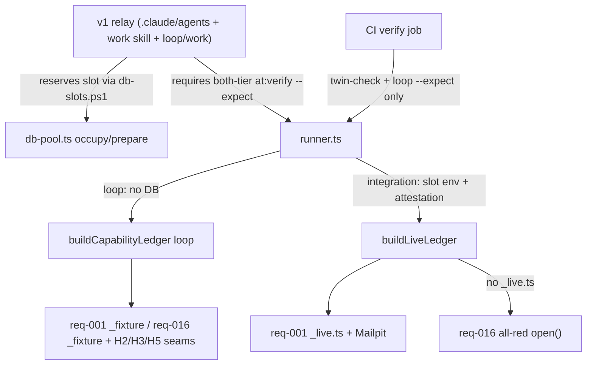

### Overview

This repository runs product work through two coupled systems: a **v1 relay ceremony** (a coordinator, a conductor, judges, and executors defined under `.claude/agents/` and `.claude/skills/work/`, sequenced by `loop/work/*.ps1`) and an **acceptance-test harness** (`tests/at/harness/`, driven by `bun run at:verify`). The ceremony exists to move a Linear item from plan to merge with external review gates; the harness exists to prove two requirements, `req-001` (signup/signin, 37 P0 ids) and `req-016` (notifications, 12 P0 ids), at two tiers with an exact-match `--expect` contract. CI (`.github/workflows/ci.yml`) only runs the **loop tier with `--expect`** plus typecheck, selftest, and bijection checks. It never touches a database.

The parking task is possible because the dependency arrows point one way: ceremony depends on the harness (executors and merge rulings call `at:verify --tier loop|integration --expect`), the harness's integration path depends on the slot pool (`db-pool.ts`, `attestation.ts`, `live-email.ts`), and the suites depend only on a narrow seam of the harness. Loop greens touch no slot code at all, so the slot machinery, six of seven v1 agent types, most `loop/work` scripts, and the CI twin-guard step can go while loop stays green. Integration `req-001` green against the single local `44321` stack is the one path that needs surgery, for three concrete reasons below.

### Key Concepts

- **Tiers.** `AT_TIER=loop` means no database: `ControlledClock`, in-memory fixture worlds, email sim. `AT_TIER=integration` means a live Supabase stack plus Mailpit, a real clock with no `advance`, and per-method live backing. `drill`/`--wired` always refuse (exit 3). `registry.ts` has no tier default; the runner injects `AT_TIER` into the vitest child.
- **Bijection + `--expect`.** `check.ts:inspectBijection()` requires the P0 ids in `.taskmaster/docs/acceptance/at-req-0NN.md` to equal exactly the `atTest('AT-...')` call sites in `tests/at/suites/req-0NN/*.test.ts`. `expected.ts:loadTierExpectation()` then requires the manifest in `tests/at/expected/req-0NN.json` to match that same P0 set, and the run's greens/reds to match the manifest exactly. A declared red that goes green fails.
- **Red kinds.** `pending/sut-missing` (thrown as `AtPending` from `_pending.ts`, e.g. unlanded leaves) vs `capability-pending` (thrown as `CapabilityPending` from `capabilities.ts`, naming the missing ledger entry, e.g. `sut.accounts.registerWithGithub`, `fixtures.worlds`, `H3 static provider scan`).
- **Slot pool.** `db-pool.ts:occupy()/prepare()/stackEnv()` manages standing stacks `ai4good-slot-N` with ports `repo port + N*1000` (slot 1 API = 45321). It refuses the personal `44320-44329` block (`PERSONAL_PORT_LOW/HIGH`, `personalBlockProblems`, `stackEnv`, `withSlotSql`). It forces `jwt_expiry = 120` (`SLOT_JWT_EXPIRY_SECONDS`), resets the slot DB every run, and mints a nonce into `at_runtime.slot_attestation` that the child reads back to earn the `slot` brand and `real` capabilities.
- **Ledger.** `index.ts:buildCapabilityLedger()` builds the `AtHarness` per `open()`. Loop wires fixture + sim seams; above loop it attests first, then builds a real clock and live mail catcher, then calls `suites/req-0NN/_live.ts` if it exists. Only `req-001` has `_live.ts`. `h.static` is always `pendingCapability('H3 static provider scan')`.

### How It Works

**`at:verify` end to end** (`tests/at/harness/runner.ts:main()`): parse `req-0NN --tier`, refuse `--wired`, check the suite directory exists, run bijection preflight (exit 2 on mismatch, no tests), run `--expect` manifest preflight (exit 2, no lock/Docker/reset). Then dispatch: `loop` spawns vitest with an empty `stackEnv`; `integration` calls `occupy()` then `prepare()` then prints `evidence()` and builds the child env from `slotStackEnv()` (only `AT_SUPABASE_URL/DB_URL/ANON_KEY/SERVICE_ROLE_KEY/MAIL_URL` plus `AT_SLOT_ATTESTATION`); `drill` refuses. Vitest runs `suites/req-0NN/` with `--reporter=json`, `registry.ts:atTest` registers one `it` per AT id plus a JSONL row, `openWorld()` builds a fresh harness and tears it down per id, and the runner grades reported rows against P0 ids and the manifest.

**Slot occupy/prepare** is the only production caller (`runner.ts:1332-1369`). Without `AT_DB_SLOT`, `occupy()` derives the item from the git branch (`itemFromBranch`) and demands the reservation file that `loop/work/db-slots.ps1:Reserve-DbSlot` wrote; no reservation means refuse with no fallback to a free slot. With `AT_DB_SLOT=N` it skips admission but still enforces ownership and takes the `at-verify-ai4good-slot-N-0.lock` claim. `prepare()` mirrors the tree's `supabase/` into the slot dir, overlays identity (`project_id=ai4good-slot-N`, shifted ports, `jwt_expiry=120`), runs the personal-block and path-closure guards, restarts the stack if the config hash moved, proves the target via `supabase status -o json` plus container-name checks, waits, resets, re-waits, proves migrations replayed, and writes the attestation nonce. Every integration run therefore resets its slot.

**Inside vitest**, `chooseTierBody` picks the `integration`, `loop`, or `default` procedure per id. Loop `req-001` bodies drive a Map-backed fixture over shipped `_shared` modules and only touch `h.clock.advance` (AT-001.12/13); loop `req-016` bodies drive sentinels (`a-emitter` AT-016.01 plants, never scans), faults (`processRestart`, `faults.at(...,'crash')`), clock freeze/advance, config overrides, and the email-sim force outcomes, with pair-counting oracles in suite-local `_oracles.ts`, not the H4 judge. Integration `req-001` bodies in `_integration.ts` call the live adapter from `_live.ts` (fetch to `${apiUrl}/auth/v1|functions/v1`, `Bun.SQL` operator reads, Mailpit link polling); unbacked methods throw `CapabilityPending` with the exact names the manifest declares. Integration `req-016` has no `_live.ts`, so `buildLiveLedger` falls back to the loop fixture with stand-in worlds/sut and every id dies at `open()` naming `fixtures.worlds, sut.notifications`, which is what `req-016.json` declares.

**The v1 ceremony around it:** founder types `/work`, the coordinator runs `twin-check.ps1` (twins `orchestrator.md`/`orchestrator-opus.md` must match modulo frontmatter plus two opus paragraphs), claims the leaf, reserves a slot, spawns a worktree-isolated `conductor`, which sequences plan, Gate-1 review, draft `executor`, Gate-2 reviews, fix `executor` (both-tier `at:verify --expect` on the reserved slot), audit panel, merge sitting on opus, and mechanical merge. CI mirrors a slice of this: twin guard, prose fast lane, `typecheck`, `at:selftest` (all of `harness/**/*.selftest.ts`), `at:check` per suite, `at:verify --tier loop --expect` per manifest, ownership and reference guards. The v2 path (`/controller` + poteto-mode) already runs beside it and keeps only `mechanical`.

**What depends on what for the parking plan:** loop greens depend on `runner/check/expected/registry/index (loop branch)/contracts/clock/fixtures/guards/sentinels/faults/vendors/config/atconfig` plus the two suites' `_bind/_contract/_fixture/test` files and manifests. Nothing in that set imports `db-pool.ts`, and `AT_DB_SLOT` is read only on the integration branch (`runner.ts:1338`, `db-pool.ts:occupy`). So parking `db-pool.ts`, the six relay agent types (all but `mechanical`), `twin-check`'s CI step, `stamp-hook/banner/watch-items/attribution-report*/ci-status/context-gauge/sheet-check/render-mermaid`, and freezing the harness (no new sentinels/faults/oracles/worlds; new ATs only via existing `atTest` + adapters or via `harness/*.selftest.ts` shipped-module probes) keeps `req-001` (21 green + 16 `sut-missing` reds) and `req-016` (11 green + AT-016.01 `H3 static provider scan` red) green at loop. The H4 judge (`oracles.ts`, `record-oracles.ts`, empty `recordings/`) already has zero suite callers, so it parks silently; `h.static` pending must stay or AT-016.01's declared red breaks.

Three integration-only inversions must be fixed to keep `req-001` green (16 green + 5 `capability-pending` + 16 `sut-missing`) against `44321`: (1) `stackEnv()` and `personalBlockProblems` currently throw inside `44320-44329`, the exact target block (`project_id poancmeitlmxejofwzuu`, api 44321, db 44322, mail 44324); (2) `SLOT_JWT_EXPIRY_MS=120_000` in `_integration.ts` plus 135s/150s waits and a 240s timeout assume the slot generator's 120s pin, while `supabase/config.toml` says 3600, so AT-001.12/13 hang or false-red unless the stack is pinned to 120s or the waits are rewritten; (3) isolation today is `prepare()`'s reset plus namespaced emails (`_live.ts` teardown only closes SQL), and `createLiveEmail` demands the `slot` attestation brand, so the runner needs a non-slot reset/wipe story and a non-slot way to build `LiveVendors` (or drops the brand requirement). Note `AT_DB_SLOT=1` today selects pool slot 1 (API 45321), not `44321`; the target state redefines or removes that variable.

### Where Things Live

- Runner/contract: `tests/at/harness/runner.ts`, `check.ts`, `expected.ts`, `registry.ts`, `index.ts`, `capabilities.ts`, `contracts.ts`, `suite-adapters.ts`, `config.ts`, `atconfig.ts`, `typecheck.ts`; manifests `tests/at/expected/req-001.json`, `req-016.json`; selftests `tests/at/harness/*.selftest.ts`.
- Slot path to park: `tests/at/harness/db-pool.ts`, slot-shaped parts of `attestation.ts` + `live-email.ts`, `loop/work/db-slots.ps1`, `AT_DB_SLOT` in `.claude/settings.json`.
- Ceremony to park: `.claude/agents/{conductor,orchestrator,orchestrator-opus,executor,reviewer-runner,distiller}.md` (keep `mechanical.md`), `.claude/skills/work/` prose, `loop/work/{twin-check,stamp-hook,banner,watch-items,attribution-report*,ci-status,context-gauge,sheet-check,render-mermaid,pstack-models.expected}.ps1/md`; CI twin-guard block in `.github/workflows/ci.yml` (keep typecheck/selftest/check/loop-verify/ownership/reference). Live hooks `statusline.ps1`/`guard-branch-switch.ps1`/`work-lib.ps1` stay until settings paths change.
- Suites: `tests/at/suites/req-001/{a,b,c,d,e,f,test files,_bind,_contract,_fixture,_integration,_live,_pending,_source-scan}.ts` and `tests/at/suites/req-016/{a,b,c,d,test files,_bind,_contract,_fixture,_oracles,taxonomy}.ts`; acceptance pins `.taskmaster/docs/acceptance/at-req-0NN.md`.

### Gotchas

- Every id runs at both tiers; there are no integration-only files. "Only at integration" means the integration map entry in `_integration.ts`, invisible to `at:check` (it only greps `atTest(` in `*.test.ts`).
- Loop `req-016` green is stand-in green: `_fixture.ts` is derived from `taxonomy.ts` by construction, said so in its own header.
- `AT-016.01`'s loop red is the hardcoded `static` pending, not broken sentinels/faults; those work.
- A plain `it()` inside a suite file or a `harness/*.selftest.ts` against `127.0.0.1:44321` does not satisfy bijection or `--expect` unless it is an `atTest` in `suites/req-0NN/*.test.ts` with a manifest entry.
- `stamp-hook.ps1`/`banner.ps1` are already unwired (live SessionStart is `session-start-banner.sh`; settings hook paths are absolute to the main checkout, so worktree parks are invisible until merge). `twin-check.ps1` still has non-CI callers (`/work` preflight, `run-drills.ps1`), and `/controller` still cites `work-lib.ps1`, materialization prose, and `db-pool.ts setup`, so those callers need updating alongside the park.
