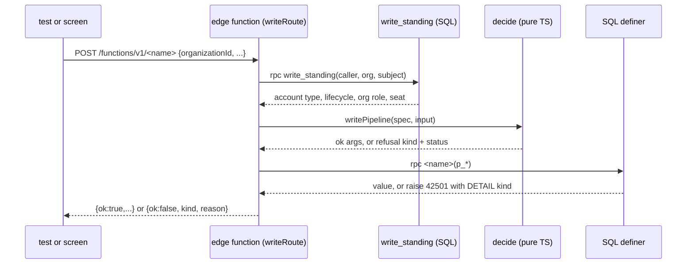

# How the tree supports the project need intake (REQ-003)

Synthesis of three explorer reports. Contradictions were checked against the code. Every path is relative to the worktree root.

## Overview

The ai4good tree has no intake surface yet. There is no need table, no draft state, no urgency column, no upload path, no snapshot table and no lifecycle engine. What the tree has is the frame every product write and every acceptance suite must fit. That frame is strict, it is enforced by static scans that run in CI, and it decides most of the design before a line of intake code exists.

The frame has four parts. First, the write boundary. Every product write is one edge function built as `Deno.serve(writeRoute(...))`, registered in `WRITE_ROUTES`, gated by `write_standing`, judged by a pure `decide` function, and executed by one SECURITY DEFINER SQL function that calls `assert_account_active`. Second, the tenant posture. Every new `public` table is revoked from every client role, has row level security on, and is declared in `TENANT_CATALOG`. Third, the acceptance harness. A suite is a folder with a fixture adapter for the loop tier and a live adapter for the integration tier, thirteen `atTest` call sites, and a manifest that declares which ids are green and which are red, with the exact shape of each red. Fourth, the NGO profile suite's static oracles. They scan the whole product tree for storage calls, document columns, and publish or lifecycle state on anything named like a project. A REQ-003 build that adds those things under ordinary names turns REQ-002 red in the same CI run.

## Key Concepts

- **Write route.** One edge function folder under `supabase/functions/<name>/`, built with `writeRoute` from `supabase/functions/_shared/edge.ts` lines 336 to 380. It resolves the JWT caller, reads `write_standing`, runs `writePipeline`, then calls one RPC as service role.
- **`WRITE_ROUTES`.** The inventory in `supabase/functions/_shared/write-routes.ts` lines 23 to 70. A row is either `edge` with an `rpc` name or `stand-in` with a reason. `writeRoute` refuses to serve a name that is not an edge row (edge.ts lines 339 to 341).
- **`write_standing`.** The SQL function at `supabase/migrations/20260908120000_account_lifecycle_audit_and_contact_transfer.sql` lines 94 to 127. It returns account type, lifecycle, the caller's role in the target organisation, whether the organisation exists, the seat holder, and an optional subject account. It knows nothing about a project or a need.
- **`writeGateDecision`.** `write-routes.ts` lines 290 to 307. It refuses an unreadable standing, a deactivated account, a missing account, and a wrong account type. It does not check email verification, organisation role, or the platform acknowledgment.
- **`orgAdminActionAllowed`.** `supabase/functions/_shared/memberships.ts` lines 96 to 114. The admin gate. Refusal kinds `not-a-member` and `not-an-admin`.
- **`assert_account_active`.** The SQL backstop at the same migration, lines 69 to 92. The policy scan reports `definer-no-write-gate` for any non-stable SECURITY DEFINER function that `service_role` may execute and that does not call it (`tests/at/suites/req-001/_policy-scan.ts` lines 644 to 651).
- **`TENANT_CATALOG`.** `tests/at/suites/req-001/_policy-scan.ts` lines 21 to 37. A hand-written map of every `public` table to `tenant-isolated` or `unreachable-by-client-roles`. An undeclared table fails AT-001.21 at loop, which CI runs.
- **`public.projects`.** `supabase/migrations/20260811130000_single_seat_org_and_single_developer_projects.sql` lines 57 to 66. Columns `id`, `org_id`, `name`, `assigned_volunteer_id`, `created_at`. The table comment says product project creation is not landed and names `has_platform_acknowledgment` as the hook creation must call.
- **`public.audit_events`.** Append-only. UPDATE, DELETE and TRUNCATE raise (same migration, lines 49 to 67). The sole writer is `append_audit_event`, latest definition at `supabase/migrations/20260914120000_org_vetting.sql` lines 14 to 57. Execute is revoked from `public` and never granted to `service_role`, so only an owner definer may call it.
- **Discovery allowance.** `public.discovery_spend` per organisation per UTC day. Remaining is `granted - spent`, never stored. Grants are 10 unverified and 30 vetted (`supabase/functions/_shared/discovery-allowance.ts` lines 17 to 20). The read route is `discovery-allowance` with `action: 'read'`.
- **`atTest` and `bindSuite`.** `tests/at/harness/registry.ts` lines 861 to 969. The id's requirement must match the binding (lines 802 to 817). A per-tier body map must cover every tier or supply `default` (lines 740 to 757).
- **`CapabilityPending`.** The one red shape the NGO profile suite uses. `tests/at/suites/req-002/_pending.ts` lines 21 to 41 shows `AWAITED` and `awaiting()`.
- **`--expect` manifest.** `tests/at/expected/req-0NN.json`. Both tiers declared, ids in exact bijection with the P0 set, each red an object with a kind (`tests/at/harness/expected.ts` lines 246 to 268 and 286 to 296).
- **Static source arms.** Underscore files in a suite that scan `supabase/functions`, `supabase/migrations` and `src` (`tests/at/suites/req-002/_source-scan.ts` lines 31 and 114 to 132). They throw when they cannot read, and an empty list is the assertion.

## How It Works

### 1. A write today, the path a need write must copy

The canonical example is `supabase/functions/set-organization-profile/index.ts`. The steps, in order.

1. Boot. `writeRoute` throws if the name is not an edge row of `WRITE_ROUTES` (edge.ts lines 339 to 341).
2. The platform checks the JWT because `config.toml` states `verify_jwt = true` for the function (`supabase/config.toml` lines 491 to 516).
3. `resolveCaller` presents the bearer to `/auth/v1/user`. No caller is 401.
4. `spec.target` reads `body.organizationId` (`write-routes.ts` lines 269 to 271). A malformed UUID is 400 (edge.ts lines 359 to 363).
5. `loadWriteStanding` calls `write_standing` as service role (edge.ts lines 320 to 332).
6. `writePipeline` runs `writeGateDecision` and then `spec.decide` (`write-routes.ts` lines 309 to 319).
7. `decide` calls `orgAdminActionAllowed(input.standing.orgRole)` and validates fields (`memberships.ts` lines 151 to 184).
8. `callDatabaseFunction` posts to `/rest/v1/rpc/<rpc>` as service role (edge.ts lines 283 to 317).
9. The SQL definer calls `assert_account_active`, locks the row, re-reads membership, and raises with `errcode = '42501'` and `detail = '<kind>'` on refusal.
10. A five-character SQLSTATE maps to 409 and the `DETAIL` text is parsed through `parseWriteRefusalKind` (`write-routes.ts` lines 100 to 104 and 232 to 234). Anything else is 502.

A new refusal kind such as a missing description must be added to `WRITE_REFUSAL_KINDS` (`write-routes.ts` lines 74 to 96), or the route answers `refused`.

### 2. A read today, and how intake fields become visible

Reads do not use `writeRoute`. `project-workspace/index.ts` uses `callerReads` in edge.ts lines 398 to 423, which GETs `/rest/v1/projects?...&select=id,name,org_id,assigned_volunteer_id` with the caller's own JWT. Row level security filters. `organization-dashboard` does the same for `projectsOf`. Any intake field on a project row is invisible until those `select=` lists grow.

`callerReads`, `publicProjectReads` and `callDatabaseFunction` are the only three function bodies in edge.ts that may reach the database (`tests/at/suites/req-001/_write-route-scan.ts` line 30 and lines 168 to 176). A new `_shared` module that names `/rest/v1/` fails `shared-module-reaches-database` (lines 178 to 184). A read route's `index.ts` must not match `REACHES_DATABASE` (line 23 to 24) or it is reported as an unregistered write route (lines 196 to 201).

`public-project` is anonymous (`config.toml` lines 524 to 525). `projectIsPublic` returns true for every row (`supabase/functions/_shared/public-project.ts` lines 18 to 25). A draft stored as a `projects` row is world-readable by id.

### 3. The tenant posture a new table joins

`scanTenantMigrations` in `_policy-scan.ts` reads every migration. For a new table it expects, in the same migration: `create table public.<t>`, a `revoke all ... from anon, authenticated, service_role`, `enable row level security` for an isolated table, `grant select to authenticated` only for an isolated table, at least one `create policy` whose USING names `auth.uid()` or a `public.viewer_*` helper, and a row in `TENANT_CATALOG`. The live check at integration walks `pg_class` both ways. There are exactly three viewer helpers, `viewer_is_org_member`, `viewer_is_platform_admin`, `viewer_is_volunteer`; a fourth fails the live catalog pin (`tests/at/suites/req-001/_integration.ts` line 167). `projects` today grants select to `authenticated` and has three select policies (`supabase/migrations/20260906120000_tenant_read_posture_and_org_member_policies.sql` lines 56 and 103).

### 4. The audit table and the snapshot

`audit_events` refuses every mutation by trigger. A raw-intake snapshot written as a row there is immutable by construction and retrievable by the operator through SQL, since the table is unreachable by client roles. The cost is two migrations. PostgreSQL cannot add an enum value and use it in one transaction, so a new `audit_event_kind` value gets its own file, as `supabase/migrations/20260912110000_audit_event_kind_escalation_contact.sql` line 4 and `20260914110000_audit_event_kind_org_vetting.sql` line 4 do. `append_audit_event` labels the actor `account_type:id` when the actor has an account row, else `operator` (`20260914120000_org_vetting.sql` lines 31 to 41). A definer that updates or deletes `audit_events` fails `audit-mutation-in-definer` (`_policy-scan.ts` lines 652 to 657).

A separate snapshot table is the other option. It must join the posture above and forbid updates itself.

### 5. Capacity, verification, and the admin role

"With Discovery capacity" means remaining credits greater than zero on `discovery_spend`. A fresh verified NGO with no spend row reads remaining equal to the unverified grant. The test reads it through the REQ-002 adapter's `readAllowance`; nothing in this run rebuilds the ledger.

Email verification is not a write pipeline gate. Only the debit arm of `public.discovery_allowance` reads `auth.users.email_confirmed_at` (`supabase/migrations/20260916120000_discovery_allowance.sql` lines 149 to 153). The `verification.ts` module says it has no deployed caller (`supabase/functions/_shared/verification.ts` lines 8 to 24). A submission gate on verification is REQ-005.5's. AT-003.03 needs a caller who is verified and has capacity, and a refusal whose kind names the description alone.

The admin gate is `orgAdminActionAllowed` on `standing.orgRole`. There is one seat per organisation (`org_memberships_one_seat_per_org_idx`, `20260811130000_...sql` lines 41 to 42). A "member without the admin role" is that sole seat with its role set to `member` by the operator, as `_live.ts` line 362 does with an `UPDATE`. A volunteer is refused earlier by `writeGateDecision` as `not-an-ngo-account`. A visitor is 401.

`has_platform_acknowledgment` exists, is granted to `service_role`, and no writer calls it (`20260808120000_...sql` lines 93 to 109 and 376). The need creation definer is where the auth suite expects it to fire.

### 6. The acceptance suite, compile time to run time

1. Add `'req-003': typeof import('../suites/req-003/_fixture.ts')` to `AdapterModules` in `tests/at/harness/suite-adapters.ts` lines 108 to 112.
2. `_fixture.ts` exports `requirement = 'req-003' as const` and `createFixtureAdapter({ clock, worlds, config, vendors })`. The loader checks the literal at run time (`tests/at/harness/index.ts` lines 93 to 101).
3. `_live.ts` exports the same literal and `createLiveAdapter({ stack })` (index.ts line 241). Without this file every `open()` at integration throws `CapabilityPending(['fixtures.worlds', 'sut.<key>'])` before construction (registry.ts lines 773 to 776).
4. `_bind.ts` calls `bindSuite({ requirement: 'req-003', sut: '<key>' })` as `tests/at/suites/req-002/_bind.ts` lines 22 to 28 does.
5. Each `*.test.ts` file calls `atTest('AT-003.NN', title, body)` with a single body or a per-tier map.
6. `at:check` reads P0 ids from `.taskmaster/docs/acceptance/at-req-003.md` (`tests/at/harness/check.ts` lines 49 to 60) and call sites from `*.test.ts` files only (lines 72 to 83). The P0 set is 01, 02, 03, 04, 17, 05, 07, 09, 10, 11, 12, 14, 16.
7. `tests/at/expected/req-003.json` has `"requirement": "003"` (expected.ts lines 212 to 215), both tiers, and a red shaped `{ "kind": "capability-pending", "capabilities": ["..."] }`. The whole first line is rebuilt and compared with an em dash (expected.ts lines 286 to 296).

The loop fixture composes the REQ-002 fixture the way REQ-002 composes REQ-001 (`tests/at/suites/req-002/_fixture.ts` line 48). Provisioning, membership role, and allowance come from the inner adapter. Intake members go on a new SUT key. Product writes at loop run the same `writePipeline` spec over Maps (req-002 `_fixture.ts` lines 90 to 100 show the spec shape). At integration the live adapter posts with `functionPost` (`tests/at/harness/live-stack.ts` lines 159 to 168) and reads rows back with `sqlClient`.

An id that waits on another surface is written as `atTest('AT-003.NN', title, awaiting(AWAITED.x))`, or as a per-tier map with `integration: awaiting(...)` and a green `default` body, as AT-002.05 does (`tests/at/suites/req-002/b-allowance.test.ts` lines 429 to 455). The manifest lists the same capability names in the same order.

### 7. The scans that a REQ-003 build can trip

Three oracle families run at CI on every push, through `at:selftest` and the REQ-001, REQ-002 and REQ-016 loop suites.

**Write boundary** (`_write-route-scan.ts`). Every edge row needs a folder, one `Deno.serve(writeRoute(` (lines 214 to 219), no `callDatabaseFunction`, `/rest/v1/`, `createClient`, `.rpc(` or the service key in the index (lines 230 to 238), and a `[functions.<name>]` block stating `verify_jwt = true` (lines 240 to 251). A stand-in row must appear in `tests/at/suites/req-001/_fixture.ts` as `writeGateDecision('<name>'` or `name: '<name>'` (lines 254 to 267 and 330).

**Document content and storage** (`tests/at/suites/req-002/_source-documents.ts`). Any `.ts` or `.tsx` under the product roots that calls `storage.from(`, `createBucket(` or `createSignedUrl(` fails (line 53). Any column typed `bytea` fails (line 23). Any column named `attachment`, `file_bytes`, `file_data`, `storage_key`, `storage_path`, `object_key`, `object_path`, `download_url`, `download_path` and the rest of the list at lines 25 to 43 fails. Any route folder, inventory key, RPC name, file path or UI route matching `upload-document`, `get-attachment`, `attachment-download`, `document-upload` and the others at lines 50 to 51 fails. Answering `application/pdf` or `application/octet-stream` fails (line 54).

**Publish and lifecycle absence** (`tests/at/suites/req-002/_source-absences.ts`). A name fails when its tokens hold `project` or `projects` together with `lifecycle`, `state` or `status` (lines 382 to 388). This applies to route folders, inventory keys, RPC names, `_shared` module file names, UI routes, SQL function names and SQL type names (lines 519 to 579). A column named `lifecycle`, `state` or `status` fails on any table whose name is `projects` or holds the token `project` (lines 392 to 401), in `create table` and in `alter table ... add column` alike (lines 541 to 565). A trigger on `projects` that mentions `lifecycle` fails (lines 487 to 494).

**Sole notification writer** (`tests/at/suites/req-016/_source-scan.ts`). A product file that contains `deliver(` as a call is a send path (line 50). A file outside the four emitter files that sends is reported as `undeclared:<path>` (lines 110 to 114). An insert into a `notification_*` table outside `emit_notification` fails.

**Trust wording** (`_source-absences.ts` lines 84 to 136). A quoted string that says an organisation or NGO is "verified" without naming email, a JWT or a token fails. Refusal sentences about an unverified admin must say "email".

## Where Things Live

| What | Path |
|---|---|
| Write inventory and pipeline | `supabase/functions/_shared/write-routes.ts` |
| Route constructors, `callerReads` | `supabase/functions/_shared/edge.ts` |
| Admin decision | `supabase/functions/_shared/memberships.ts` |
| Allowance decision and grants | `supabase/functions/_shared/discovery-allowance.ts` |
| Canonical NGO admin write | `supabase/functions/set-organization-profile/index.ts` |
| Project reads | `supabase/functions/project-workspace/index.ts`, `public-project/index.ts`, `_shared/tenant-reads.ts`, `_shared/public-project.ts` |
| Notification emitter and component map | `supabase/functions/_shared/notifications.ts` lines 60 to 70 |
| `projects`, single seat | `supabase/migrations/20260811130000_single_seat_org_and_single_developer_projects.sql` |
| `write_standing`, `assert_account_active`, `audit_events` | `supabase/migrations/20260908120000_account_lifecycle_audit_and_contact_transfer.sql` |
| Latest `append_audit_event` | `supabase/migrations/20260914120000_org_vetting.sql` lines 14 to 57 |
| Allowance ledger SQL | `supabase/migrations/20260916120000_discovery_allowance.sql` |
| Function JWT blocks, storage section | `supabase/config.toml` lines 125 to 135 and 491 to 525 |
| Tenant catalog and definer scan | `tests/at/suites/req-001/_policy-scan.ts` |
| Write boundary scan | `tests/at/suites/req-001/_write-route-scan.ts` |
| REQ-002 suite, the template | `tests/at/suites/req-002/` (`_bind.ts`, `_contract.ts`, `_fixture.ts`, `_live.ts`, `_pending.ts`, `_source-*.ts`, `a-` to `f-` test files) |
| REQ-002 oracles that scan the whole tree | `tests/at/suites/req-002/_source-documents.ts`, `_source-absences.ts` |
| Harness registry, adapters map, expectation loader | `tests/at/harness/registry.ts`, `suite-adapters.ts`, `expected.ts`, `check.ts`, `index.ts` |
| Config pins | `tests/at/harness/atconfig.ts`, `config.ts` lines 31 to 37 |
| Manifest precedent | `tests/at/expected/req-002.json`, `tests/at/expected/README.md` |
| Disclosure copy, as design HTML only | `design/screens/reference-files.html` line 23 (base) and lines 28 to 35 (Tier-2 modal) |
| Intake mock, urgency keys | `design/screens/project-intake.html` line 28 (`soon`, `this-quarter`, `no-deadline`) |
| Live stack driver | `.claude/skills/verify-ai4good/SKILL.md`, `tests/at/harness/live-stack.ts` |

## Gotchas

1. **`projects` is a seat, not a need.** The table comment says creation is not landed. Storing intake on it makes every draft public by id through `public-project`, and any `state` or `status` column on it fails the REQ-002 absence oracle and `at:selftest`. A separate table whose name does not hold the token `project` can carry a state column.
2. **`notLanded` is undeclarable.** Adapter members that throw a plain `Error` (`req-002/_fixture.ts` lines 119 to 123, `_live.ts` lines 81 to 85) cannot be declared in the manifest. A red must be a `CapabilityPending` thrown from the test body through `awaiting()`.
3. **Loop green plus integration red is normal.** `tests/at/expected/README.md` lines 155 to 161 says so. The first integration declaration is authored from analysis, never copied from a run (lines 37 to 45).
4. **CI runs the loop tier only.** The integration gate is local. A local integration green is the item's evidence, not CI's.
5. **The em dash.** `CAPABILITY PENDING —` is U+2014. A hyphen in the manifest never matches.
6. **The `requirement` field is `"003"`.** Not `req-003`.
7. **`h.config.get` sees only `CONFIG_KEYS`.** The file caps in `AT_CONFIG` are not keys (`tests/at/harness/config.ts` lines 31 to 37). Do not invent a `req-003.*` key, and do not pin REQ-032 numbers here.
8. **Grants 10 and 30 are pins.** Read them through `createConfigRegistry()` or the REQ-002 adapter. Never write the numerals in a test body.
9. **Stand-in needle.** A stand-in row in `WRITE_ROUTES` must be named in REQ-001's `_fixture.ts`, not in REQ-003's.
10. **A per-tier map with a hole is refused at registration.** Supply every tier or `default`.
11. **Single-body form is typed at loop.** Clock commands compile but do nothing at integration. Autosave is write-then-read and needs no clock.
12. **Unverified NGO with a live session** exists only through the REQ-002 trick of clearing `email_confirmed_at` after completion. AT-003.03 wants the opposite, a verified admin, so no trick is needed.
13. **`deliver(` is a send path.** Do not name an upload helper `deliver`. Do not create `supabase/functions/_shared/lifecycle.ts` or a `lifecycle/` folder; those prefixes are reserved for a declared non-sender component.
14. **`create-organization/index.ts` lines 12 to 13 are stale.** They say no project table exists. The table exists; the writer does not.
15. **`src/lib/api/example.functions.ts`** tells authors to use `createServerFn` instead of edge functions. Do not follow it. Nothing under `src/` changes in this run.
16. **Integration runs reset the stack.** A 502 during reset is the environment. Never paste `bun run db:start` output.
17. **Design mocks still show a cause-tag picker** (`design/screens/project-intake.html` line 27). The PRD and AT-003.02 and AT-003.17 win. No cause field at intake.
18. **`architecture-notes#req-003`** in the manifest's sources line matches no file in this tree.

## Constraints for the design

1. Every product write is one `Deno.serve(writeRoute({ name, decide, render }))` in `supabase/functions/<name>/index.ts`, and `name` is an edge row of `WRITE_ROUTES`. `supabase/functions/_shared/edge.ts` lines 336 to 341; `tests/at/suites/req-001/_write-route-scan.ts` lines 196 to 219.
2. Every write function has `[functions.<name>]` with `verify_jwt = true` in `supabase/config.toml`. `_write-route-scan.ts` lines 240 to 251.
3. A route's `index.ts` and any helper beside it never name `callDatabaseFunction`, `/rest/v1/`, `createClient`, `.rpc(` or the service key. `_write-route-scan.ts` lines 186 to 193 and 230 to 238.
4. Only `callDatabaseFunction`, `publicProjectReads` and `callerReads` inside `edge.ts` may reach the database. A new read extends `callerReads` or a sibling inside edge.ts, never a new `_shared` module. `_write-route-scan.ts` lines 30 and 168 to 184.
5. The organisation a write targets is `body.organizationId`. `write_standing` carries no project id, so the SQL definer re-checks that the need belongs to the target organisation under a row lock. `supabase/functions/_shared/write-routes.ts` lines 269 to 271; `supabase/migrations/20260908120000_...sql` lines 94 to 127.
6. Every new refusal kind is added to `WRITE_REFUSAL_KINDS` so the SQL `DETAIL` round-trips as a kind. `write-routes.ts` lines 74 to 104.
7. Every new SECURITY DEFINER write function sets `search_path = ''`, calls `public.assert_account_active`, revokes execute from `public`, and grants execute to `service_role` only. `tests/at/suites/req-001/_policy-scan.ts` lines 43 to 47 and 644 to 651.
8. The admin gate is `orgAdminActionAllowed(standing.orgRole)` in `decide`, and the definer raises `not-a-member` or `not-an-admin` again in SQL. `supabase/functions/_shared/memberships.ts` lines 96 to 114 and 151 to 161.
9. Every new `public` table, in the same migration: `revoke all` from `anon, authenticated, service_role`, `enable row level security`, for an isolated table `grant select to authenticated` and at least one policy whose USING names `auth.uid()` or a `public.viewer_*` helper, and a row in `TENANT_CATALOG`. `_policy-scan.ts` lines 21 to 37 and 256 to 569.
10. No fourth `viewer_*` helper. `tests/at/suites/req-001/_integration.ts` line 167.
11. No column named `lifecycle`, `state` or `status` on `projects` or on any table whose name holds the token `project`. No route folder, inventory key, RPC, `_shared` module, SQL function or SQL type whose name holds `project` with `lifecycle`, `state` or `status`, or the tokens `publish`, `triage`, `scoped`, or `visibility` with `project`. `tests/at/suites/req-002/_source-absences.ts` lines 360 to 401 and 519 to 579.
12. No `storage.from(`, `createBucket(` or `createSignedUrl(` in product TypeScript. No `bytea` column. No column named from the list at `_source-documents.ts` lines 25 to 43. No route, RPC or file named like a document upload or download. `tests/at/suites/req-002/_source-documents.ts` lines 23 to 54 and 70 to 131.
13. No `deliver(` call, no provider import, no provider credential, and no insert into a `notification_*` table outside `emit_notification`. No taxonomy row. `tests/at/suites/req-016/_source-scan.ts` lines 49 to 67; brief fact 4.
14. `emit_notification` and `append_audit_event` are callable by an owner definer only, never from an edge function. `supabase/migrations/20260914120000_org_vetting.sql` line 57; `20260913120000_notification_taxonomy_and_outbox.sql` lines 191 to 240.
15. A new `audit_event_kind` value lives in its own migration file, before the definer that writes it. `supabase/migrations/20260912110000_audit_event_kind_escalation_contact.sql` line 4; `20260914110000_audit_event_kind_org_vetting.sql` line 4.
16. No definer updates or deletes `audit_events`. `_policy-scan.ts` lines 652 to 657.
17. A quoted string that calls an organisation or NGO "verified" without the word email, jwt or token fails the trust oracle. `_source-absences.ts` lines 46 to 56 and 98 to 105.
18. `has_platform_acknowledgment(p_account_id)` is the hook the need creation definer calls. `supabase/migrations/20260808120000_...sql` lines 93 to 109 and 376.
19. Discovery capacity is a read of `discovery_spend` through the REQ-002 adapter's `readAllowance` or the `discovery-allowance` route with `action: 'read'`. The ledger is not rebuilt and the grants are not restated. `supabase/functions/_shared/discovery-allowance.ts` lines 17 to 20; `tests/at/harness/config.ts` lines 31 to 37.
20. The suite registers in `AdapterModules`, exports `requirement = 'req-003' as const` from both `_fixture.ts` and `_live.ts`, and binds through `bindSuite`. `tests/at/harness/suite-adapters.ts` lines 108 to 112; `tests/at/harness/index.ts` lines 93 to 101 and 234 to 241.
21. Exactly thirteen `atTest` call sites in `*.test.ts` files, one per P0, none for 06, 08, 13, 15. `tests/at/harness/check.ts` lines 49 to 60 and 72 to 83.
22. `tests/at/expected/req-003.json` has `"requirement": "003"`, both tiers, exact bijection with the thirteen ids, and every red as `{ "kind": "capability-pending", "capabilities": [...] }` whose names match the `awaiting()` call in the same order. It is written before the first run. `tests/at/harness/expected.ts` lines 212 to 215, 246 to 268, 286 to 296; `tests/at/expected/README.md` lines 37 to 45.
23. A red is thrown from the test body through `awaiting()`. No body calls a `notLanded` adapter member. `tests/at/suites/req-002/_pending.ts` lines 37 to 41; `_fixture.ts` lines 119 to 123.
24. A per-tier body map covers `loop`, `integration` and `drill`, or supplies `default`. `tests/at/harness/registry.ts` lines 740 to 757.
25. `_contract.ts` uses type aliases only, and imports judgement types from shipped modules. `tests/at/suites/req-002/_contract.ts` lines 5 to 16.
26. A `_source-*.ts` arm throws when it cannot read, returns a problem list, and has a harness selftest that proves it can fail on injected text. `tests/at/suites/req-002/_source-scan.ts` lines 1 to 21; `tests/at/harness/req002-documents-oracles.selftest.ts`.
27. No new harness sentinel, fault, vendor sim, fixture world, or capability. `CLAUDE.md`, acceptance tests paragraph. `LIFECYCLE_STATES` in `tests/at/harness/fixtures.ts` is seed vocabulary, not a product engine.
28. Nothing under `src/`. The wiring leaf is not in this run. Brief, Units paragraph; `.github/workflows/ci.yml` ownership guard.
29. A stand-in row in `WRITE_ROUTES` is named in `tests/at/suites/req-001/_fixture.ts` or the scan reports `stand-in-not-gated`. `_write-route-scan.ts` lines 254 to 267 and 330.
30. `write_standing` grows no field without changing `parseWriteStanding`, which fails closed on any shape it does not know. `write-routes.ts` lines 150 to 191.

## Ids whose proof waits on another surface

The brief asks that an id whose full proof waits on a surface owned elsewhere be declared red by shape. Applying the REQ-002 precedent, loop proves the shipped decision and integration is red on the missing surface. My reading of the thirteen ids.

**Red at integration, certain.**

- **AT-003.07** (upload attaches to the draft). Waits on the REQ-032 upload primitive. The tree has no bucket (`supabase/config.toml` lines 130 to 135), no multipart helper in `live-stack.ts`, and the REQ-002 document oracle forbids storage calls and document columns under ordinary names. A JSON metadata attach can prove "attached" at loop over the shipped decision. At integration a file never leaves the test, so the criterion's "uploads a reference file" is not proven. Capability name of the shape `storage.reference-upload`.
- **AT-003.09** (disclosure shown when the upload surface renders). The disclosure copy is design HTML, not a shipped constant. The backend can serve the copy or a flag and loop can pin it. "Renders" is the wiring leaf's, so integration waits on a `ui.*` surface, as AT-002.05 waits on `ui.discovery-surface`.
- **AT-003.10** (Tier-2 hardened disclosure before any further upload). Waits on two surfaces: the classification event from REQ-004 D5.L1, stubbed by the operator, and the upload surface render, the wiring leaf's. Loop can prove that the served disclosure switches on a stubbed classification. Integration is red on the `ui.*` surface and the REQ-004 event.

**Red at integration unless the design lands a local transition.**

- **AT-003.11** (no file, submission starts Discovery) and **AT-003.12** (state moves `draft` to `discovery_in_progress`). The engine is REQ-005.5 D1.L1, and the manifest's cross edge says engine before submission integration. The brief tells the design to decide how to prove the transition until then. The tree permits a local state column on a need table that is not named like a project (constraint 11) and a pure transition helper. If the design lands that, both ids can be green at both tiers, with the engine's later arrival a "Not done here" line. If not, both are red on a name of the shape `lifecycle.transition-engine`. AT-003.11 depends on the same transition, so the two move together.

**Green at both tiers in this tree, in my reading.**

- AT-003.01, .02, .04. Capture and the admin gate need only the write frame and a read that returns the fields. "Renders on the draft" in .02 is a route read, as REQ-002's dashboard read is.
- AT-003.03. A verified admin with remaining credits greater than zero is provisionable at both tiers. The block must carry a description-only refusal kind.
- AT-003.05. Autosave is a data contract. Write, open a second session, read. No clock and no screen.
- AT-003.17. A negative read of an empty label set over a stub column or array. The producer's absence is the point.
- AT-003.14 and AT-003.16. The snapshot is this run's own surface. Append-only `audit_events` or a new immutable table gives immutability; operator SQL gives retrieval. "Later edits" are the same write route or operator SQL.

Open judgment for the design. AT-003.17 and AT-003.03 are green only if the design ships the stub column and the refusal kind. AT-003.14 and .16 turn on whether the snapshot is a row this run writes; they wait on nothing else.
