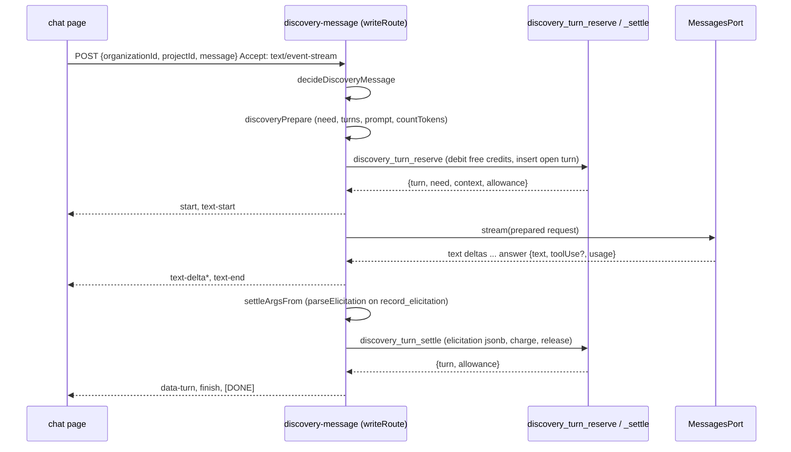

# How Discovery produces, stores, meters and streams a turn, and where the scope and cause labels attach

Synthesised from four explorer reports under `loop/items/AI4DEV-135/lanes/`. Where the reports overlapped or disagreed, I checked the code. Line numbers are from the tree at branch head `33e1cec`.

## Overview

Discovery is a chat between an NGO admin and Claude Opus. The goal is a technical scope for a software need that a non-technical person described. Today the subsystem does one thing end to end: it takes a user message, reserves the credits the turn could cost, calls the model, settles the real cost, and stores the turn. When the model decides the elicitation is complete it calls one tool, `record_elicitation`, and the parsed payload lands as a jsonb column on that turn. That elicitation is the only structured output that exists. Nothing stores a scope, nothing writes a cause label, and no guardrail or regeneration path exists.

The design that matters for this run is the reserve-then-act-then-settle ledger in `public.discovery_turns`. Every new artifact (a scope, a label set, a regeneration, an off-topic count) either rides on that ledger or lives beside it, and the ledger's constraints and its immutability trigger decide which. The second thing that matters is the seam to the model: one Anthropic port, one prompt builder, one tool, one parser, one first-`tool_use`-only answer folder. The scope output is a second tool and touches every one of those. The third is the acceptance harness: sixteen ids are already registered as placeholders under three pending names, and each unit moves its ids into a real test file and flips them green in `tests/at/expected/req-004.json` in the same commit.

## Key concepts

- **Turn.** One row of `public.discovery_turns`: the user message, the model reply, the metering numbers, and the optional `elicitation`. Statuses `open`, `settled`, `failed`, `abandoned`. One open turn per project (`discovery_turns_one_open_per_project`).
- **Reserve, act, settle.** SQL `discovery_turn_reserve` inserts the open row and debits free credits for the worst case. TypeScript calls the model. SQL `discovery_turn_settle` writes the outcome and releases what was not spent. The two RPCs are one write route, `discovery-message`.
- **Billing target.** `free` when `projects.funded_at` is null, else `fuel`. Free turns move credits in `discovery_spend`. Fuel turns reserve zero credits and today charge nothing, because `project_fuel_available_micros` is a `select 0` stub.
- **Elicitation.** The `record_elicitation` tool payload: `{ complete: true, facts, constraints, userStories[{story, acceptanceCriteria}], openQuestions }`. Stored on the settling turn. The conversation read returns the latest non-null one.
- **Prepared request.** The full model request (system blocks, messages, tools) that `discoveryPrepare` counts tokens for. It hangs on the reserve args under a `Symbol`, so `JSON.stringify` drops it before the RPC and SQL never sees the prompt.
- **`MessagesPort`.** The seam to Anthropic: `model`, `create`, `countTokens`, `stream`. Live: `anthropicMessagesPort`. Loop tier: `createAnthropicMessagesSim`, a FIFO of scripted replies that never reads the prompt.
- **Stream part.** One SSE line in the Vercel AI SDK UI-message-stream v1 format. Today: `start`, `text-start`, `text-delta`, `text-end`, `data-turn`, `error`, `finish`, `[DONE]`.
- **Write route.** A row in `WRITE_ROUTES` (`supabase/functions/_shared/write-routes.ts`) plus one `Deno.serve(writeRoute(...))` folder plus a security-definer SQL function. A write function that is not in the inventory fails at boot and fails the CI scan.
- **Tenant catalog.** `TENANT_CATALOG` in `tests/at/suites/req-001/_policy-scan.ts`. Every `public` table must be listed under one RLS posture, or the loop and integration scans fail.
- **Pending name.** A string in `AWAITED` (`tests/at/suites/req-004/_pending.ts`). A placeholder test throws `CapabilityPending([name])` and `--expect` checks the exact message.
- **At-config pin.** A numbered fact in `tests/at/harness/atconfig.ts` with a `source`, reached through a dotted key in `CONFIG_KEYS`. Tests never hold a literal.

## How it works

### 1. The chat page sends a message

`src/routes/discovery/$organizationId.$projectId.tsx` is a TanStack file route, `ssr: false`. After sign-in it POSTs `{ projectId }` to `discovery-conversation`, parses the body with `parseConversationBody` (`src/lib/discovery-chat.ts`), and seeds `useChat` with `messagesFromTurns(turns)`. Each settled turn becomes a user message and, only when `assistantMessage` is a non-empty string, an assistant message.

Sending uses `DefaultChatTransport` to POST `{ organizationId, projectId, message }` to `discovery-message` with `Accept: text/event-stream`, Bearer token and `apikey`. The transport takes the last user text part as `message`.

The page keeps four fields per turn (`id, seq, status, userMessage, assistantMessage`) and the allowance. It drops `conversation.elicitation`, `chargedCredits`, and every other field. `onData` returns unless `part.type === 'data-turn'`; on that part it updates the allowance and `knownMaxSeq`. `textOf` renders only `type === 'text'` parts, assistant text through `react-markdown` (no plugins, no `urlTransform`), user text as `<p>`. Any other `data-*` part is a no-op today.

### 2. Gate and decide

`writeRoute` (`supabase/functions/_shared/edge.ts` 337–437) checks POST, auth, JSON body, loads `write_standing`, and runs `writePipeline` against the inventory row `WRITE_ROUTES['discovery-message']`, whose RPC is `discovery_turn_reserve` and whose standing admits `ngo`. `decideDiscoveryMessage` (`discovery-turn.ts` 57–71) requires an existing org, an org admin, a uuid `projectId`, and a message of at most `DISCOVERY_MESSAGE_MAX_CHARS` (4000). It emits the reserve args with `p_settings: reserveSettings()` and `p_counted_through_seq: 0`.

### 3. Prepare: build the prompt and count tokens

`discoveryPrepare` (`discovery-turn.ts` 90–115):

1. `needIntakeAnswer` loads the need. 404 becomes `no-such-project`. Stage must be `discovery_in_progress`, else `need-not-in-discovery`.
2. `reads.discoveryTurnsOf(projectId)` reads the ledger as the caller (REST, RLS).
3. `contextMessagesFrom` turns the settled rows into user/assistant pairs. A settled turn whose `assistant_message === ''` is dropped entirely, user line too. Tool blocks are never replayed; context is plain text only.
4. `buildModelRequest` sets `system: discoverySystemPrompt(need, skills)`, `tools: [RECORD_ELICITATION_TOOL]`, `effort: 'low'`, `model: port.model`. The need block is `{ title, description, urgency, reference_files: file names }`. No `causeLabels`, no mission text.
5. If `caller.emailVerified`, `port.countTokens(request)`; otherwise the count stays 0 and SQL refuses `email-unverified`.
6. Returns the args with `counted_input_tokens`, `p_counted_through_seq = last settled seq`, and the request under `[PREPARED_REQUEST]`.

`discoverySystemPrompt` (`discovery-prompt.ts` 12–17) returns two `SystemBlock`s: the template plus the five skill bodies (cached, `cache_control: ephemeral` on the wire), then the need JSON (uncached). The skills are a generated Deno module, `discovery-skills/index.ts`, built from five `.md` files by `bun run discovery:skills`; a selftest fails if the module drifts. `04-complete-the-record.md` is the instruction that makes the model call `record_elicitation`. The template's last line says: "When elicitation is complete, call record_elicitation and also write a two-sentence closing message."

### 4. Reserve (one SQL transaction)

`callDatabaseFunction('discovery_turn_reserve', args)`. The current body is in `supabase/migrations/20260923120100_organization_discovery_switch.sql` 102–244. In order: active account; org `FOR SHARE`; admin membership; `organizations.discovery_disabled_at` set → `discovery-disabled`; email confirmed; validate `p_settings`; lock `projects`; need stage `discovery_in_progress`; if an open turn exists and is younger than `turn_deadline_seconds` (150) → `turn-in-flight`, else mark it `abandoned` with `charged_credits = reserved_credits`; `p_counted_through_seq` must equal `max(seq)` of settled rows else `stale-context`; billing = `free` or `fuel` from `projects.funded_at`.

Then the money. Estimated input = `counted_input_tokens + 64`. Free: read the allowance, shrink `max_output` to what the remaining credits buy but never below `min_output_tokens` (512), compute `reserved_micros` and `reserved_credits = ceil(reserved_micros / 100000)`, and debit those credits through `discovery_allowance(..., 'debit', ...)`. Fuel: read `project_fuel_available_micros` (returns 0 today), shrink, refuse `fuel-exhausted` if the cap falls under the minimum, `reserved_credits = 0`. Insert the open row with `seq = max(seq)+1`. Return `{ turn, need, context, allowance }`. The SQL `context` array includes empty assistant lines that the TypeScript context drops; the model sees the TypeScript version.

### 5. Act: JSON or stream

`writeRoute` looks at `Accept`. With `text/event-stream` (`wantsEventStream`, `discovery-stream.ts`) it writes the SSE headers including `x-vercel-ai-ui-message-stream: v1` and emits, in order: `start(id)`, `text-start(id)`, `text-delta` per chunk from `port.stream`, `text-end`, then optional `error`, then the settle RPC and `data-turn` with the rendered turn, then `finish` and `data: [DONE]`. A client abort triggers `AbortController.abort()` and `EdgeRuntime.waitUntil(work)` so settle still runs. Without that header (`edge.ts` 424–435) it runs `discoveryAct` → `port.create` → settle → JSON `{ ok: true, turn, reply, elicitation, allowance }`.

The acceptance suite's live `functionPost` never sends the stream header, so every AT takes the JSON path. Streaming, abort and `data-turn` are exercised only by the page.

### 6. The Anthropic port

`anthropicMessagesPort` (`supabase/functions/_shared/anthropic-messages.ts`). `paramsFor` sends `model: servedModel()` (`DISCOVERY_MODEL` env or `claude-opus-5`), `max_tokens`, the system blocks, messages, `request.tools` unchanged, the server-side-fallback beta, and `output_config.effort` only when the served model is `claude-opus-5`. `request.model` is ignored on the wire. `answerFrom` (34–39) joins all `text` blocks, takes the **first** `tool_use` block only, folds cache tokens into `inputTokens`, and records `message.model` as served model. Streaming appends only `text_delta`; tool JSON is never streamed. Cancel before `message_start` → `{ ok: false, status: 499 }`; cancel after → `stopReason: 'user_stopped'`, `toolUse: null`, output tokens from a recount of the partial text.

### 7. Settle args and the settle RPC

`settleArgsFrom` (`discovery-turn.ts` 121–143):

- `!ok && status === null` → no args, failure. The open turn is left hanging until the 150 s deadline; the next reserve abandons it and keeps the free debit.
- `stopReason === 'refusal'` → `p_outcome: 'failed'`, everything null.
- Else `completed` if `ok` else `failed`. `p_elicitation` is set only when `ok`, `toolUse.name === 'record_elicitation'`, and `parseElicitation` accepts the input. A bad payload settles as **completed with null elicitation**, not as failed.

`discovery_turn_settle` (`supabase/migrations/20260920120000_discovery_turns.sql` 221–273, never replaced). Completed requires usage and `assistant_message` non-null and `output_tokens ≤ max_output_tokens`; it writes `status='settled'`, `assistant_message`, `elicitation = p_elicitation`, the tokens, `stop_reason`, `served_model`, `actual_micros`, `charged_credits`, `overrun_micros`, `settled_at`. Free charged = `least(reserved_credits, ceil(actual_micros / micros_per_credit))`; fuel charged is 0. Failed writes `status='failed'`, `charged_credits = 0`. If `reserved_credits > charged_credits`, `discovery_spend_release` returns the difference. Returns `{ turn, allowance }`; `renderDiscoveryMessage` produces the camelCase view plus `reply` and `elicitation`.

Every update passes the trigger `discovery_turns_immutable`, function `discovery_turn_immutable` (same migration, 63–84). No delete. Only `open` → `settled | failed | abandoned`. Only these columns may change: `status, assistant_message, elicitation, input_tokens, output_tokens, stop_reason, served_model, actual_micros, charged_credits, overrun_micros, settled_at`. Any other column, including a new one, is frozen at insert unless this list is extended.

### 8. The conversation read

`discovery-conversation` is not a write route; it is `edgeHandler` + `callerReads`. `conversationAnswer` (`discovery-turn.ts` 165–183) reads the project (for `org_id`), all turns in seq order through `turnViewFromSql`, and the allowance. `elicitation` is the last turn by seq whose `elicitation !== null`. Body: `{ ok, conversation: { projectId, turns, elicitation }, allowance }`.

### 9. Metering numbers

| dotted key | value | code constant |
|---|---|---|
| `req-004.discovery.micros_per_credit` | 100000 | `DISCOVERY_MICROS_PER_CREDIT` |
| `req-004.discovery.input_micros_per_token` | 5 | `DISCOVERY_PRICE_MICROS_PER_TOKEN.input` |
| `req-004.discovery.output_micros_per_token` | 25 | `.output` |
| `req-004.discovery.max_output_tokens` | 4096 | `DISCOVERY_REQUEST_SETTINGS.maxOutputTokens` |
| `req-004.discovery.min_output_tokens` | 512 | `.minOutputTokens` |
| `req-004.discovery.turn_deadline_seconds` | 150 | `DISCOVERY_TURN_DEADLINE_SECONDS` |
| `req-002.discovery.daily_credits.unverified` | 10 | `DISCOVERY_DAILY_GRANT.unverified` |
| `req-002.discovery.daily_credits.vetted` | 30 | `.vetted` |

`AT-004.01` through `_source-pins.ts` asserts TypeScript, the SQL sentences, and at-config agree. There is no pin for a conversation turn ceiling or a regeneration bound. `turn_deadline_seconds` is the open-turn timeout, not the ceiling.

### 10. Neighbours this run touches

**Need intake.** `need_intakes` (migration `20260917120000_project_need_intake.sql`) has stages `draft` and `discovery_in_progress` only, and `cause_labels text[] not null default '{}'` with CHECK `need_intakes_draft_has_no_labels` (`stage <> 'draft' or cause_labels = '{}'`). Title is `projects.name`, not a column. The write route `project-need` (`decideProjectNeed`, `need-intake.ts` 74–130) has actions `start | save | attach | submit` and rejects any unknown key, so it cannot accept labels. The read route `need-intake` selects an explicit column list (`edge.ts` 471–475); a new column is dropped from the read unless that list changes. `NeedIntakeView.causeLabels` is mapped and always `[]` today. No SQL or TypeScript writes `cause_labels`. No vocabulary table exists.

**Organisation mission.** `organizations.mission`, written by `set-organization-profile`, read by `callerReads.organization` (`edge.ts` 476–479). Discovery does not read it. `discoveryPrepare` already holds `CallerReads`, which already has `organization()`.

**Notifications.** `TAXONOMY` (`notification-taxonomy.ts` 32–123) is a closed list of 48 events, mirrored by the SQL seed; `emit` refuses an unregistered event and `runtimeRegistrationSurface()` is empty by design. The landed producer pattern is vetting: TypeScript builds `p_notice = { channels, copy }`, the definer SQL hand-builds the write set and calls `public.emit_notification`. `createNotifications.emit` is test-only. The nearest existing rows for this run are `discovery.fit_decline_review` (`recipients: ['platform_admin']`, `opsItem: true`) and `discovery.fit_declined`; both are fit-decline rows, not founder-flag or regeneration rows. Forbidden event-name patterns (`tests/at/suites/req-016/taxonomy.ts` 160): `/change[._-]?request/i`, `/\bcr\b/i`, `/scope[._-]?change/i`, `/donat/i`. `NOTIFICATION_COMPONENTS['scope.service']` is already declared as a non-sender with paths `supabase/functions/_shared/scope.ts` and `supabase/functions/scope/` that do not exist yet; a `deliver(` or mail-client import in those files fails AT-016.01.

**RLS posture.** `need_intakes` and `discovery_turns` are `tenant-isolated`: revoke all, enable RLS, grant select to `authenticated`, policies `*_select_org_member` (`viewer_is_org_member(org_id)`) and `*_select_platform_admin`. A new table must copy that shape and be added to `TENANT_CATALOG`.

### 11. The acceptance harness

`_bind.ts` binds the suite to `req-004` / `discovery`. Each `atTest('AT-004.NN', title, bodies)` registers one id once; `bun run at:verify req-004 --tier <loop|integration> --expect` picks `bodies[tier] ?? bodies.default` and compares against `tests/at/expected/req-004.json` (`requirement: "004"`, tiers `loop` and `integration` only, red kind only `capability-pending`).

Loop: `createFixtureAdapter` (`_fixture.ts`) runs `writePipeline` → `discoveryPrepare` → in-memory reserve → `discoveryAct` → in-memory settle, with `h.vendors.anthropic` the FIFO sim. A test scripts replies with `h.vendors.anthropic.script([...])` and reads captured requests with `h.vendors.anthropic.requests()`. Integration: `createLiveAdapter` (`_live.ts`) POSTs the deployed function; vendor sims are `refusing('vendors.anthropic')`, so AT-004.10's integration body throws `CapabilityPending(['vendors.anthropic'])`. The fixture tape `GRANT_TRACKER` is `source: 'handwritten'`; `record-grant-tracker.ts` can re-record it from a live run with `ANTHROPIC_API_KEY`.

Suite rules (`loop/bringup/AI4DEV-3-at-harness.md` 121–158): capture once, assert many; generic self-checks in the harness; fresh world only when state demands; shared contract, thin adapters. Tests reach the product only through `DiscoverySut` (`_contract.ts`).



## Where things live

| Path | What |
|---|---|
| `supabase/functions/discovery-message/index.ts` | The write route. Builds one `anthropicMessagesPort()` at module load. |
| `supabase/functions/discovery-conversation/index.ts` | The read route. |
| `supabase/functions/_shared/discovery-turn.ts` | Decide, prepare, act, stream, settle args, conversation read, render, types. |
| `supabase/functions/_shared/discovery-prompt.ts` | Template, `DiscoveryNeed`, `SystemBlock`, `RECORD_ELICITATION_TOOL`, `parseElicitation`. |
| `supabase/functions/_shared/discovery-skills/*.md`, `index.ts` | Skill bodies and the generated module. |
| `supabase/functions/_shared/anthropic-messages.ts` | The one Anthropic client. |
| `supabase/functions/_shared/discovery-metering.ts` | Prices, caps, `reserveSettings`, billing target. |
| `supabase/functions/_shared/discovery-stream.ts` | SSE part helpers and `wantsEventStream`. |
| `supabase/functions/_shared/discovery-reads.ts` | `DiscoveryTurnSqlRow`, read ports. |
| `supabase/functions/_shared/edge.ts` | `writeRoute`, `callerReads`, `callDatabaseFunction`. |
| `supabase/functions/_shared/write-routes.ts` | `WRITE_ROUTES`, `WRITE_REFUSAL_KINDS`, `writePipeline`. |
| `supabase/functions/_shared/need-intake.ts` | Need types, `decideProjectNeed`, `needIntakeAnswer`. |
| `supabase/functions/_shared/notifications.ts`, `notification-taxonomy.ts`, `notification-copy.ts` | Emitter, taxonomy, copy. |
| `supabase/migrations/20260920120000_discovery_turns.sql` | Table, CHECKs, immutable trigger, `discovery_turn_settle`, `discovery_spend_release`. |
| `supabase/migrations/20260923120100_organization_discovery_switch.sql` | Latest `discovery_turn_reserve`. |
| `supabase/migrations/20260917120000_project_need_intake.sql` | `need_intakes`, `cause_labels`, draft check, RLS. |
| `src/routes/discovery/$organizationId.$projectId.tsx`, `src/lib/discovery-chat.ts` | The chat page and its helpers. |
| `tests/at/suites/req-004/` | `_contract.ts`, `_fixture.ts`, `_live.ts`, `_pending.ts`, `_source-pins.ts`, `_source-absences.ts`, `z-later-runs.test.ts`, `fixtures/grant-tracker.ts`. |
| `tests/at/harness/atconfig.ts`, `config.ts`, `vendors.ts` | Pins, dotted keys, the Anthropic sim. |
| `tests/at/expected/req-004.json` | The green/red declaration. |
| `tests/at/suites/req-001/_policy-scan.ts`, `_write-route-scan.ts` | Tenant catalog and write-route inventory scans. |
| `tests/at/suites/req-016/_source-scan.ts`, `taxonomy.ts` | Sole-writer scan and forbidden event names. |

## Gotchas

1. **The immutable allow-list is the real settle schema.** A new column on `discovery_turns` that settle should write must be added to the array in `discovery_turn_immutable`, or settle raises "the Discovery reservation is immutable".
2. **`open_has_no_outcome` does not mention `elicitation`.** The column is unconstrained jsonb; TypeScript is the schema. A scope column would be the same unless a CHECK is added.
3. **After settle a turn never changes again.** A regenerated scope or a second elicitation is a new turn; the conversation read picks the latest non-null.
4. **First `tool_use` only.** `answerFrom` discards a second tool block, and the sim returns one `toolUse` per reply. Two tools in one model answer need a list on `DiscoveryModelAnswer` or must be two turns.
5. **`DiscoveryModelRequest.tools` is `typeof RECORD_ELICITATION_TOOL[]`.** A second tool with a different shape will not type-check until the type widens.
6. **`parseElicitation` is stricter than the JSON schema.** Exactly five keys, `complete === true`, story objects with exactly two keys. A bad payload is a completed turn with null elicitation.
7. **A tool-only turn vanishes from context.** `assistant_message === ''` drops the whole pair in `contextMessagesFrom` and in the chat page. SQL's `reservation.context` keeps it. The model sees the TypeScript version.
8. **Uncertain provider answers do not settle.** `status === null` leaves the turn open; the next reserve abandons it and keeps the free debit. Cancel after `message_start` settles completed and bills the partial text.
9. **The AT suite is JSON only; the page is SSE only.** No test covers `data-turn`, abort, or an unknown `data-*` part.
10. **Fuel is routed, not charged.** `billing='fuel'` is real; `project_fuel_available_micros` returns 0, so a funded project refuses `fuel-exhausted` live. AT-004.15 needs a funded project that can still take a turn: the loop fixture subtracts `actualMicros` in memory, and the live adapter throws `checkout.project-fuel` when `fuelMicros > 0`.
11. **The email gate is SQL.** `verification.ts` `discoveryMessageAllowed` is used by the loop fixture and pin tests, not by the live decide function.
12. **The need read has an explicit select list.** New columns on `need_intakes` appear on the write answer (`to_jsonb`) and vanish from the read until `edge.ts` 473 lists them.
13. **`cause_labels` is a reserved slot.** Draft must be `{}` (AT-003.17 pins it on write, read and row). After submit anything goes: no vocabulary, no membership CHECK.
14. **Taxonomy names are guarded.** `scope.change`-shaped names fail AT-016.02; a new row needs the SQL seed and the TypeScript table in step, plus its own req-016 test. Nothing in Discovery emits today.
15. **`scope.service` is a declared non-sender with paths that do not exist.** Creating `supabase/functions/_shared/scope.ts` or `supabase/functions/scope/` puts those files under the sole-writer scan.
16. **Pins are mandatory.** A hard-coded turn ceiling or regeneration bound in a test body violates the registry rule; both numbers need `AT_CONFIG` entries with a `source`. The ceiling has no number anywhere and waits on a founder ruling.
17. **Placeholder bodies use `{ default }`**, so every tier throws the same pending. Each unit deletes its ids from `z-later-runs.test.ts`, registers them in a real file, and moves them from `red` to `green` in `req-004.json` in one commit. AT-004.23 is retired, not pending; do not add it.
18. **The stream format is fixed by the page.** A new part the page must ignore today has to be `data-*` (the SDK's v1 format), emitted after `text-end`, and never in place of the text parts (an assistant message with empty text still renders an empty `<li>`). Extra keys on `data-turn` are already ignored.
19. **`react-markdown` is unsanitized** on the page. A backend-rendered scope document will pass through the same renderer once wired.
20. **`DISCOVERY_PROMPT_OVERHEAD_TOKENS` exists only in the credits-run design notes**, not in code. Overhead is `countTokens` plus the 64-token margin.

## Open questions the explorers left

- Whether `record_scope` is a second tool on the same turn as `record_elicitation` or a follow-up turn after `complete: true`. The port and the sim allow one `toolUse` per answer.
- Where the scope should be stored: a jsonb column on the turn (fits the elicitation pattern, immutable per turn, versions are turns), on `need_intakes` (durable, needs a new writer), or a new table (needs `TENANT_CATALOG` and RLS). The suite only names the capability `discovery.scope-output`.
- Whether cause labels come from the scope tool, the elicitation, or a separate call.
- Whether `@ai-sdk/react` stores an unknown `data-*` part on `UIMessage.parts` before `onData` runs. The page ignores it either way.
- Whether settle must release unused fuel once `project_fuel_reserve` lands; today only free credits release.
- How the `--wired` screen driver would reach `/discovery/:organizationId/:projectId`; integration still throws `ui.discovery-surface`.

## Verbatim captures the design step needs

### `record_elicitation` schema (`discovery-prompt.ts` 19–37)

```ts
const strings = { type: 'array', items: { type: 'string' } };
export const RECORD_ELICITATION_TOOL = {
  name: 'record_elicitation',
  description: 'Record the completed, agreed facts, constraints and user stories of this NGO software need.',
  strict: true,
  input_schema: {
    type: 'object' as const, additionalProperties: false,
    properties: {
      complete: { type: 'boolean', const: true }, facts: strings, constraints: strings,
      userStories: { type: 'array', items: {
        type: 'object', additionalProperties: false,
        properties: { story: { type: 'string' }, acceptanceCriteria: strings },
        required: ['story', 'acceptanceCriteria'],
      } },
      openQuestions: strings,
    },
    required: ['complete', 'facts', 'constraints', 'userStories', 'openQuestions'],
  },
};
```

Stored shape:

```ts
{ complete: true, facts: string[], constraints: string[],
  userStories: { story: string, acceptanceCriteria: string[] }[],
  openQuestions: string[] }
```

### `discovery_turns` columns, constraints, indexes

Columns: `id`, `project_id`, `org_id`, `seq`, `status`, `billing`, `utc_day`, `user_message`, `assistant_message`, `elicitation` jsonb, `request_settings` jsonb not null (`{ model, max_tokens, effort }`), `max_output_tokens`, `estimated_input_tokens`, `micros_per_credit`, `input_micros_per_token`, `output_micros_per_token`, `reserved_micros`, `reserved_credits`, `input_tokens`, `output_tokens`, `stop_reason`, `served_model`, `actual_micros`, `charged_credits`, `overrun_micros`, `opened_at`, `settled_at`.

Enums: `discovery_turn_status` (`open`, `settled`, `failed`, `abandoned`); `discovery_billing` (`free`, `fuel`).

Named CHECKs: `discovery_turns_open_iff_unsettled`, `discovery_turns_reservation_is_the_bound`, `discovery_turns_free_reserved_at_ratio`, `discovery_turns_fuel_touches_no_credits`, `discovery_turns_open_has_no_outcome`, `discovery_turns_settled_is_measured`, `discovery_turns_failed_costs_nothing`, `discovery_turns_abandoned_keeps_reservation`. Default-named: `discovery_turns_pkey`, `discovery_turns_project_id_seq_key`, `discovery_turns_project_id_org_id_fkey`. Indexes: `discovery_turns_one_open_per_project` (unique on `project_id` where `status = 'open'`), `discovery_turns_by_org_day`. Trigger: `discovery_turns_immutable` → `discovery_turn_immutable()`. RLS policies: `discovery_turns_select_org_member`, `discovery_turns_select_platform_admin`.

### Stream parts (`discovery-stream.ts`)

| helper | SSE `type` |
|---|---|
| `start` | `start` + `messageId` |
| `textStart` / `textDelta` / `textEnd` | `text-start` / `text-delta` / `text-end` |
| `dataTurn` | `data-turn` + `data` |
| `error` | `error` + `errorText` |
| `finish` / `done` | `finish` / `[DONE]` |

### `AWAITED` (`tests/at/suites/req-004/_pending.ts`)

```ts
export const AWAITED = {
  discoverySurface: 'ui.discovery-surface', projectFuelCheckout: 'checkout.project-fuel',
  fundedTurnBilling: 'billing.funded-turn', anthropicLive: 'vendors.anthropic',
  referenceUpload: 'storage.reference-upload', publishFlow: 'publish.flow', triageQueue: 'triage.queue',
  guardrails: 'discovery.guardrails', scopeOutput: 'discovery.scope-output',
  sensitivityTiers: 'discovery.sensitivity-tiers', fitDecline: 'discovery.fit-decline', regeneration: 'discovery.regeneration',
} as const;
```

Placeholders in `z-later-runs.test.ts` for this run: AT-004.12, .13, .14, .15 → `discovery.guardrails`; AT-004.20, .21, .22, .24, .25, .52, .58, .59, .60 → `discovery.scope-output`; AT-004.37, .38, .39 → `discovery.regeneration`. `AWAITED.publishFlow` and `notYet()` are unused.

### `tests/at/expected/req-004.json` shape

```json
{ "requirement": "004", "tiers": { "loop": { "green": [...], "red": { "AT-004.NN": { "kind": "capability-pending", "capabilities": ["…"] } } }, "integration": { "green": [...], "red": { … } } } }
```

Loop green today (19): .01, .02, .03a, .03b, .04, .05, .06, .08, .09, .10, .11, .41–.49. Integration green (10): .01, .08, .11, .41, .42, .43, .44, .47, .48, .49.

### The sixteen acceptance ids (verbatim from `.taskmaster/docs/acceptance/at-req-004.md`)

- **AT-004.12 (P0)** — Given free-credit Discovery, When the NGO asks an unrelated task (general Q&A, document drafting, translation, coding help), Then the agent declines/redirects to scoping.
- **AT-004.13 (P0)** — Given repeated off-topic requests on free credits, When the pattern continues, Then a plain notice is shown and the conversation is flagged for founder visibility — and the NGO is never locked out.
- **AT-004.14 (P0)** — Given a free conversation reaching the bounded per-conversation turn ceiling, When the ceiling is passed, Then Discovery wraps up: it generates the scope or directs the NGO to start a fresh Discovery.
- **AT-004.15 (P0)** — Given a funded project's Discovery, When the NGO goes off-topic AND continues past the free turn ceiling AND repeats off-topic requests, Then no free-scope redirect, turn-ceiling wrap-up, notice, or founder flag occurs — only the per-turn cost display and fuel gauge apply. [cx r2: exercises the full "funded = no guardrail" clause, not one off-topic turn]
- **AT-004.20 (P0)** — Given a completed Discovery, When the scope is generated, Then it contains ALL of: a summary; user stories with nested acceptance criteria; a suggested stack; a complexity tier (small/medium/large); risk flags; a data-sensitivity tier; a maintainability-fit verdict; zero to three cause labels; a Lovable recommendation with rationale; and the Lovable-vs-Claude-Code build split. [d90: cause labels added to the enumerated contract — see AT-004.58-60 for generation behavior]
- **AT-004.21 (P0)** — Given any Discovery output or rendered scope doc, When inspected, Then no project/build-cost estimate appears and the complexity tier is never expressed in money — the mandated ~$25/mo Lovable maintenance figure and per-turn costs are permitted. [cx: narrowed — was "no dollar anywhere", which contradicted the required maintenance figure]
- **AT-004.22 (P0)** — Given every generated scope, When inspected, Then both parts of the build split are present (which parts are built in Lovable and which are coded through Claude Code) — v1 always emits both.
- **AT-004.24 (P0)** — Given a scoped project, When the INITIAL automated build backlog is decomposed [cross: REQ-026/036], Then it derives from the passing dev-authored PRD and no task decomposes Discovery output directly (later volunteer-added sub-issues / accepted scope-additions are exempt). [cx r2: scoped to initial decomposition — later sub-issues are allowed by REQ-026]
- **AT-004.25 (P0)** — Given rendered scope docs across Tier 0, Tier 1, and Tier 2 fixtures, When read by the NGO, Then each plainly explains its assigned data tier (Tier-2 additionally renders fixtures-only handling), the complexity tier with rationale + start-small advice, maintenance expectations (chat-evolve, ~$25/mo paid directly, NGO owns the code), and links Lovable pricing where recommended. [cx r2: parameterized across all tiers, not Tier-2 only]
- **AT-004.37 (P0)** — Given a generated scope the NGO rejects, When they regenerate, Then regeneration works a bounded number of times, each with a logged reason, and costs zero credits.
- **AT-004.38 (P0)** — Given the regeneration bound is exhausted, When the NGO tries again, Then the case escalates to an admin instead of regenerating.
- **AT-004.39 (P0)** — Given a system-error mid-turn, When the turn is retried, Then the retry costs zero credits.
- **AT-004.52 (P0)** — Given a completed Discovery, When PRD authoring and the completion scorer run [cross: REQ-036], Then the Discovery scope is the source supplied to PRD authoring AND the reference the scorer compares the PRD against. [cx r2: covers "scope contract = PRD source + scorer gate reference", not just downstream lineage]
- **AT-004.58 (P0)** — Given a shared vocabulary already containing a cause label (fixture: "food security") and a new Discovery conversation whose problem description clearly matches that same domain, When the scope generates, Then the emitted cause label REUSES the existing "food security" label rather than inventing a synonymous new one (e.g. "hunger relief" or "food banks") — generation normalizes against the existing vocabulary, it does not invent freely per project. [d90]
- **AT-004.59 (P0)** — Given a Discovery conversation describing a domain with no matching existing label, When the scope generates, Then a new cause label is added to the shared vocabulary — the vocabulary grows only for genuinely new domains; and Given a conversation too thin to support a confident label, When the scope generates, Then zero cause labels are emitted — generation may legitimately produce none, causes are never a required output. [d90]
- **AT-004.60 (P0)** — Given a scoped project carrying Discovery-generated cause labels, When the NGO removes one, Then it is removed; When the NGO or any other account attempts to type, create, or curate a cause label through any supported UI/API, Then no such control or endpoint exists anywhere in the product — there is no admin taxonomy-management surface either. Correction is deletion-only; invention stays machine-owned. [d90]

### Architecture notes, REQ-004 block (verbatim, `.taskmaster/docs/architecture-notes.md` 135–141)

- **Charging formula:** per-turn cost is conversation-weighted; cached content heavily discounted; regenerations + system-error retries cost zero credits. `[intent]`
- System-prompt tuning to extract technical scope from non-technical NGOs.
- Model: **Claude Opus**; ~$1–2 per scoped run; 5–10 structured turns.
- Free-phase guardrail mechanics: a system-prompt scope line; a **deterministic per-conversation turn ceiling** (platform-configurable, pilot-tuned) → wrap-up; repeated-off-topic decline counter → founder-visibility flag.
- Scope regenerable up to **3×** (reason logged) then admin escalation.
- Transparency UI: credit gauge ("Discovery credits: 7 of 10 today") + per-turn cost.

### Current `WRITE_ROUTES` (all `kind: 'edge'`)

| Route | RPC | Admits |
|---|---|---|
| `complete-signup` | `complete_signup` | account-absent-by-design |
| `create-organization` | `create_organization` | ngo |
| `update-organization` | `update_organization` | ngo |
| `set-organization-profile` | `set_organization_profile` | ngo |
| `project-need` | `project_need` | ngo |
| `transfer-organization-contact` | `transfer_organization_contact` | platform_admin |
| `set-escalation-contact` | `set_escalation_contact` | platform_admin |
| `set-account-lifecycle` | `set_account_lifecycle` | platform_admin |
| `set-organization-vetting` | `set_organization_vetting` | platform_admin |
| `discovery-allowance` | `discovery_allowance` | ngo |
| `discovery-message` | `discovery_turn_reserve` | ngo |
| `set-organization-discovery` | `set_organization_discovery` | platform_admin |

### `TENANT_CATALOG` postures

tenant-isolated: `organizations`, `org_memberships`, `projects`, `need_intakes`, `discovery_turns`, `acknowledgments`, `notification_deliveries`. unreachable-by-client-roles: `accounts`, `volunteer_profiles`, `audit_events`, `org_escalation_contacts`, `org_vetting`, `discovery_spend`, `notification_event_types`, `notification_events`, `notification_ops_items`, `notification_fixture_transitions`.

## Attachment points for this run

Each entry lists what exists today and what the unit must touch. "Pending names" are the `AWAITED` strings whose ids the unit moves.

### (1) The scope output contract as a second structured output

- Pending name: `discovery.scope-output`. Ids: AT-004.20, AT-004.22. Placeholders in `tests/at/suites/req-004/z-later-runs.test.ts` lines 12 and 14; declaration `tests/at/expected/req-004.json` (red → green at loop; integration red under `vendors.anthropic` if the proof needs the real model, the way AT-004.10 does).
- Tool and parser: `supabase/functions/_shared/discovery-prompt.ts`. Add a `RECORD_SCOPE_TOOL` beside `RECORD_ELICITATION_TOOL` (`strict: true`, `additionalProperties: false`) and a `parseScope`. Fields per AT-004.20: summary, user stories with acceptance criteria, stack, complexity tier `small|medium|large`, risk flags, data-sensitivity tier, maintainability-fit verdict, zero to three cause labels, Lovable recommendation with rationale, build split with both parts required. Sensitivity tier and fit verdict are shape-only here (filled by a later run).
- Types: `DiscoveryModelRequest.tools` (`discovery-turn.ts` 16) is `typeof RECORD_ELICITATION_TOOL[]`; widen it. `DiscoveryModelAnswer.toolUse` is a single `{ name, input } | null`; a two-tool turn needs a list, and `answerFrom` (`anthropic-messages.ts` 34–39) plus `createAnthropicMessagesSim` (`tests/at/harness/vendors.ts` 42–90) must fold it. If the scope is its own turn, none of that changes.
- Request: `buildModelRequest` (`discovery-turn.ts` 80–89) `tools: [...]`. The real port forwards `request.tools` unchanged in `paramsFor` and `countTokens`.
- Prompt: `DISCOVERY_SYSTEM_PROMPT_TEMPLATE` (`discovery-prompt.ts` 5–9) and the skill markdown under `discovery-skills/` (`04-complete-the-record.md` is the current close instruction); regenerate with `bun run discovery:skills`; `tests/at/harness/discovery-skills.selftest.ts` guards drift. Loop test `d-conversation.test.ts` 58 asserts exactly two system blocks with block 0 cached.
- Settle: `settleArgsFrom` (`discovery-turn.ts` 121–143) special-cases `record_elicitation` only; `DiscoverySettleArgs` has `p_elicitation` only. SQL `discovery_turn_settle` (`supabase/migrations/20260920120000_discovery_turns.sql` 221–273) takes `p_elicitation` only.
- Storage choice, three options: (a) a sibling jsonb column on `discovery_turns` (new migration; extend the array in `discovery_turn_immutable` or settle raises; optional CHECK that open/failed rows hold null; latest-non-null wins in `conversationAnswer`); (b) `need_intakes` (durable "the project's scope"; needs a new SQL writer; `callerReads.need` select list at `edge.ts` 471–475 and `NeedIntakeSqlRow`/`needViewFromSql` at `need-intake.ts` 18–72 change; `need_intakes_draft_has_no_labels` untouched); (c) a new table (migration, tenant-isolated posture, `TENANT_CATALOG` entry in `tests/at/suites/req-001/_policy-scan.ts` 21–39; `_source-absences.ts` `MONEY_TABLES` scan is over `discovery_spend` and `discovery_turns` only).
- "Completed Discovery": today only `elicitation.complete === true` on the latest non-null elicitation (`conversationAnswer`, `discovery-turn.ts` 177). The need stages are `draft` and `discovery_in_progress` (`NEED_STAGES`, `need-intake.ts` 6–7); a "scoped" mark must not invent the lifecycle engine.
- Read: `conversationAnswer` and `DiscoveryConversationView` (`discovery-turn.ts` 162–183), `renderDiscoveryMessage` (184–191), `turnViewFromSql` (28–41), `DiscoveryTurnSqlRow` (`discovery-reads.ts`).
- Stream: a new `data-scope` helper beside `dataTurn` in `discovery-stream.ts`, emitted after `text-end` in `edge.ts` 382–422, or extra keys on `data-turn`. The page's `onData` (`$organizationId.$projectId.tsx` 240–249) ignores both today. `tests/at/harness/discovery-stream.selftest.ts` covers the helpers.
- Tests: loop through `h.vendors.anthropic.script([{ kind: 'tool', name: 'record_scope', input, text, usage }])` and `h.vendors.anthropic.requests()[i].tools`; `DiscoverySut` (`_contract.ts` 18–38) and `DiscoveryMessageOutcome` (6–10, currently `{ ok, turn, reply, elicitation, allowance }`) gain the scope; `_fixture.ts` `sendMessage` (201–233) and `_live.ts` (67–72) adapt; `fixtures/grant-tracker.ts` is the tape to extend; a scope oracle beside `grant-tracker.oracle.ts`.

### (2) Money-free markdown rendering of the scope

- Pending name: `discovery.scope-output`. Ids: AT-004.21, AT-004.25. Placeholders `z-later-runs.test.ts` lines 13 and 16.
- Renderer: a new backend module producing markdown from the contract (the brief says the backend renders; the page shows assistant text through `react-markdown`, default CommonMark, no `remark-gfm`, no `urlTransform`, at `$organizationId.$projectId.tsx` 325–335). Copy module beside it, following `supabase/functions/_shared/need-intake-copy.ts`, `notification-copy.ts`, `acknowledgment-copy.ts`: the "~$25/mo" maintenance sentence and the Lovable pricing link.
- Read surface: the rendered document rides on the same read as the scope (`conversationAnswer` or the need read), or is rendered on demand from the stored contract.
- Absence claim for AT-004.21 (no build-cost figure, tier never in money): a scan in the shape of `tests/at/suites/req-004/_source-absences.ts` (`scanFreeCreditsOutsideMoney` uses `MONEY_WORDS = ['usd','cents','dollars','price','amount','paid','stripe','fuel']` over product files and refuses to report an absence when it finds no source), plus a runtime assertion over every rendered fixture. The permitted figure and per-turn costs must be allow-listed.
- Fixtures for AT-004.25: three scope fixtures (Tier 0, 1, 2) under `tests/at/suites/req-004/fixtures/`, each rendered and checked for the data-tier sentence (Tier 2 adds fixtures-only), the complexity rationale and start-small advice, maintenance expectations, and the pricing link where Lovable is recommended.
- No `NOTIFICATION_COMPONENTS` or taxonomy change. If the renderer lands at `supabase/functions/_shared/scope.ts`, it sits under the `scope.service` non-sender declaration (`notifications.ts` 53–70) and must not define `deliver(` or import a mail client (`tests/at/suites/req-016/_source-scan.ts`).

### (3) A versioned scope read plus the absence of any scope-to-tasks path

- Pending name: `discovery.scope-output` today. Ids: AT-004.24, AT-004.52. Placeholders `z-later-runs.test.ts` lines 15 and 33. The brief allows a new pending name in `AWAITED` (`_pending.ts` 2–8) for the PRD author and scorer if the existing names do not fit; `AWAITED.publishFlow` exists and is unused.
- Versioned read: if the scope is per turn, the version is the turn `seq` and the read is the ordered `turns[].scope` list from `conversationAnswer`; if per need or per table, a version column and an ordered read. The read route is `discovery-conversation` (`supabase/functions/discovery-conversation/index.ts`, `edgeHandler` + `callerReads`, not in `WRITE_ROUTES`) or a new read function; read functions must not match `REACHES_DATABASE` in `tests/at/suites/req-001/_write-route-scan.ts` 152–283 without an inventory row.
- Absence of a decomposition path: a source scan in the `_source-absences.ts` shape over `supabase/functions`, `supabase/migrations`, `src` for any producer that reads the scope and writes tasks or backlog items. No task table exists (`TENANT_CATALOG` has none), so the scan proves an absence over the whole product and must throw when it finds no product source.
- Interface stubs: the PRD author and the scorer are wave-3 consumers. What they assert lives in the test only; the ids most likely to stay red under a stated shape are these two.

### (4) A cause-label vocabulary table, generation with reuse, and a deletion-only write route

- Pending name: `discovery.scope-output`. Ids: AT-004.58, AT-004.59, AT-004.60. Placeholders `z-later-runs.test.ts` lines 39–41. Also re-run req-003 (`c-labels.test.ts` AT-003.17 pins draft `causeLabels: []`), req-001 (write-route scan AT-001.29 in `f-lifecycle-and-audit.test.ts` 48–60, tenant catalog AT-001.21/22/23/40) and req-016 if a taxonomy row is added.
- Vocabulary table: new migration `create table public.<vocabulary>`; revoke all, enable RLS, choose a posture, policies calling only `public.viewer_*` functions; add to `TENANT_CATALOG` (`_policy-scan.ts` 21–39). Consumers elsewhere are the volunteer picker and the public card, which argues for `authenticated` select.
- Label column: `need_intakes.cause_labels text[] not null default '{}'` (`20260917120000_project_need_intake.sql` 12), CHECK `need_intakes_draft_has_no_labels`. No membership CHECK; a foreign-key or trigger against the vocabulary is the unit's call. The read select list at `edge.ts` 471–475 already includes `cause_labels`; `NeedIntakeView.causeLabels` (`need-intake.ts` 68) maps it.
- Generation inputs: the mission text (`organizations.mission`, `callerReads.organization` at `edge.ts` 476–479, `organizationDashboard` in `tenant-reads.ts` 64–94) and the existing vocabulary, both threaded into `discoveryPrepare` (`discovery-turn.ts` 90–115, which already holds `CallerReads`) and `discoverySystemPrompt` (`discovery-prompt.ts` 12–17) as a third, uncached `SystemBlock` (a growing vocabulary in the cached block busts the cache). The `d-conversation.test.ts` 58 assertion on two blocks changes. `DiscoveryNeed` (`discovery-prompt.ts` 10) stays or grows; the reserve SQL need projection (`20260923120100_organization_discovery_switch.sql` 179–241) is `{ title, description, urgency, reference_files }` and is for operators and tests, not the model.
- Producer: writes `need_intakes.cause_labels` and inserts new vocabulary rows in the same transaction as the scope settle (stage is already `discovery_in_progress`, so the draft CHECK passes). Candidates: `discovery_turn_settle` (definer, `service_role` only) with a new argument, or a sibling definer it calls. `project-need` (`decideProjectNeed`, `need-intake.ts` 74–130) must stay unable to accept labels.
- Deletion-only route: new row in `WRITE_ROUTES` (`write-routes.ts` 24–76), `{ surface: { kind: 'edge', rpc }, standing: { kind: 'account-required', admits: ['ngo'] } }`; folder `supabase/functions/<name>/index.ts` with one `Deno.serve(writeRoute(...))`; `[functions.<name>] verify_jwt = true` in `supabase/config.toml`; SQL definer with `assert_account_active`, `set search_path = ''`, revoke from all and grant to `service_role`; new refusal kinds in `WRITE_REFUSAL_KINDS` (`write-routes.ts` 80–111). Name must not match `namesGrantSurface` or `isPlatformBreakerName` in `_source-absences.ts` (no `grant`, `credit`, `allowance`, `circuit`, `breaker`, or `platform` + `cap|limit|pause|halt|disable` + `discovery|allowance`).
- Absence claim for AT-004.60's second half: a scan in the `_source-absences.ts` shape over `WRITE_ROUTES`, route folders, shared modules, UI routes, migrations and `src` for any create, curate, or taxonomy-management surface for labels; it refuses to report an absence when the product source is empty.
- Loop proof of reuse (AT-004.58): seed "food security" in the fixture world; script `{ kind: 'tool', name: 'record_scope', input: { ..., causeLabels: ['food security'] } }`; assert `sim.requests()[n].system` carries the vocabulary block and the settled row reuses the label. Integration: `awaiting(AWAITED.anthropicLive)` until a live oracle or recorder exists, the way AT-004.10 does. The recorder pattern is `fixtures/record-grant-tracker.ts`.
- No taxonomy row is owed here; nothing in Discovery emits notifications today.

### (5) Free-phase guardrails: scope rule, turn ceiling pin, off-topic counter and founder flag, none on fuel

- Pending name: `discovery.guardrails`. Ids: AT-004.12, .13, .14, .15. Placeholders `z-later-runs.test.ts` lines 4–7. Section B of the acceptance file.
- Scope rule: the template line "Stay within the stated need." in `DISCOVERY_SYSTEM_PROMPT_TEMPLATE` (`discovery-prompt.ts` 7) and the skills under `discovery-skills/` (`02-ground-the-scope.md` is a prompt about not inventing scope, not a stored document). Loop proof through `sim.requests()[n].system[0].text`; the loop sim never reads the prompt, so a decline is scripted.
- Turn ceiling pin: new `AtConfigEntry` in `tests/at/harness/atconfig.ts` (`name, value, unit, source`, `provisional: true` until the founder rules) and a dotted key in `CONFIG_KEYS` (`tests/at/harness/config.ts` 31–37, `req-004.discovery.*`); a TypeScript constant in `discovery-metering.ts` beside `DISCOVERY_TURN_DEADLINE_SECONDS` and a `_source-pins.ts` equality (`meteringPinProblems`). `MAX_CONVERSATION_TURNS = 10` in `d-conversation.test.ts` is a local test bound, not the ceiling. The ceiling counts settled turns per project (`p_counted_through_seq` and `max(seq)` already exist in reserve).
- Where the ceiling acts: `discovery_turn_reserve` (`20260923120100_organization_discovery_switch.sql` 102–244) already refuses by kind (`turn-in-flight`, `stale-context`, `fuel-exhausted`); a ceiling refusal is a new kind in `WRITE_REFUSAL_KINDS` and in the SQL sentence, or the wrap-up is a prompt instruction that triggers unit 1's scope generation. Billing target `free` vs `fuel` is decided in that function from `projects.funded_at` (`billingTargetFor` in `discovery-metering.ts` mirrors it), which is the switch for AT-004.15: `fuel` means no rule, no ceiling, no counter.
- Off-topic counter and founder flag: a fact the platform records, not a model opinion. Detection must be deterministic: a marker the model emits (a tool or a fixed token) that `settleArgsFrom` maps to a new settle argument; storage on the turn needs a column plus the `discovery_turn_immutable` allow-list, or on the project/need. The flag may owe a notification: no `TAXONOMY` row fits today (`notification-taxonomy.ts` 32–123; `discovery.fit_decline_review` is the only platform-admin Discovery row and is fit-decline). A new row is a TypeScript row, a SQL seed row (`20260913120000_notification_taxonomy_and_outbox.sql` 53–101), a req-016 test, and a name outside `FORBIDDEN_EVENT_PATTERNS`. The producer pattern is `org-vetting.ts` 294–437 (`p_notice`, then SQL `emit_notification`).
- Never a lockout: the reserve must still accept a turn after the flag; `discovery-disabled` (the per-NGO switch, `discovery-switch.ts`) stays admin-only.
- Tests: loop through `sut.sendMessage` with scripted replies; integration through `reserveTurnAsOperator` / `settleTurnAsOperator` (`_live.ts`) the way AT-004.11 does; funded case needs `setProjectFundingAsOperator`, which throws `checkout.project-fuel` live when `fuelMicros > 0` (`_live.ts` 123–124), so AT-004.15 at integration likely stays red under that name. UI-marked ids throw `ui.discovery-surface` at integration after the backend proof.

### (6) Bounded regeneration at zero credits with logged reasons and admin escalation

- Pending name: `discovery.regeneration`. Ids: AT-004.37, .38, .39. Placeholders `z-later-runs.test.ts` lines 28–30. Section G.
- Bound pin: `3` from the architecture notes; new `AtConfigEntry` in `atconfig.ts` with source, dotted key in `config.ts`, constant in `discovery-metering.ts`, `_source-pins.ts` equality.
- Zero credits: `discovery_turns_failed_costs_nothing` already forces `charged_credits = 0` on `failed`; a regeneration turn on `free` billing must reserve without debit or settle as charge-zero, which touches `discovery_turn_reserve` (the free branch that calls `discovery_allowance(..., 'debit', ...)`), `discovery_turns_free_reserved_at_ratio` (free ⇒ `reserved_credits = ceil(reserved_micros / micros_per_credit)`), and `discovery_turns_settled_is_measured` (free charged = `least(reserved, ceil(actual/ratio))`). A regeneration that is a normal turn violates those CHECKs unless a new billing kind or a settle path releases everything. Fuel turns already charge zero (`discovery_turns_fuel_touches_no_credits`).
- Regeneration as a new version: each regeneration is a new turn (or a new row in the scope store), so unit 3's ordered read is the version history. The turn ledger is immutable after settle; no in-place rewrite.
- Logged reason: a new column on `discovery_turns` (frozen after insert by the trigger, so it is a reserve-time argument, not a settle-time one) or a column on the scope store; `request_settings` jsonb has no CHECK and could carry it, but that is a metering record.
- Retry after a system error (AT-004.39): the `!ok && status === null` branch of `settleArgsFrom` leaves the turn open; the abandon path in reserve keeps the free debit (`discovery_turns_abandoned_keeps_reservation`). A zero-cost retry needs the abandon or the failed path to release, or a retry that reuses the open reservation. Explorer 1's report calls the abandon debit a deliberate choice; changing it changes AT-004.49.
- Admin escalation when the bound is exhausted: a durable record plus a platform-admin notification through the emitter in the vetting shape. No taxonomy row fits today; `discovery.fit_decline_review` (`recipients: ['platform_admin']`, `opsItem: true`) is the nearest shape to copy. A new row needs the TypeScript table, the SQL seed, a req-016 test, and a name outside `/scope[._-]?change/i`. The ops-item store belongs to the operations requirement (wave 5); `notification_ops_items` exists as an outbox table and is `unreachable-by-client-roles`.
- Route: regeneration is a write. Either a new action on `discovery-message` (a body key that `decideDiscoveryMessage` at `discovery-turn.ts` 57–71 must accept and that `discovery_turn_reserve` must understand) or a new `WRITE_ROUTES` row with its own folder, `config.toml` block, and definer, registered as in (4).
- Tests: `DiscoverySut` (`_contract.ts`) gains a regenerate call; loop through the fixture's in-memory reserve/settle (`_fixture.ts`), integration through the operator RPCs (`_live.ts`) and the live function. Escalation proof drains the notifications outbox through the req-016 adapter pattern.
