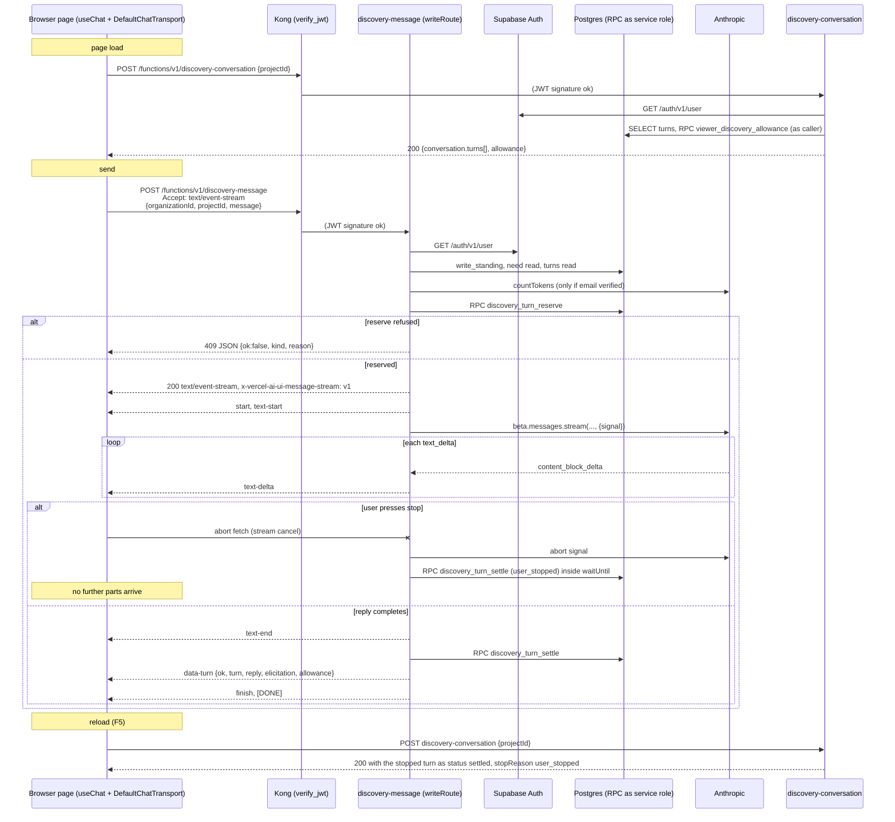

# How a browser page talks to Discovery on the local stack

Synthesized 2026-09-17 from four explorer reports in this folder (`explorer-a-route-contract.md`,
`explorer-b-frontend-scaffold.md`, `explorer-c-local-stack-and-user-path.md`,
`explorer-d-ui-message-stream-mapping.md`), checked against the tree at the current head of
`nirdrang/ai4dev-159-a-bare-chat-page-on-the-vercel-ai-sdk-over-the-real`. Line numbers are from
this checkout. Every quoted `reason` string is exact, including its em dash, because the page
will show it to a person and a test may match it.

## Overview

Discovery is the chat between an NGO admin and the model that turns a submitted project need into
a scope. The backend for it is shipped: two Supabase edge functions, `discovery-message` (send one
user message, get one assistant reply, pay credits) and `discovery-conversation` (read every turn
of a project plus the remaining allowance). The send function answers JSON by default and, when the
request carries `Accept: text/event-stream`, answers the Vercel AI SDK "UI message stream" over SSE
instead. Nothing in `src/` calls either function today. The only route is a placeholder heading.

This item adds one TanStack Start route that uses the Vercel AI SDK's `useChat` hook with a
`DefaultChatTransport` pointed at `discovery-message`, loads history from `discovery-conversation`,
shows the allowance, offers a stop button, renders the reply as markdown, and shows a refusal as its
`reason` text. The page must deploy unchanged on Lovable and on Vercel, so it holds no server secret
and uses no host-specific server API: it is a browser client over `fetch` and two public
`VITE_*` values. The rest of this document is the exact contract that page must speak, how the
local stack is set up so a signed-in NGO admin with a project exists, and where the SDK side is
still unverified because the SDK is not yet installed in this tree.

## Key Concepts

- **Write route.** `writeRoute` in `supabase/functions/_shared/edge.ts` (lines 340 to 437) is the
  shared POST frame for functions that change state: OPTIONS preflight, POST only, caller
  resolution through Auth, JSON body parse, standing check, a `decide` step, an optional `prepare`
  step, one reserve RPC as the service role, then either a JSON settle or an SSE stream.
  `discovery-message` is a write route. `discovery-conversation` is not; it is a plain
  `edgeHandler` read.
- **Caller.** `{ id, githubHandle, emailVerified }`, judged from `GET /auth/v1/user` with the
  bearer token the browser sent (`edge.ts` lines 166 to 208, `caller.ts`). The function never
  decodes the JWT itself. No `Authorization` header means no Auth round trip and a 401.
- **NGO admin.** Two facts, not one: the account row has `account_type = 'ngo'`, and
  `org_memberships.role = 'admin'` in the organisation named in the body. `orgAdminActionAllowed`
  in `memberships.ts` refuses `member` as `not-an-admin` and no row as `not-a-member`.
- **Turn.** One row of `discovery_turns`: one user message and, once settled, one assistant message,
  with `seq`, `status` (`open`, `settled`, `failed`, `abandoned`), `billing` (`free` or `fuel`),
  credit and token fields, and `stop_reason`. `turnViewFromSql` (`discovery-turn.ts` lines 28
  to 40) is the camelCase projection both functions return.
- **Reserve, act, settle.** Every send first reserves credits in SQL (`discovery_turn_reserve`),
  then calls the model, then settles the turn (`discovery_turn_settle`) with the real usage. All
  credit refusals happen at reserve, before any model call and before any stream byte.
- **Allowance.** `{ organizationId, utcDay, vetted, dailyGrant, spentToday, remaining }`
  (`discovery-allowance.ts` lines 88 to 95). Unverified organisations get 10 credits a day, vetted
  30. `remaining` is the number the page shows.
- **UI message stream.** The Vercel AI SDK's SSE protocol: `data: <json>\n\n` lines whose JSON
  has a `type` (`start`, `text-start`, `text-delta`, `text-end`, `data-*`, `error`, `finish`),
  ended by the literal `data: [DONE]\n\n`, behind the response header
  `x-vercel-ai-ui-message-stream: v1`. `discovery-stream.ts` writes it by hand; the `ai` package is
  not used on Deno.
- **The local stack.** One Supabase project per machine, `project_id = "poancmeitlmxejofwzuu"`,
  API on `http://127.0.0.1:44321`, Postgres on 44322, Mailpit on 44324 (`supabase/config.toml`
  lines 19, 44, 117). Functions are served at `{API}/functions/v1/<name>` from the checkout
  where `bun run db:start` ran.

## How It Works

### 1. What the page needs before its first call

The page needs three things it cannot invent: the API base URL and anon key, a signed-in NGO
admin's access token, and an organisation id plus a project id whose need is in
`discovery_in_progress`.

**URL and key.** The Lovable Vite wrapper injects every `VITE_*` variable into
`import.meta.env` (`node_modules/@lovable.dev/vite-tanstack-config/dist/index.js` lines 400 to
408). The tracked `.env` sets `VITE_SUPABASE_URL="https://poancmeitlmxejofwzuu.supabase.co"` and
`VITE_SUPABASE_PUBLISHABLE_KEY` to the hosted anon JWT (`.env` lines 5 and 6). That is the hosted
project, on purpose, because Lovable needs them in git. A local drive therefore needs a
git-ignored `.env.local` in this worktree that overrides both:

- `VITE_SUPABASE_URL` = the `API_URL` from `bunx supabase status -o json`, expected
  `http://127.0.0.1:44321`
- `VITE_SUPABASE_PUBLISHABLE_KEY` = the `ANON_KEY` from the same status (a JWT with
  `iss=supabase-demo`, `role=anon`)

Vite's file order is `.env`, then `.env.local`, then `.env.[mode]`, then `.env.[mode].local`,
later files win. This worktree has no `.env.local` today (Explorer B checked). A mismatched pair,
hosted key with local URL or the reverse, fails at Kong's JWT check. Never paste the output of
`db:start` anywhere; it contains the secret key and GitHub push protection refuses the branch.

**A session.** There is no sign-in route in `src/`. The local Auth issues 120-second access
tokens (`config.toml` line 181, a test pin read at container start) with refresh-token rotation on
(line 187). A page that holds only the access token dies two minutes after sign-in. The page needs
either `@supabase/supabase-js` (installed at `package.json` line 80, as a devDependency, unused
in `src/`) with `signInWithPassword` and its auto refresh, or a hand-rolled
`POST {API}/auth/v1/token?grant_type=refresh_token` with `{ refresh_token }` before expiry. The
integration adapter refreshes at 20 seconds remaining (`tests/at/suites/req-001/_live-tenant-reads.ts`
lines 136 to 150). Every Auth call sends `apikey: <ANON_KEY>` and `Authorization: Bearer <ANON_KEY>`
until a session exists; a 401 with a good-looking token usually means `apikey` is missing.

**A user and a project.** The product path that produces the state the two functions require is
the one `.claude/skills/verify-ai4good/scripts/drive-discovery.ts` runs (Explorer C traced it):

1. `POST {API}/auth/v1/signup` with `{ email, password }`. Confirmations are on
   (`config.toml` line 274), so the answer has a `user` and no token.
2. Poll Mailpit: `GET {MAIL}/api/v1/search?query=to:<address>&limit=50`, then
   `GET {MAIL}/api/v1/message/{ID}/raw`, decode quoted-printable, keep the URL that contains
   `/auth/v1/verify` and `type=signup`.
3. `GET` that link with `redirect: manual`. The 3xx itself is the confirmation. It points at
   `site_url = "http://127.0.0.1:3000"` (line 169), which nothing listens on; that is fine for the
   drive, and a gotcha for a human clicking the mail (see Gotchas).
4. `POST {API}/auth/v1/token?grant_type=password` with `{ email, password }`. Answer has
   `access_token`, `refresh_token`, `user.id`.
5. `POST {API}/functions/v1/complete-signup` with `accountType: "ngo"`, an
   `organizationName`, `acknowledgmentTextVersion: "tos-platform-promise-v1"`, `signerName`,
   `signerTitle`, and the exact `authorityAttestation` sentence from
   `supabase/functions/_shared/acknowledgment-copy.ts` lines 37 to 40. Answer:
   `{ ok: true, accountId, accountType: "ngo", organizationId }`. This creates the account, the
   organisation, and the admin membership. It creates no project.
6. `POST {API}/functions/v1/project-need` with
   `{ organizationId, action: "start", title, description, urgency: "soon" }`. Answer carries
   `need.projectId`. This is what creates the project.
7. `POST {API}/functions/v1/project-need` with `{ organizationId, action: "submit", projectId }`.
   Stage becomes `discovery_in_progress`. A submit with an empty description is 409
   `missing-description`, which is why the drive puts the description on `start`.

After step 7 the caller is a signed-in NGO admin with `organizationId`, `projectId` and an
`access_token`. The email is verified, which matters: an unverified email is a 409 at reserve.
The proof page gets these ids from somewhere the brief does not specify (URL path, search params,
or pasted); see Open questions.

### 2. Headers and CORS for every function call

Every call from the browser to either function is a cross-origin POST from the Vite origin
(`http://localhost:8080` or `http://127.0.0.1:8080`; the Lovable wrapper fixes port 8080, host
`::`) to `http://127.0.0.1:44321`. There is no Vite proxy in `vite.config.ts`.

Request headers the drive uses and the functions expect (`drive-discovery.ts` lines 91 to 96,
`tests/at/harness/live-stack.ts` lines 145 to 149):

| Header | Value | Needed on |
|---|---|---|
| `Authorization` | `Bearer <access_token>` | both |
| `apikey` | the anon key | both |
| `Content-Type` | `application/json` | both |
| `Accept` | `text/event-stream` | send, to get the stream instead of JSON |

Preflight: `edgeHandler` (`edge.ts` line 117) answers `OPTIONS` with 204 and the trio in
`CORS_HEADERS` (lines 83 to 87): `access-control-allow-origin: *`,
`access-control-allow-headers: authorization, apikey, content-type, x-client-info`,
`access-control-allow-methods: POST, OPTIONS`. `Accept` is not in the allow list on purpose: it is
a CORS-safelisted request header (`loop/items/AI4DEV-132/research/chat-ui.md` line 163). Any
other custom request header fails preflight. `Origin *` is deliberate because no function reads a
cookie; the bearer token is the only credential.

Two gates sit in front of the function code. Kong checks the JWT signature first because both
functions have `verify_jwt = true` (`config.toml` lines 584 to 588); a missing or expired token is
a 401 from Kong with a platform body such as `Invalid JWT`, not the function's JSON shape. Then
`resolveCaller` asks Auth; a token Auth does not recognise is the function's own 401
`{ ok: false, reason: "authenticate before calling discovery-message" }` (or `"authenticate before
reading a Discovery conversation"`). Neither 401 carries a `kind`.

### 3. Send: what the page posts and what the server does before any byte comes back

The wire body of `discovery-message` is not the SDK's default. `decideDiscoveryMessage`
(`discovery-turn.ts` lines 57 to 71) reads exactly:

```json
{ "organizationId": "<uuid>", "projectId": "<uuid>", "message": "<text>" }
```

`organizationId` is the write route's `target` (`organizationIdField`), checked for UUID shape at
`edge.ts` lines 360 to 364. `projectId` is `uuidField`. `message` is `stringField` (trimmed,
non-empty), at most `DISCOVERY_MESSAGE_MAX_CHARS` = 4000. The functions never read a `messages`
array, so the transport must reshape the SDK's outgoing body (the brief says so; the decision paper
names `prepareSendMessagesRequest` as the hook, `chat-ui.md` lines 57 to 64).

Order of checks, each one a JSON answer if it fails (`edge.ts` lines 347 to 380):

1. Method: anything but POST is 405 `{ ok: false, reason: "discovery-message accepts POST only" }`.
2. Caller: 401 as above.
3. Body: non-JSON or non-object is 400 with `reason` only. An empty body parses as `{}`.
4. Organisation id shape: 400 `kind: "invalid-request"`.
5. Standing (`write_standing` RPC): unreadable is 502 `kind: "refused"`; no account 409
   `no-account`; deactivated 403 `account-deactivated`; a volunteer or platform-admin account
   403 `not-an-ngo-account`.
6. `decideDiscoveryMessage`: missing `organizationId` 400 `invalid-request`
   `"a Discovery message must name its organisation"`; unknown organisation 409
   `no-such-organisation`; not admin 403 `not-a-member` or `not-an-admin`; bad project id, empty
   message or over 4000 chars 400 `invalid-request` `"a Discovery message requires a project id and
   text within the message limit"`.
7. `discoveryPrepare` (`discovery-turn.ts` lines 90 to 115): reads the need through PostgREST as
   the caller (RLS). Project not visible is 409 `no-such-project` with the tenant sentence
   `"no such thing is visible to this caller"`. Stage not `discovery_in_progress` is 409
   `need-not-in-discovery` `"the need is not in Discovery"`. Then it loads the settled turns,
   builds the model request, and calls Anthropic `countTokens` only if `caller.emailVerified`
   (line 108). A REST failure throws and becomes the `edgeHandler` 502
   `"discovery-message could not complete the request: <detail>"`.
8. Reserve: `discovery_turn_reserve` as the service role (`edge.ts` line 375). A SQL refusal with a
   five-character SQLSTATE becomes 409 with `kind` parsed from the `DETAIL` and `reason` from the
   exception message. This is where every money refusal lives.

Only after step 8 succeeds does the response shape depend on `Accept`.

### 4. The credit refusals the page must show

All of these are HTTP 409, JSON `{ ok: false, kind, reason }`, and never a stream, whatever
`Accept` said. The remedies are not a field; they are the clause after ` — ` inside `reason`
(`discovery-allowance.ts` lines 50 to 59).

| Situation | `kind` | `reason` |
|---|---|---|
| Email not verified | `email-unverified` | `a Discovery message needs a verified email address — this account is email-unverified. Use the verification link sent to the account address, then send the message again` (`20260923120100_organization_discovery_switch.sql` line 150) |
| Zero credits, unverified org | `daily-allowance-exhausted` | `discovery_allowance refuses: organisation <uuid> has no Discovery credits left today — get vetted (daily grant becomes 30), fund project fuel to continue now, or wait for the next UTC day` |
| Zero credits, vetted org | `daily-allowance-exhausted` | same prefix, remedies `fund project fuel to continue now, or wait for the next UTC day` |
| Debit larger than what is left | `debit-exceeds-remaining` | `discovery_allowance refuses: organisation <uuid> still has <n> Discovery credits remaining today — this debit is larger than what remains` |
| Funded project, no fuel | `fuel-exhausted` | `this funded project has no fuel left for this Discovery turn; top up project fuel to continue; free credits are never spent on a funded project` |
| Discovery switched off by a platform admin | `discovery-disabled` | `a platform admin switched Discovery off for this organisation — <switch reason>` |
| Another turn still open, under 150 s old | `turn-in-flight` | `a Discovery turn is in flight` |
| Conversation changed after token count | `stale-context` | `the conversation changed after token counting` |
| Project not in this org at SQL | `no-such-project` | `no such project in this organisation` |

The brief names four the page must render: email unverified, zero credits with the tier remedies,
fuel exhausted, Discovery switched off. The rule for the page: branch on `kind` when it is there,
and always print `reason`. The 401, 405, body-parse 400, `edgeHandler` 502 and every
`discovery-conversation` refusal have `reason` only.

To produce the zero-credit refusal on the local stack, the previous item's drive sent short
turns until the 10-credit grant ran out (each short Haiku turn reserved 2 and charged 1), then sent
once more. The transcript at `loop/items/AI4DEV-132/artifacts/verify-discovery/transcript.json`
records the 409 body.

### 5. Send: the JSON answer (no `Accept: text/event-stream`)

`discoveryAct` calls `messages.create`, the frame settles, and the answer is 200
(`edge.ts` lines 424 to 435, `renderDiscoveryMessage` lines 184 to 191):

```json
{
  "ok": true,
  "turn": { "id", "projectId", "seq", "status": "settled", "billing": "free", "utcDay",
            "userMessage", "assistantMessage", "elicitation": null,
            "requestSettings": { "model", "maxTokens", "effort" },
            "maxOutputTokens", "estimatedInputTokens", "reservedCredits", "chargedCredits",
            "reservedMicros", "actualMicros", "overrunMicros", "inputTokens", "outputTokens",
            "stopReason": "end_turn", "servedModel", "openedAt", "settledAt" },
  "reply": "<same string as turn.assistantMessage>",
  "elicitation": null,
  "allowance": { "organizationId", "utcDay", "vetted": false, "dailyGrant": 10,
                 "spentToday": 1, "remaining": 9 }
}
```

The acceptance suite uses this path because `functionPostRaw` sends no `Accept`. A definite model
failure after settle is 502 with `reason` only; an uncertain outcome (`args === null`) is 502
`"the provider outcome is uncertain"`.

### 6. Send: the stream (with `Accept: text/event-stream`)

`wantsEventStream` (`discovery-stream.ts` lines 15 to 17) is true when any comma-separated
`Accept` entry, with its `;` parameters stripped, lowercased, equals `text/event-stream`. Then
`edge.ts` lines 382 to 423 return a `Response` with an implicit 200 and these headers, the CORS
trio plus `DISCOVERY_STREAM_HEADERS` (`discovery-stream.ts` lines 1 to 5):

- `content-type: text/event-stream`
- `cache-control: no-cache`
- `connection: keep-alive`
- `x-vercel-ai-ui-message-stream: v1`
- `access-control-expose-headers: x-vercel-ai-ui-message-stream`

The expose header is there (Explorer C said it was not; it read only `CORS_HEADERS`). A browser
can read the `v1` marker, which the SDK's protocol page says the response must carry.

The body is one `ReadableStream`. Every part is `data: <json>\n\n`, no `event:` field, no `id:`
field. The frame mints one `crypto.randomUUID()` (line 395) and uses it for both the message id and
the text-part id. The happy sequence, confirmed by the live transcript (`discovery-message-sse-2`):

| Wire JSON | When |
|---|---|
| `{ "type": "start", "messageId": "<uuid>" }` | at once |
| `{ "type": "text-start", "id": "<same uuid>" }` | at once |
| `{ "type": "text-delta", "id": "<uuid>", "delta": "<chunk>" }` | one per Anthropic `content_block_delta` of type `text_delta` (`anthropic-messages.ts` lines 81 to 84) |
| `{ "type": "text-end", "id": "<uuid>" }` | after the provider stream ends |
| `{ "type": "data-turn", "data": { "ok": true, "turn", "reply", "elicitation", "allowance" } }` | after settle succeeded and there was no failure |
| `{ "type": "finish" }` | always, in `finally` |
| `data: [DONE]` | always, in `finally`, not JSON |

`data-turn.data` is byte-for-byte the JSON 200 body of section 5, so the page reads the settled
turn, its cost and the new `allowance.remaining` from that one part. It is nested: the SDK sees
`{ type: "data-turn", data: {...} }`, so the payload is `part.data`, and the drive's own wrapper
made it `part.data.data`.

Failures after the stream opened stay on the stream at HTTP 200: `{ "type": "error", "errorText":
"<string>" }` then `finish` then `[DONE]`. `data-turn` is skipped. Sources of `errorText`: the
provider's failure reason, `"the model refused the request"` (stop reason `refusal`, settles
`failed`), the settle RPC's message, `"the provider outcome is uncertain"`, or a thrown error's
message (`edge.ts` lines 401 to 408). So the page has two refusal channels: a JSON 4xx before the
stream, and an `error` part inside a 200 stream.

### 7. Stop

The SDK's `stop()` must abort the fetch. On the server, aborting the fetch fires the stream's
`cancel()` (`edge.ts` lines 416 to 420): `cancelled = true` so every later `emit` is a no-op,
`abort.abort()` on the provider signal, and `EdgeRuntime.waitUntil(work)` so the settle finishes
after the browser is gone. The browser therefore sees only what was already sent: in the live
transcript (`discovery-message-sse-3-cancelled`), `start`, `text-start`, and one `text-delta`
with `delta: "Got"`. No `text-end`, no `data-turn`, no `finish`, no `[DONE]`. Status stays 200.

On the provider side (`anthropic-messages.ts` lines 54 to 96): if `message_start` had arrived,
`stopped()` returns `ok: true`, `stopReason: "user_stopped"`, the accumulated text, and output
tokens from a `countTokens` recount of that text, or `request.maxTokens` if the recount fails.
The turn settles `completed`, and the row is `status: "settled"`, `stop_reason: "user_stopped"`,
`charged_credits: 1` in the live run, with a partial `assistant_message` that is longer than what
the browser received (`"Got it—you have the basics recorded, but you need reminders so"` against
`"Got"`), because the provider kept sending until it noticed the abort and the frame kept
accumulating but not emitting. If the abort lands before `message_start`, the answer is
`cancelledBeforeAnswer` (status 499, `"the client cancelled before the provider answered"`), the
turn settles `failed`, and the browser still sees nothing more. That branch was not driven live.

Two consequences for the page. The reservation is not rolled back by a stop; the user pays for
what the model produced. And the page learns the cost and the new allowance only by reloading the
conversation, never from the aborted stream.

### 8. Reload: `discovery-conversation`

`supabase/functions/discovery-conversation/index.ts` (18 lines) is POST only, resolves the
caller, and requires exactly:

```json
{ "projectId": "<uuid>" }
```

No `organizationId`, no `Accept`. Missing or malformed id is 400 `{ ok: false, reason: "a
Discovery conversation must name the project as a uuid" }`. `conversationAnswer`
(`discovery-turn.ts` lines 165 to 183) reads the project as the caller (RLS decides visibility):
empty is 404 `TENANT_NOT_FOUND` (`"no such thing is visible to this caller"`), a failed read is
502 `TENANT_READ_FAILED` (`"the read could not complete, so no decision was made"`). Then it reads
`discovery_turns?project_id=eq.<id>&order=seq` and calls `viewer_discovery_allowance` as the
caller. If that RPC fails the answer is still 200 with `allowance: null` (line 179). No admin
check: any org member the SELECT policy admits can read.

200 body:

```json
{
  "ok": true,
  "conversation": {
    "projectId": "<uuid>",
    "turns": [ /* every row in seq order, as DiscoveryTurnView, all statuses */ ],
    "elicitation": null
  },
  "allowance": { "organizationId", "utcDay", "vetted", "dailyGrant", "spentToday", "remaining" }
}
```

`turns` includes open, failed and abandoned rows, not only settled ones, so a mid-flight reload
can show a user line with `assistantMessage: null`. The stopped turn is there with
`stopReason: "user_stopped"` and its partial text. `conversation.elicitation` is the last non-null
per-turn elicitation; this leaf does not render it.

### 9. The four flows in one picture



### 10. The page side: what the tree already fixes and what the SDK must do

**Where the route goes.** A `.tsx` under `src/routes/` that exports
`const Route = createFileRoute("<path>")({...})`. Conventions in `src/routes/README.md`: a bare `$`
segment is a path parameter (`users/$id.tsx` is `/users/:id`). The route tree
`src/routeTree.gen.ts` regenerates on `vite dev` and `vite build`; never edit it, and CI exempts it
from the ownership guard (`.github/workflows/ci.yml` line 258). The brief does not name the URL.

**SSR is on.** `src/start.ts` does not set `defaultSsr: false`, and the root shell in
`src/routes/__root.tsx` renders the document on the server. Anything that touches `window`,
`localStorage`, or a Supabase browser client at render or loader time must sit behind
`ssr: false` on the route, a `ClientOnly` wrapper, or a `useEffect`. `useChat` itself is a hook
and may be fine on the server render, but the session and the initial-messages fetch are not.

**No server functions.** `src/lib/api/example.functions.ts` is a `createServerFn` template whose
comment says to use it instead of edge functions. Do not. A server function binds the page to the
Start server runtime (Workers on Lovable; Nitro on Vercel only if enabled), which is the
host-specific dependency the brief forbids, and it is where a secret would leak. The page is
`fetch` plus `import.meta.env.VITE_*` and nothing else.

**Ownership.** The page is `src/`, Lovable territory. `package.json` and `bun.lock` belong to
neither territory, so adding `ai`, `@ai-sdk/react` and `react-markdown` in the same pull request
is allowed. Touching `supabase/`, `tests/`, `loop/`, `.claude/` or `.github/` in the same pull
request fails CI (`ci.yml` lines 260 to 269). The verify skill's drive script lives under
`.claude/`, so the evidence drive for this item is a browser session, not a script change, unless
the founder splits the pull request.

**Typecheck.** `bun run typecheck` runs `tsc --noEmit` on `tsconfig.json` (which includes
`src/**`, `strict: true`, `types: ["vite/client"]`), on `tests/at`, and on the verify drive
scripts. CI runs it; CI does not run eslint. `import.meta.env.VITE_SUPABASE_URL` is typed only as
Vite's index signature, so the page should guard for `undefined`.

**The transport.** What the tree can say for certain (from the decision paper, `chat-ui.md` lines
46 to 64, and the brief line 40): `DefaultChatTransport` takes `api` (the function URL), `headers`
(static or a function, so a refreshed JWT can be read per request), `body`, and
`prepareSendMessagesRequest`, which rewrites the outgoing body. The page must set `Authorization`,
`apikey` and `Accept: text/event-stream` in `headers`, and use `prepareSendMessagesRequest` to send
`{ organizationId, projectId, message }` where `message` is the text of the last user message.
`useChat` returns `messages`, `status` (`submitted`, `streaming`, `ready`, `error`), `stop()`,
`regenerate()`, `error`, `setMessages`, and accepts an initial `messages` array. Everything finer
than that (callback argument names, how parts map to `UIMessage.parts`, how a non-200 JSON body
surfaces) is unverified in this tree because `node_modules/ai` and `node_modules/@ai-sdk/react`
are absent. The first task of the writer is to install them and read the types.

**History to `UIMessage[]`.** No mapping exists. A settled turn is one user string and one
assistant string, so the natural mapping is two `UIMessage` objects per turn, with ids derived from
`turn.id` plus a role suffix. Stream `messageId` values are random UUIDs minted per send and never
match `discovery_turns.id`, so the page should not expect ids to line up across a reload. The
allowance after reload is `allowance` on the conversation body, not a `data-turn` part.

### 11. Running it against the local stack

- `bun run db:start` from this worktree, output to a file. The edge container bind-mounts
  `supabase/functions` from the directory where start ran; a stack started from another worktree
  serves that worktree's functions (measured 2026-09-02, 34 red tests with a healthy stack).
  `bun run db:stop` then `db:start` from here fixes it.
- Copy `supabase/functions/.env` from the previous item's worktree so `ANTHROPIC_API_KEY` and
  `DISCOVERY_MODEL=claude-haiku-4-5-20251001` reach the edge runtime. `servedModel()` reads
  `DISCOVERY_MODEL` at call time (`anthropic-messages.ts` line 11).
- Write `.env.local` with the local `VITE_SUPABASE_URL` and `VITE_SUPABASE_PUBLISHABLE_KEY` as
  section 1 says.
- `bun run dev` serves on port 8080.
- Do not drive the page while an integration run is resetting the database
  (`bun run at:verify ... --tier integration` runs `supabase db reset`).
- Auth rate limits that apply locally: 30 sign-ups or sign-ins and 30 token verifications per
  five minutes per IP. Use unique emails. `db:reset` does not clear the limiters; a stack restart
  does.

## Where Things Live

| Path | What |
|---|---|
| `supabase/functions/discovery-message/index.ts` | send entry: `writeRoute` with decide, prepare, settle (act and stream), render |
| `supabase/functions/discovery-conversation/index.ts` | read entry: `edgeHandler`, POST `{ projectId }` |
| `supabase/functions/_shared/edge.ts` | CORS (83 to 87), `json`/`refusal` (89 to 99), `edgeHandler` (112 to 125), `resolveCaller` (166 to 208), `writeRoute` (340 to 437) with the stream branch at 382 to 423, `callerReads` (455 to 497) |
| `supabase/functions/_shared/discovery-stream.ts` | SSE part encoders, `wantsEventStream`, `DISCOVERY_STREAM_HEADERS` |
| `supabase/functions/_shared/discovery-turn.ts` | `decideDiscoveryMessage` (57), `discoveryPrepare` (90), `discoveryStream` (153), `conversationAnswer` (165), `renderDiscoveryMessage` (184), `turnViewFromSql` (28) |
| `supabase/functions/_shared/anthropic-messages.ts` | provider port; the abort and `user_stopped` logic (54 to 96) |
| `supabase/functions/_shared/discovery-allowance.ts` | `Allowance` type, grants, the exact refusal sentences |
| `supabase/functions/_shared/write-routes.ts` | route registry, refusal `kind` vocabulary, field parsers |
| `supabase/migrations/20260923120100_organization_discovery_switch.sql` | current `discovery_turn_reserve` with every 409 `DETAIL` |
| `supabase/config.toml` | ports, `site_url`, `jwt_expiry = 120`, `verify_jwt` per function, `[edge_runtime] policy = "per_worker"` |
| `.claude/skills/verify-ai4good/scripts/drive-discovery.ts` | the SSE client the drive used (lines 80 to 148) and the full user path |
| `loop/items/AI4DEV-132/artifacts/verify-discovery/transcript.json` | recorded wire bytes: JSON send, SSE send, abort, conversation read, three 409 refusals |
| `loop/items/AI4DEV-132/research/chat-ui.md` | the decision paper naming `useChat` and `DefaultChatTransport` |
| `src/routes/` | where the new route file goes; `__root.tsx` is the shell; `README.md` the naming rules |
| `vite.config.ts`, `.env`, `.env.example` | Lovable wrapper; tracked hosted `VITE_*`; the git-ignored `.env.local` slot |
| `tests/at/harness/live-stack.ts`, `local-stack.ts` | how the harness discovers the local stack coordinates |

## Gotchas

**Facts that will bite the page writer**

1. Credit refusals are never a stream. `Accept: text/event-stream` only changes the post-reserve
   success path. The SDK will receive a 409 JSON body where it expected SSE; how that reaches
   `error` or `onError` is unverified (see below), so the page may need a `fetch` wrapper in the
   transport that reads a non-200 JSON body and surfaces `reason` itself.
2. The stop drops the tail of the protocol. No `finish`, no `[DONE]`, no `data-turn` after an
   abort. The page must not wait for them, and must reload the conversation to see the charge.
3. The settled text after a stop is longer than the streamed text. Reload shows more than the
   stop left on screen. That is correct behaviour, not a defect.
4. `data-turn` is the only place the stream carries the allowance. If the SDK exposes `data-*`
   parts only under a typed `UIMessage` generic, the allowance is invisible until the page declares
   that type. Unverified.
5. The default SDK body is not the wire body. `{ id, messages, trigger, messageId }` will be
   refused 400 `invalid-request` because `projectId` and `message` are missing. Reshape it.
6. Remedies live inside `reason` after ` — `. There is no `remedies` array. The unverified tier
   has three remedies, the vetted tier two.
7. `kind` is absent on 401, 405, body-parse 400, `edgeHandler` 502, every
   `discovery-conversation` refusal, and Kong's `Invalid JWT`. Print `reason` always.
8. The same UUID is both `start.messageId` and `text-start.id`. The protocol treats them as
   different ids; the frame does not.
9. Tracked `.env` is the hosted project. Without `.env.local`, `vite dev` drives
   `poancmeitlmxejofwzuu.supabase.co`, and the local stack shares that `project_id` string, so it
   is easy to confuse the two.
10. Local access tokens live 120 seconds. A page without refresh dies after two minutes. Hosted
    tokens do not have this pin.
11. `site_url` is port 3000, Vite is 8080. A human clicking the confirmation mail lands on a dead
    port; the confirmation still happens (the 3xx is the confirmation). `localhost` and `127.0.0.1`
    are different origins for Auth redirects; function CORS `*` hides that only for functions.
12. Functions CORS allows `POST, OPTIONS` only; `discovery-conversation` is POST, not GET.
13. `@supabase/supabase-js` is a devDependency. Vite bundles it anyway if `src/` imports it; a
    `--production` install would omit it. Moving it is a deploy-shape choice for the writer.
14. Open turns are in the conversation read, with `assistantMessage: null`. A reload during a
    turn shows a user line with no reply; the next send within 150 seconds is 409
    `turn-in-flight`, after 150 seconds the stale turn is abandoned at full reserved charge.
15. `dailyGrant` is a high-water mark, `greatest(stored, current tier)`, so it can be 30 on a
    later un-vetted organisation.
16. The prepare-time `no-such-project` reason is the tenant sentence (`"no such thing is visible
    to this caller"`), not the SQL one; both carry the same `kind`.
17. Unverified callers still reach SQL. Prepare skips `countTokens` for them so Anthropic is not
    billed; reserve then raises `email-unverified`.
18. `regenerate()` is on the hook and out of this leaf. A per-turn regenerate today is a new paid
    turn.

**Disagreements between explorers, and how each was resolved**

- Explorer C: "There is no `access-control-expose-headers`; a browser cannot read
  `x-vercel-ai-ui-message-stream`." Explorers A and D: it is on the stream response. Resolved by
  `discovery-stream.ts` line 4 and `edge.ts` line 422: the stream response carries
  `access-control-expose-headers: x-vercel-ai-ui-message-stream`. It is not on JSON answers or
  on the preflight, which is what Explorer C read.
- Explorer A's open question on a missing `Authorization` header versus Explorer C's measured
  fact: Explorer C cites a 2026-08-31 measurement that an unauthenticated POST to a
  `verify_jwt = true` function is a 401 from Kong. So a missing header is a Kong 401, but the exact
  body bytes for the missing-header case (as opposed to the expired-token `Invalid JWT`) remain
  unrecorded.
- Explorer D corrected its own prompt: the Anthropic stand-in is `tests/at/harness/vendors.ts`
  lines 71 to 87; there is no `anthropic-messages-standin.ts`.
- Explorer B cites `@supabase/supabase-js` at `package.json` line 80; the decision paper says
  line 79. Line 80 is right in this checkout.
- Explorer B and the `vite.config.ts` comment disagree on Nitro: the comment says Nitro is always
  included with Cloudflare as default; the installed wrapper 2.3.2 skips Nitro outside the Lovable
  sandbox unless `nitro: true` is passed. The package source is the authority; the comment is
  stale. Not run to confirm the output layout.

**Open questions carried forward**

SDK-side, unanswerable until `ai` and `@ai-sdk/react` are installed and read:

1. Exact `DefaultChatTransport` option names and the argument and return shape of
   `prepareSendMessagesRequest`.
2. Whether the SDK sets `Accept: text/event-stream` on its own, and whether it adds any request
   header that is not CORS-safelisted (which would fail preflight; only `authorization`, `apikey`,
   `content-type`, `x-client-info` are allowed).
3. How `start`, `text-start`, `text-delta`, `text-end`, `data-turn`, `error`, `finish` and
   `[DONE]` land on `UIMessage.parts`, and which event moves `status`.
4. Whether `stop()` aborts the fetch, whether an abort ends as `ready` or `error`, and whether the
   partial text stays in `messages`.
5. Whether a non-200 JSON body reaches `onError` as structured data or only as an `Error` whose
   `message` is raw text. The paper never names `onError`.
6. The submit function name (`sendMessage` versus older `append`/`handleSubmit`).
7. Whether `useChat` needs a typed `UIMessage` generic before `data-turn` parts are visible.
8. Whether `reconnectToStream` would POST the same `api` after a refresh and open a new reserved
   turn by accident. Discovery has no reconnect route.
9. Whether `react-refresh/only-export-components` warns on `export const Route`. CI does not run
   eslint, so it cannot block.

Stack-side and page-design, not measured in this tree:

10. Auth (GoTrue/Kong) CORS from the Vite origin (`http://localhost:8080` or
    `http://127.0.0.1:8080`) is not measured. Function CORS is. A browser sign-in against
    `/auth/v1/token` is a preflighted request.
11. The exact `supabase-js` auto-refresh offset against a 120-second token; the integration adapter
    refreshes at 20 seconds left, and a hand-rolled page must do something equivalent.
12. Whether Kong accepts the anon JWT as a bearer on a function (then `resolveCaller` returns
    401) or rejects it at the gateway.
13. The Kong 401 body for a missing `Authorization` header (only the expired case, `Invalid JWT`,
    is recorded).
14. Client abort before the first provider event: the server path exists
    (`cancelledBeforeAnswer`, settle `failed`), but no live transcript shows it.
15. `discovery-conversation` with `allowance: null` (allowance RPC failure) never happened live.
16. How the proof route obtains a session and the two ids: no sign-in route exists; options are an
    in-page password form, a pasted token, or the verify skill's cookies. The brief does not say.
17. The route's URL shape (`/…/$projectId`, search params, or fixed); the brief does not name it.
18. Where `.env.local` for this worktree comes from (hand-copied from `supabase status`, or a
    small script); the file is absent.
19. Whether Lovable's `importProtection` replaces or merges with Start's default
    `**/*.server.*` rule; irrelevant if the page imports no `.server.ts` file.
20. The `vite build` output layout when Nitro is skipped, and whether Vercel's environment turns
    Nitro on. Not run.
21. From the decision paper: whether Anthropic bills a client-aborted stream at tokens produced or
    in full. The port recounts the produced text and settles on that.
