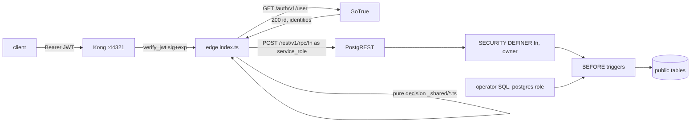

# How the ai4good tree authorises writes, talks to Supabase Auth, and lands an acceptance id

Written for the designer of the six admin-operations units. Read this before the design arena. Line numbers are as of branch head `nirdrang/ai4dev-56-admin-operations-lifecycle-gates-and-audit-d6`, cut from `main` at `32c8fbc`.

## Overview

Every product write in this tree takes one road. A browser or the live test adapter posts to `/functions/v1/<name>` with a user's access token. The edge function asks Supabase Auth who the token belongs to, runs a pure TypeScript decision from `supabase/functions/_shared/`, and then calls one SECURITY DEFINER database function over PostgREST as the `service_role`. The database function runs as the table owner, re-checks the same facts in SQL, and inserts or updates rows. Client roles hold no write privilege on any public table. The three write routes on `main` are `complete-signup`, `create-organization` and `update-organization`. There is no lifecycle column, no audit table, no escalation contact, no write-route registry, and no product code that calls Auth's link or unlink surface.

The acceptance harness grades the same decisions at two tiers. The loop tier runs the shipped TypeScript judgements over in-memory Maps with a controlled clock. The integration tier resets the one local Supabase stack, replays the migrations, and drives real HTTP against Auth and the deployed functions, with operator SQL for the Givens no product path can build. Ten ids in this run (AT-001.25, .26, .27, .28, .29, .30, .31, .33, .34, .35) are declared red at both tiers with the shape `pending / sut-missing`. A leaf flips an id by replacing a stub, moving the id in the expected manifest, and trimming the pending map, all in one change. The design job is to decide where the new gate, the new tables, and the unlink refusal sit so that both tiers can prove them, and to be honest about the two clauses (virtual keys, concierge onboarding) whose surfaces do not exist.

## Key Concepts

- **`Caller`** (`supabase/functions/_shared/caller.ts` lines 58 to 69). The authenticated identity a write sees. Two fields only, the Auth user `id` and a derived `githubHandle`. No account type, no ban flag, no identities array. Built only by `callerFromAuthAnswer(status, user)`, which returns `null` for anything but a 2xx object body with a string `id`.
- **`resolveCaller`** (`supabase/functions/_shared/edge.ts` lines 168 to 210). The I/O half. Reads `Authorization`, calls `GET /auth/v1/user` with the same bearer plus the anon `apikey`, and hands the answer to `callerFromAuthAnswer`. A missing header returns `null` with no round trip.
- **`callDatabaseFunction`** (`edge.ts` lines 277 to 310). `POST /rest/v1/rpc/<name>` as the `service_role`. One call is one implicit transaction. This import is the mechanical mark of a write route. Only the three write entries import it (grep over `supabase/`).
- **SECURITY DEFINER write functions.** `public.complete_signup`, `public.create_organization`, `public.update_organization`. Owner-running, `search_path = ''`, EXECUTE revoked from `PUBLIC` and granted to `service_role` only. They are the backstop, not the only check.
- **Triggers.** `org_memberships_grantee_must_be_ngo` (BEFORE INSERT OR UPDATE on `org_memberships`), `projects_seat_holds_a_volunteer` (BEFORE INSERT OR UPDATE OF `assigned_volunteer_id`), `projects_single_developer_seat` (BEFORE UPDATE on `projects`). No trigger exists on any `auth.*` table, by a stated decision.
- **Privilege posture.** Stated once in migration `20260906120000_tenant_read_posture_and_org_member_policies.sql` lines 3 to 23. `revoke all` on the six public tables from `anon`, `authenticated` and `service_role`, then `select` back to `authenticated` on the four tenant tables and to `service_role` on `accounts` and `org_memberships`. All policies are `FOR SELECT TO authenticated`.
- **The two catalog checks.** Static, `tests/at/suites/req-001/_policy-scan.ts`, reads every migration in name order and overlays grants and revokes against `TENANT_CATALOG`, an expectation written by hand. It runs at the loop tier, so it runs in CI. Live, `tenantTableFacts()` in `_live-tenant-reads.ts` lines 263 to 329 plus `assertTenantCatalog` in `_integration.ts` lines 168 to 199, reads `pg_class`, `has_table_privilege` for all seven privileges, `pg_policies` and `pg_proc`, and walks both ways between the catalog and the live schema.
- **`AccountsSut`** (`tests/at/suites/req-001/_contract.ts` lines 375 to 823). The one system-under-test shape for REQ-001. Product operations, Auth mirrors, operator Givens, and read-back. Both adapters annotate their object as this type, so a method missing on either does not compile.
- **`AtPending` / `CapabilityPending`** (`tests/at/harness/pending.ts`). The two classes a declared red must throw. Their first line is the shape the expected manifest matches.
- **`LEAF` / `notLanded`** (`tests/at/suites/req-001/_pending.ts` lines 47 to 90). The map of leaves that still own stubbed ids, and the stub body that throws `AtPending(ctx.atId, 'sut-missing', …)`.

## How It Works

### 1. One write, edge to row

Take NGO `complete-signup`.

1. The client posts `/functions/v1/complete-signup` with `Authorization: Bearer <access token>` and a JSON body. Live tests use `functionPost` in `tests/at/harness/live-stack.ts` lines 143 to 152.
2. The platform checks the JWT signature and expiry because `[functions.complete-signup] verify_jwt = true` (`supabase/config.toml` lines 490 to 491). An expired token gets the platform body `Invalid JWT` and never reaches Deno. This check is not "who is calling" and not "is the session live". Two read functions share `verify_jwt = true`, so it is not the write discriminator.
3. `edgeHandler('complete-signup', …)` (`edge.ts` lines 101 to 114) answers OPTIONS with 204, maps thrown errors to a shaped 502, and runs the inner handler. CORS allows POST and OPTIONS only (`edge.ts` lines 72 to 76).
4. `resolveCaller` calls `GET /auth/v1/user`. A live token answers 200 with `id`, `email`, `email_confirmed_at` and `identities[]`. A token whose session was logged out answers 403 `session_not_found`. An expired token at Auth answers 403 `bad_jwt`. A malformed `auth.identities` row makes Auth answer 500. Shipped code treats every non-2xx the same way, as no caller, and the route answers 401. Do not pin 401 versus 403 in a new test without measuring.
5. `readJsonBody` (`edge.ts` lines 371 to 388) turns malformed JSON into 400.
6. The shared decision runs. `validateCompleteSignup(body, { githubHandle: caller.githubHandle })` in `accounts.ts` lines 213 to 303 checks the account type, the organisation name rule, the volunteer GitHub gate, the acknowledgment version, and the signer fields. The handle comes from Auth's `identities[]` through `extractGithubHandle` (`github.ts` lines 50 to 65), never from the request. `platform_admin` is refused by construction because `PUBLIC_SIGNUP_ACCOUNT_TYPES = ['ngo','volunteer']`.
7. For a volunteer, `stubGithubStatsFor(handle)` (`github.ts` lines 124 to 145) produces a deterministic import. No GitHub HTTP.
8. `callDatabaseFunction(url, serviceRoleKey, 'complete_signup', { p_account_id: caller.id, … })` posts to PostgREST as the `service_role`.
9. `public.complete_signup` (current body in `20260811120000_acknowledgment_signer_identity.sql` lines 112 to 355) re-checks in SQL. It refuses `platform_admin` and unknown types, re-applies the name rules, binds the volunteer handle to a real `auth.identities` row (`provider = 'github'` and `identity_data->>'user_name' = handle`), then inserts `accounts` (primary key is the Auth user id), and for an NGO inserts `organizations` plus an `org_memberships` row with role `admin`, and for a volunteer inserts `volunteer_profiles`, and last inserts `acknowledgments` with the signer columns. All or none.
10. The membership insert fires `org_memberships_grantee_must_be_ngo` (`20260811125000_...sql` lines 52 to 98). A raised exception comes back through PostgREST as a 4xx with the database sentence, which the edge maps to HTTP 409. Transport failures map to 502.

`create-organization` (`create-organization/index.ts` lines 55 to 72) adds one step before the decision. It reads `accounts?id=eq.<caller.id>&select=account_type` as the `service_role` (`accountTypeOf`, three-way `found` / `absent` / `failed`), then `ngoOnlyActionAllowed` (`accounts.ts` lines 336 to 345) refuses anything but `ngo`, including `platform_admin`. `update-organization` (`update-organization/index.ts` lines 60 to 81) reads the caller's `org_memberships` row for that org as the `service_role`, then `parseOrgRole` and `orgAdminActionAllowed` (`memberships.ts`) decide `not-a-member` or `not-an-admin`. An unknown org yields no row and therefore `not-a-member`, which hides existence. The definer in `20260811125000_...sql` lines 125 to 185 re-reads the role in that org only.

This is how a deployed write learns the caller's global type today. There is no type claim in the JWT. `[auth.hook.custom_access_token]` is commented out (`config.toml` lines 326 to 333) and the last merge chose not to add it. An admin-only route in unit 1 can tell a platform admin from everyone else exactly the way `create-organization` does, one service-role read of `public.accounts.account_type`. The RLS helper `viewer_is_platform_admin()` (`20260907120000_...sql` lines 70 to 89) is a SELECT-path predicate over `auth.uid()`, not a write-path check, and `auth.uid()` is null on the service-role and operator connections.

### 2. The five paths that reach a row, and what each misses

The reader's first design decision is where the lifecycle gate sits. Five placements exist. Each sees a different slice of traffic.

| Placement | Sees | Misses |
|---|---|---|
| Edge entry, after `resolveCaller`, in each `index.ts` | HTTP callers of that one function | A new function that forgets the check; a raw service-role `POST /rest/v1/rpc/<fn>`; operator SQL; the loop-only `sendDiscoveryMessage`; Auth's own endpoints |
| Shared decision module beside `ngoOnlyActionAllowed`, imported by edge and fixture | Same as above, and loop green grades the same code the edge runs | Same as above for any path that never imports TypeScript |
| Definer body, same shape as `complete_signup`'s `platform_admin` raise | Every RPC caller, including a raw service-role key | Operator `INSERT`/`UPDATE` that never calls the function; tables with no definer (`createProjectAsOperator` is a raw insert); Auth endpoints |
| BEFORE trigger on writable tables | Operator SQL too; this is how AT-001.37 covers "any path including an operator insert" (`20260811125000_...sql` lines 35 to 40) | Who is writing. A trigger sees `NEW` and `OLD`, not the JWT. It can refuse writes that touch a deactivated account's rows; it cannot see the actor on an operator connection |
| RLS policy | Nothing on today's write path | `service_role` has BYPASSRLS, the owner bypasses unless FORCE, and FORCE is refused by the static scan (`_policy-scan.ts` line 309). `authenticated` holds SELECT only |

Two facts settle a lot. First, `service_role` cannot write any public table directly. After the overlay it holds SELECT on `accounts` and `org_memberships` and nothing else (unit 4 measurement, lines 10 to 27). A direct table write with the service-role key is privilege-denied, so every product write passes through a definer. A gate in the definer therefore covers every product write and every raw RPC. Second, the operator connection is the `postgres` role over `AT_SUPABASE_DB_URL`, not the service role. It bypasses definers and RLS and hits only triggers, unique indexes and foreign keys. It is test-only. No UI talks to the database (`src/` has zero references to the three write function names).

The manifest's design for D6.L2 (`loop/decomp/req-001.md`) is "one mandatory boundary every write route registers with, with a conformance check that fails an unregistered write route". That is a registry plus a static scan, not a trigger. The gate itself has to sit where a caller's account row can be read, so the TypeScript layer (shared module or edge entry) with a definer backstop is the natural pair. The conformance check then enumerates write routes from the tree and fails CI when one is not in the gate list.

### 3. Enumerating write routes mechanically

There is no registry today. A route's presence is two facts. The directory `supabase/functions/<name>/index.ts` exists (six names; `_shared/` is not a function). And `[functions.<name>]` with a `verify_jwt` line appears in `config.toml` lines 490 to 506, stated rather than inherited. A route is a write route when its entry imports `callDatabaseFunction` from `_shared/edge.ts`. A grep over `supabase/functions/*/index.ts` for that import yields exactly `complete-signup`, `create-organization`, `update-organization`. Reads import `callerReads` (caller JWT) or `publicProjectReads` (service-role, read-only RPC) instead.

Precedents for a static scan that reads the tree and throws when the instrument is broken are `_source-scan.ts` (a naming oracle over `src/routes/`, throws if the directory is missing or empty) and `_policy-scan.ts` (throws on an empty migrations directory; its selftest `tests/at/harness/policy-scan.selftest.ts` proves each refusal code fires on a synthetic weakening). A new harness helper gets a selftest by dropping `tests/at/harness/<name>.selftest.ts`; the vitest glob already includes it and no script or CI change is needed. Note one write that has no edge function. `sendDiscoveryMessage` exists only in the loop fixture as a stand-in over `discoveryMessageAllowed` (`verification.ts`, which no deployed function imports). A registry over `supabase/functions/*` would miss it unless the stand-in also consults the gate.

### 4. What "history preserved" means row by row

An NGO seat moving from account A to account B touches these tables.

| Table | Attribution today | If `org_memberships.account_id` is updated to B | If A's `auth.users` row is deleted (CASCADE) |
|---|---|---|---|
| `acknowledgments` | `account_id` is the signer | Unchanged, still A, which is the "original acting humans" AT-001.25 asks for | Rows deleted, history gone |
| `org_memberships` | `(org_id, account_id)`; unique index on `org_id` alone | The seat becomes B; the trigger requires B to be `ngo`; the org cannot hold A and B at once | Seat row deleted; the org remains |
| `projects` | `org_id`; `assigned_volunteer_id` is a volunteer; no `created_by` | Unchanged if `org_id` stays | Untouched by an NGO delete |
| `volunteer_profiles` | primary key is the volunteer id | Not touched by an NGO transfer | Cascades with a volunteer delete |

Deactivate-without-delete is the only shape that keeps acknowledgment rows on A while the seat moves to B. `accounts` today is `id, account_type, created_at` (`20260808120000_...sql` lines 13 to 14, 38 to 42). There is nothing to record deactivation, so the lifecycle column and the transfer land together or the transfer has nowhere to write "old one deactivated". The architecture notes say the two-layer role schema stays so v1.5 multi-member needs no migration; a transfer that deletes membership history fights that. The repoint is an UPDATE of the seat, and the operator Given `repointMembershipAsOperator` already does that exact update in the live adapter, so a product transfer route reuses a proven shape. Every new table (audit, escalation contact) must pass the static scan: `revoke all … from anon, authenticated` after `create table`, no `service_role` write privilege, a `revoke execute from public` on every definer, and the live catalog must name it or the two-way walk fails.

### 5. Supabase Auth on the local stack, what this tree really uses

The stack is one project, `poancmeitlmxejofwzuu`, on the 443xx ports (older proofs print 543xx from before the move). GoTrue image `v2.193.0` behind CLI `v2.110.0`. Auth reads `config.toml` at container create. `db:reset` restarts containers with the old env; after an Auth config change the tree's own instruction is `db:stop` then `db:start`.

What the tree drives today, all from `tests/at/suites/req-001/_live.ts` over `authPost` in `live-stack.ts`:

- `POST /auth/v1/signup`. With `enable_confirmations = true` it returns 200 and no session. The adapter returns `{ sessionId: '' }` and never fabricates tokens. The loop fixture mints a session at signup; this is a declared divergence.
- The confirmation mail lands in Mailpit on port 44324; `verifyLinksFor` extracts `/auth/v1/verify?type=signup|recovery`. Following the link is a sign-in and mints an `auth.sessions` row. A tampered token still 303s, so status is not the oracle.
- `POST /auth/v1/token?grant_type=password`. Unconfirmed gives 400 `email_not_confirmed`; wrong password gives 400 `invalid_credentials` with no session row; success gives tokens whose `exp - iat` must equal the pinned 120 seconds or the adapter throws.
- `POST /auth/v1/logout?scope=local`. The default scope is global and empties every session; tests that need one dead session must pass `?scope=local`. After local logout the same access token gets 403 at `/user`, 400 at refresh, and 401 at a deployed write. The adapter keeps the cached tokens so the post-logout write really leaves the process.
- `POST /auth/v1/token?grant_type=refresh_token`, `POST /auth/v1/recover`, `PUT /auth/v1/user` for password change.
- Admin API, one use. `provisionPlatformAdmin` posts `/auth/v1/admin/users` with the service-role bearer and `email_confirm: true`, then runs operator SQL `insert into public.accounts (id, account_type) values (…, 'platform_admin')`, then a password grant. Two authorities, neither of which is "service_role can insert accounts". Granting the service role INSERT to shortcut this would open a hole past `complete_signup`'s refusal.

Identities. Product code only reads `identities[]`. The live Given `linkGithubIdentity` is an operator `INSERT INTO auth.identities` (`_live.ts` lines 285 to 303) with `identity_data` double-cast `::text::jsonb` and all three timestamps filled. A bound string cast once to `jsonb` becomes a scalar and `->>'user_name'` is null; null timestamps make `/user` answer 500, which the edge reports as 401. For an email identity the JSON `identities[].id` equals the user id, and `identity_id` is a separate UUID. Any unlink call must use the identity row id read from a live `/user` body.

Unlink. `enable_manual_linking = true` (`config.toml` line 212) is what makes AT-001.04's link possible and the same flag opens unlink. The comment at lines 206 to 211 records that as seen and unguarded; the founder later ruled "For 73 no unlink." (the only in-tree record of those words is the brief, line 155). No call site for unlink exists anywhere in the tree, `authPost` is POST-only, and no `DELETE` helper exists. The vendor endpoint is `DELETE /auth/v1/user/identities/{identity_id}`, and the vendor refuses deleting a user's only identity. Neither fact was probed here. A volunteer who signed up by email or Google and then linked GitHub holds two identities, so the vendor's last-identity rule would not protect the GitHub row.

Where a server-side refusal can live, given that `supabase_auth_admin` owns the `auth` schema and no edge function can wrap Auth's own DELETE:

1. A BEFORE DELETE trigger on `auth.identities` that joins `public.accounts` and raises for `account_type = 'volunteer' and provider = 'github'`. It fires exactly where Auth deletes the row. Two unknowns. The unit 4 dump shows only the default ACL for new `auth` relations (`postgres=arwdDxtm`, which includes TRIGGER); whether `postgres` holds TRIGGER on the existing `auth.identities` table was not measured. And a RAISE inside Auth's delete path is the same class of footgun the first migration refused for `auth.users` (lines 8 to 12, "a 500 inside Supabase Auth"). Whether GoTrue turns it into a shaped 4xx or a 500 is unmeasured.
2. An Auth hook. GoTrue v2.193 supports `before_user_created`, `custom_access_token`, `send_email`, `send_sms`, `mfa_verification_attempt`, `password_verification_attempt`. None fires on unlink. This route is closed.
3. A Kong rule denying `DELETE /auth/v1/user/identities/*`. No Kong config is in the tree; the local Kong is CLI-generated inside the container. Not a checked-in surface.
4. A new edge function. It cannot intercept Auth's endpoint. "Behind the edge/auth surface" in unit 5 means Auth or in front of Auth.

Realistically the trigger is the only in-tree placement, and its first step is a measurement, not a migration.

Hooks the local tool pushes. `config.toml` comments only `[auth.hook.before_user_created]` and `[auth.hook.custom_access_token]`. No `GOTRUE_HOOK_*` variable was captured because none is enabled. Whether CLI v2.110.0 writes `[auth.hook.password_verification_attempt]` into `GOTRUE_HOOK_PASSWORD_VERIFICATION_ATTEMPT_*` is unconfirmed, and the `email_sent` precedent below says "the key is in the file" proves nothing. That hook, if it lands, fires on a password grant for a user row that exists, receives `{ user_id, valid }`, and may answer `reject`. It likely does not fire for an unknown email, so a hook-based counter alone cannot throttle brute force on addresses that do not exist.

Bans. Nothing in the tree uses `banned_until` or `ban_duration`. The vendor path is `PUT /auth/v1/admin/users/{id}` with `{ "ban_duration": "…" }` under the service-role bearer, the same authority `provisionPlatformAdmin` already uses. A product lifecycle column on `public.accounts` does not by itself revoke sessions; a deactivated user's unexpired JWT still passes `verify_jwt` and still gets 200 at `/user`. Whether a ban makes `GET /user` refuse an unexpired token is unmeasured. The two mechanisms are not equivalent and combining them is a design choice.

Rate limits, measured in this item. The running auth container carries `GOTRUE_RATE_LIMIT_VERIFY=30`, `WEB3=30`, `OTP=30`, `SMS_SENT=30`, `ANONYMOUS_USERS=30`, `TOKEN_REFRESH=150`, `EMAIL_SENT=360000` and no `GOTRUE_RATE_LIMIT_HEADER` (`unit6-auth-container-env.txt`). The file says `email_sent = 2` and `sign_in_sign_ups = 30` per five minutes per IP. Forty-five password grants against `/auth/v1/token?grant_type=password` finished in 0.66 seconds with 45 times HTTP 400 `invalid_credentials`, zero 429, and no rate-limit headers (`unit6-signin-rate-limit.txt`). `GOTRUE_RATE_LIMIT_OTP=30` matches `sign_in_sign_ups` and `token_verifications` numerically, so the mapping is not proven, and the probe sent no `X-Forwarded-For`. The honest record for unit 6 is that the local stack does not throttle password grants at the file's value, for one of three unresolved reasons (no header env, no forwarded-for header, or the limiter is not wired to `/token`). AT-001.34 in unit 3 cannot be proved green against the local GoTrue's own limiter as configured. Either the product supplies its own counter (a hook or a route-level check), or the id is declared red with a named capability, the way AT-001.24 is.

### 6. The harness, from `at:check` to a green id

`bun run at:check req-001` (`tests/at/harness/check.ts`) reads every `(P0)` id from `.taskmaster/docs/acceptance/at-req-001.md` and every `atTest('AT-…'` call site under `tests/at/suites/req-001/*.test.ts`, and exits 0 only on an exact bijection. Thirty-seven and thirty-seven today. It does not read the expected JSON.

`bun run at:verify req-001 --tier <loop|integration> --expect` (`runner.ts`) repeats the bijection, then loads `tests/at/expected/req-001.json` through `loadTierExpectation` and refuses before any test runs if the file's ids are not in bijection with the P0 set. Loop needs no stack. Integration refuses a redirected repo root, checks `[auth] jwt_expiry` equals `AT_CONFIG.accessTokenLifetimeSeconds` (120) before taking the lock, takes the machine-wide stack lock, proves the stack identity twice, runs `supabase db reset --local` through the pinned CLI, and proves the on-disk migration set equals `supabase_migrations.schema_migrations`. Then it spawns vitest on `suites/req-001/` with `AT_TIER` and the `AT_SUPABASE_*` coordinates in an allowlisted child env.

`atTest` (`registry.ts` line 861) is the only place an id becomes an `it()`. Suite files import it from `_bind.ts`, which is `bindSuite({ requirement: 'req-001', sut: 'accounts', … })`. A body is one function for every tier or a per-tier map that must name every tier or `default`; a hole makes the id MISSING, which no declaration can describe. The body receives `ctx.open()` and gets `{ h, w, sut }` where `sut` is already the bound `AccountsSut`. A body that never opens is INVALID unless it throws `AtPending` or `CapabilityPending` first.

The loop adapter, `createFixtureAdapter` in `_fixture.ts` line 439, stores everything in Maps and imports every product judgement from `supabase/functions/_shared/*`. Its `resolveCaller` renders a fake `/auth/v1/user` body and still calls `callerFromAuthAnswer`. Operator methods mirror the trigger and index behaviour in TypeScript and say so; the integration tier is the oracle for that mirror. The live adapter, `createLiveAdapter` in `_live.ts` line 200, does HTTP to Auth and the deployed functions, and operator SQL through `sqlClient(stack)`. Methods the environment cannot back throw a named `CapabilityPending` (`_live.ts` lines 820 to 825, for the OAuth registrations, `sendDiscoveryMessage`, and others).

Adding a system-under-test member is three files, not `suite-adapters.ts`. Declare it on `AccountsSut` in `_contract.ts`, implement it on `const sut: AccountsSut` in `_fixture.ts`, and implement it on `const accounts: AccountsSut` in `_live.ts` or throw `CapabilityPending(['sut.accounts.<method>'])` there. Types flow from `_fixture.ts` through `suite-adapters.ts`; the live object is type-checked only because of its own annotation, which must stay. Operator Givens (`provisionPlatformAdmin`, `createOrganizationAsOperator`, `grantMembershipAsOperator`, `repointMembershipAsOperator`, `createProjectAsOperator`, `assignVolunteerAsOperator`, `retypeAccountAsOperator`, `_contract.ts` lines 628 to 706) exist because product paths seat the creator and the unique index refuses a second seat, so "admin in A and member in B" or "a platform admin exists" cannot be built through the product. They throw on a Given failure and return an outcome when the refusal is the criterion.

Red by shape. `AtPending`'s message is `${atId} PENDING [${phase}] — ${detail}` with the em dash. The manifest entry `{ "kind": "pending", "phase": "sut-missing" }` rebuilds the prefix `AtPending: AT-001.25 PENDING [sut-missing] — ` and matches it from position 0; the tail is free. `{ "kind": "capability-pending", "capabilities": [...] }` matches the whole first line `CapabilityPending: CAPABILITY PENDING — <names joined by ', '>` in order. A declared red that turns green fails `--expect` until the JSON moves in the same change. Any other red fails. Wrapping either class in a plain `Error` (for example inside an evidence capture) makes it undeclarable. Two precedents for an honest red on a missing surface. AT-001.10 is green at loop over the stand-in and `capability-pending` on `sut.accounts.sendDiscoveryMessage` at integration through `refusesWith`. AT-001.24 throws `CapabilityPending(['ui.authenticated-surface-rendering'])` at both tiers, at integration only after real anon denials have run.

To flip an id, one change touches four places. Replace `notLanded(LEAF.D6_*)` at the call site (`e-admin-operations.test.ts` lines 12 to 20 for .25, .26, .27, .28, .35; `f-lifecycle-and-audit.test.ts` lines 44 to 48 for .29, .30, .31 and 127 to 129 for .33, .34). Delete the leaf's `LEAF` key in `_pending.ts` once no id points at it, because a label with nothing pointing at it is a false pending claim. Move the id from `red` to `green` at both tiers in `tests/at/expected/req-001.json`, or keep it red with a `capability-pending` entry naming the exact capability. Write a new `loop/items/AI4DEV-56/pending-ledger.txt` listing what remains (AT-001.18 and AT-001.24) and never edit an older ledger. Then `at:check`, `at:selftest`, loop `--expect`, and integration `--expect` must all match.

### 7. A new acceptance id through doc-sync (unit 5)

The unlink refusal needs ratified text. AT-001.08 was retired because "the PRD defines no identity-collision/linking policy", and the GitHub sign-in leaf refused to guard unlink on that basis. So unit 5 appends a new P0, never revives 08. The next free number is AT-001.41 (used 01 to 07, 09, 10, 12 to 40; holes 08, 11, 15 stay retired).

The fold order in `.claude/skills/doc-sync/SKILL.md` is this. Classify (the founder ruling is the acceptance of new scope; it still needs a `dNN` row in `loop/state/decisions.jsonl`). Edit the pure section `loop/out/pure-s3-req-001-006.md` if REQ-001 must now say the link is permanent after signup; never edit `prd-mvp.md` or the isolate. Run `loop/assemble-pure.ps1` (which bans the whole word "secure", among others), `loop/extract-isolates.ps1 -Reqs 001`, and `loop/decomp/check-tree.ps1`. Amend `at-req-001.md` with `AT-001.41 (P0)` tagged `[dNN]` and update the coverage map row for the GitHub link. Amend `loop/decomp/req-001.md`: a `verify:` line that owns 41 (the board hangs unit 5 under the authentication root, not under D6, so a new leaf under D1 is the natural home), the header `(37 P0)` to 38, the Done contract to 38, and the coverage-check sentence, which `check-tree.ps1` does not parse but reviewers read. Log the decision and commit as one bundle.

In that same change land `atTest('AT-001.41', …)` in a suite file, the expected JSON entry at both tiers, and no new `LEAF` key if the id is green. Three independent bijections must hold at once. Acceptance file to decomp (`check-tree.ps1`), acceptance file to call sites (`at:check`), acceptance file to expected JSON (`--expect`). Recall that the integration body will need the identity row id from a live `/user` body and an HTTP DELETE, which no helper in `live-stack.ts` provides today.

## Where Things Live

- `supabase/functions/_shared/` holds `edge.ts` (handler, `resolveCaller`, `callDatabaseFunction`, `callerReads`), `caller.ts`, `accounts.ts`, `memberships.ts`, `github.ts`, `verification.ts` (unused by deployed code), `tenant-reads.ts`.
- `supabase/functions/<name>/index.ts` for the six routes. Writes are `complete-signup`, `create-organization`, `update-organization`. Reads are `organization-dashboard`, `project-workspace`, `public-project` (`verify_jwt = false`).
- `supabase/migrations/` seven files. `20260808120000` (tables, `has_platform_acknowledgment`, the no-trigger-on-`auth.users` note), `20260809090000` (GitHub link, imported profile), `20260811120000` (current `complete_signup`), `20260811125000` (NGO-only membership trigger, `update_organization`, role-change audit deferred at line 31), `20260811130000` (single seat, single developer), `20260906120000` (privilege overlay), `20260907120000` (`viewer_*` helpers).
- `supabase/config.toml`. `[auth]` at 176 to 215 (`jwt_expiry` 180, `enable_manual_linking` 212), `[auth.rate_limit]` at 228 to 241, hooks commented at 325 to 333, `[functions.*]` at 490 to 506.
- `tests/at/harness/` for `registry.ts`, `pending.ts`, `expected.ts`, `check.ts`, `runner.ts`, `local-stack.ts`, `live-stack.ts`, `suite-adapters.ts`, `atconfig.ts`, and the `*.selftest.ts` files.
- `tests/at/suites/req-001/` for `_bind.ts`, `_contract.ts`, `_fixture.ts`, `_live.ts`, `_live-tenant-reads.ts`, `_integration.ts`, `_policy-scan.ts`, `_source-scan.ts`, `_pending.ts`, and the six test files `a-` to `f-`.
- `tests/at/expected/req-001.json` the committed declaration; loop 25 green and 12 red, integration 20 green and 17 red.
- `.taskmaster/docs/acceptance/at-req-001.md`, `loop/decomp/req-001.md`, `loop/out/pure-s3-req-001-006.md`, `.claude/skills/doc-sync/SKILL.md`.
- `loop/items/AI4DEV-56/` for the brief, `decisions.tsv`, the four explorer reports, and `artifacts/measure/`.
- `.github/workflows/ci.yml` for the loop `--expect` run, the ownership guard (no `src/` in a Claude-territory PR), and the reference guard (any `AI4(DEV|PM)-n` the branch does not own fails).

## Gotchas

- **Unit 4 is done on `main`.** The measurement on the reset stack (`unit4-privileges-after-reset.txt` lines 10 to 27) shows no TRUNCATE, TRIGGER or REFERENCES left for any client role on any public table. The live catalog already pins the exact sets. The unit reduces to a record. The default ACL still hands `Dxt` to future public tables (line 31), which is why the static scan demands `revoke all` after every `create table`. The checks cover `public` only, never `auth.*`.
- **The static scan's `WRITE_PRIVS` omits `references` and `trigger`.** A leftover REFERENCES grant to `service_role` would pass the static scan and fail the live exact-set assertion. If unit 4 wants a loop-tier proof, that list is the place.
- **PostgreSQL grants EXECUTE on a new function to PUBLIC.** Every definer migration revokes then grants, and a drop-and-recreate drops the grants. The first replay found `anon` could call `complete_signup`. Any new definer (transfer, audit insert, gate helper) must restate revoke and grant or the scan fails.
- **`revoke all` is what makes "no privilege" true**, not the absence of a grant.
- **`config.toml` is not the running Auth.** `email_sent = 2` is theatre locally (`EMAIL_SENT=360000`). `sign_in_sign_ups = 30` did not throttle 45 grants. `jwt_expiry` is pushed, but only at container create. A stack started before the last config change fails 135 seconds into a run blaming the product.
- **`Caller` has no account type.** Every type decision is a second round trip to `public.accounts`. A `custom_access_token` hook could carry it in the JWT and the last merge chose not to.
- **`GET /auth/v1/user` answers 403, not 401, for dead tokens.** Shipped code does not care. New tests should not pin one without measuring.
- **Two layers refuse dead tokens today.** Expiry at the platform JWT check, revocation at `resolveCaller`. A product lifecycle column adds nothing at Auth; a ban would be a third, unmeasured layer.
- **The operator is not the service role.** Live Givens run as `postgres` over the database URL. A test that "proves" a gate through operator SQL proves only triggers.
- **A trigger on `auth.identities` can 500 GoTrue**, the exact footgun the first migration refused for `auth.users`. Measure before designing unit 5 around it.
- **`btrim` strips spaces only.** Tab-only names survived until explicit whitespace sets were used. Reuse the same `!~ '^\s*$'` shape for any new text column.
- **The vetting contact, the acknowledgment signer, and the escalation contact are three different people.** AT-001.28's escalation contact is one non-login person on the NGO. The three attestation fields belong to acknowledgments and to REQ-002's vetting record, not to it.
- **Concierge onboarding does not exist.** AT-001.28's Given is REQ-002's vetting step. Capturing the contact at `create-organization` is a stand-in, not the named moment. AT-001.30's virtual keys and AT-001.31's "documented recovery" cross into REQ-009 and REQ-030, which have no code under `supabase/`. The brief makes the build-versus-`capability-pending` choice a founder question to ask before the arena.
- **RM-14 says v1 has only active and deactivated.** Do not invent `suspended`.
- **Contact transfer is audited twice** (AT-001.26 who/when/why, AT-001.33 append-only). Role-change audit is AT-001.33 only. The membership migration deferred it there at line 31.
- **Loop registration mints a session; live does not.** Integration bodies register, follow the emailed link, then sign in.
- **A pending stub that says "todo" still matches the prefix.** The ledger file and the `LEAF` map are the human checks.
- **`captureFailure` must not wrap `AtPending` or `CapabilityPending`.**
- **Never name another item's Linear id in the PR.** Acceptance ids such as AT-001.25 are fine; the CI regex is `AI4(DEV|PM)-[0-9]+` only.
- **No branch or worktree is deleted without a founder decision.**

## Open questions the explorers left, kept honest

Whether `postgres` holds TRIGGER on the existing `auth.identities` table, and whether a RAISE there surfaces as a 4xx or a 500 from GoTrue. Whether CLI v2.110.0 sets `GOTRUE_SECURITY_MANUAL_LINKING` and pushes `[auth.hook.password_verification_attempt]`. Whether a ban refuses an unexpired token at `GET /user` and revokes refresh tokens. Which of the three candidate causes explains the unthrottled sign-in probe. Where AT-001.41's manifest leaf sits. Whether the key-revocation and concierge clauses are built, stubbed, or declared. None of these is answered by reading; each needs a measurement or a founder word.
