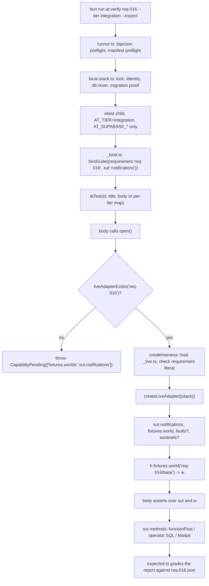
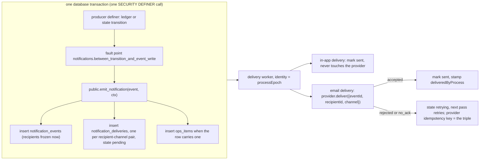

# How the notification subsystem must land: the harness, the database, the application, and the suite as a specification

Synthesized from four explorer lanes (harness, database, application, suite) and checked against the tree at the worktree for AI4DEV-89 (emitter core and static taxonomy). Every file path below is relative to that worktree root. Where an explorer and the code disagreed, the code won, and the disagreement is recorded under Gotchas.

## Overview

Nothing of REQ-016 exists in product code. There is no notification table, no emitter, no outbox, no delivery worker, no provider client, and no `_live.ts` for the suite. What exists is a complete acceptance suite under `tests/at/suites/req-016/`, an in-memory stand-in (`_fixture.ts`) that the loop tier grades, and an expect manifest (`tests/at/expected/req-016.json`) that declares eleven loop greens, one loop red on the capability `H3 static provider scan`, and twelve integration reds on the two capabilities `fixtures.worlds` and `sut.notifications`. Those twelve integration reds come from one line of harness code. `openWorld` in `tests/at/harness/registry.ts` calls `aboveLoopStandInRefusal(TIER, liveAdapterExists('req-016'), 'notifications')`, and `liveAdapterExists` is `existsSync(tests/at/suites/req-016/_live.ts)`. The file does not exist, so every id throws `CapabilityPending(['fixtures.worlds', 'sut.notifications'])` before the harness is even built.

Turning the twelve ids green at integration therefore has three parts, and all three must move in one change. First, product code: migrations for the event, delivery, and ops-item tables under the tenant posture, one emitter function that is the only writer of those tables and that runs inside the producer's transaction, and a delivery worker that marks a delivery sent only on provider acceptance. Second, the seam: a `_live.ts` that exports `requirement = 'req-016'` and `createLiveAdapter({ stack })` returning `sut.notifications`, a fixture world backed by real accounts, and the fault and sentinel seams the reliability ids arm. Third, the bodies and the manifest: the twelve test bodies are all written in the single-body form typed at the loop tier, and several of them read `h.vendors.email`, `h.clock.freezeAt`, and `h.static`, none of which exist at integration, so they need `integration:` procedures the way the auth suite's `_integration.ts` does, and the manifest must move each id from `red` to `green` in the same commit, because `--expect` fails a declared red that goes green.

## Key Concepts

**Tier.** `AT_TIER` is `loop`, `integration`, or `drill`. There is no default. At loop the harness loads `_fixture.ts` and hands the body a controlled clock and an email provider simulator. At integration it loads `_live.ts`, resets the one local Supabase stack, and hands the body a wall clock and a refusing vendor proxy. `drill` is refused by the runner.

**Adapter.** The object a suite's factory returns. Shape (`tests/at/harness/index.ts`, `FixtureAdapter`): `{ sut: Record<string, unknown>, fixtures: { world(name) }, faults?: AdapterFaultSeam, sentinels?: AdapterSentinelSeam, teardown() }`. The loop factory is `createFixtureAdapter({ clock, worlds, config, vendors })`. The live factory is `createLiveAdapter({ stack })` and receives nothing else.

**Capability pending.** `CapabilityPending` in `tests/at/harness/pending.ts`. Its first line is `CapabilityPending: CAPABILITY PENDING — <names joined by ", ">`. `expected.ts` `declaredDetail` rebuilds that exact string from the manifest and compares it whole. That is why the manifest's capability lists are ordered and exact.

**Refusing proxy.** `refusing<T>(...names)` in `index.ts` returns a Proxy whose every property read throws `CapabilityPending(names)`. `h.static` is such a proxy at every tier (`'H3 static provider scan'`). `h.vendors` is such a proxy at integration (`'vendors.email'`).

**Fault seam.** `AdapterFaultSeam` in `tests/at/harness/faults.ts`: `points()`, `arm(point, kind) -> { triggerCount(), disarm() }`, `processEpoch()`, `processRestart()`. The kind is `'crash' | 'reject' | 'lose_ack'`. The trigger count is owned by the adapter at the point and increments only when execution reaches it.

**Sentinel seam.** `AdapterSentinelSeam` in `tests/at/harness/sentinels.ts`: `scopes()` and `read(scope)`. The stand-in exposes one scope, `notifications.delivery_bodies`.

**NotificationsSut.** The system-under-test contract in `tests/at/suites/req-016/_contract.ts`: `senders`, `taxonomy`, `documentedDefaults`, `runtimeRegistrationSurface`, `emit`, `events`, `deliveries`, `opsItems`, `drainDeliveries`. Every one returns a promise. `drainDeliveries({ passes })` refuses a value that is not a whole number at least 1.

**World.** `WorldSeam & { actors: Record<Role, string>, fire, transitionCommitted, reassignRole, burstThreadComments }` in the same file. `Role` is `'ngo' | 'volunteer' | 'ex_volunteer' | 'platform_admin'`. `Channel` is `'email' | 'inapp'`.

**Taxonomy.** `TAXONOMY` in `tests/at/suites/req-016/taxonomy.ts`. Forty-eight rows, each `{ event, recipients, channels | null, tone, class, payloadKeys?, guarded?, opsItem?, escalation? }`. `GUARDED_ROWS` is the eleven rows with `guarded: true`. `channels: null` means the row binds to the documented default.

**Write route.** A row of `WRITE_ROUTES` in `supabase/functions/_shared/write-routes.ts`, served by exactly one `Deno.serve(writeRoute({ name, decide, render }))` in `supabase/functions/<name>/index.ts`, with `[functions.<name>] verify_jwt = true` in `supabase/config.toml`, calling one `SECURITY DEFINER` function as the service role in one round trip.

**Tenant catalog.** `TENANT_CATALOG` in `tests/at/suites/req-001/_policy-scan.ts`. Every `create table public.X` in the migrations must have a row, posture `tenant-isolated` or `unreachable-by-client-roles`. The static scan runs in CI; the live catalog check over `pg_class` runs only at integration.

**Write gate.** `public.assert_account_active(uuid)` in `supabase/migrations/20260908120000_account_lifecycle_audit_and_contact_transfer.sql`. `scanWriteGateSql` fails any volatile `SECURITY DEFINER` function that `service_role` may execute and that does not call it, unless the short name is in `WRITE_GATE_EXEMPT`.

## How It Works

### The harness and its two tiers

The entry point is `bun run at:verify req-016 --tier integration --expect`, which is `tests/at/harness/runner.ts`. Before any test runs it does four preflights. It checks that the P0 ids in `.taskmaster/docs/acceptance/at-req-016.md` are exactly the `atTest('AT-016.NN'` call sites in `tests/at/suites/req-016/*.test.ts` (`inspectBijection` in `check.ts`; per-tier body files such as the auth suite's `_integration.ts` do not count). It loads `tests/at/expected/req-016.json` and checks its ids are the same set. At integration it refuses if `AT_REPO_ROOT` differs from the install root, checks the `jwt_expiry` pin, takes a machine-wide lock keyed by project id and API port, and calls `prepareLocalStack` in `local-stack.ts`, which proves the stack identity, runs `supabase db reset`, and proves that the set of `<14 digits>_*.sql` files on disk equals the set of versions in `supabase_migrations.schema_migrations`. Then it spawns vitest with `bun --no-env-file` and an allowlisted environment (`ENV_ALLOWLIST` plus the five `AT_SUPABASE_*` coordinates). Secrets from `.env.local` never reach the suite.

The suite touches the harness through one file, `tests/at/suites/req-016/_bind.ts`, which calls `bindSuite({ requirement: 'req-016', sut: 'notifications', sutMissingDetail })`. The types of `sut` and `w` are not named by the suite. `tests/at/harness/suite-adapters.ts` reads them off `typeof import('../suites/req-016/_fixture.ts')`, so `SutOf<'req-016','notifications'>` is whatever `createFixtureAdapter` returns under `sut.notifications`, and `WorldOf<'req-016'>` is whatever its `fixtures.world()` resolves to. That map has two lines today, `req-001` and `req-016`. Note that the types come from the loop fixture even at integration. A `_live.ts` whose `sut.notifications` differs structurally from the loop fixture's compiles only if it still satisfies `NotificationsSut`, which is what the fixture's `sut` is annotated as.

`atTest` in `registry.ts` registers one vitest `it()` per id. A bare function is the single-body form and runs at every tier, typed at loop. An object `{ default?, loop?, integration?, drill? }` is the per-tier form; a map with a hole and no `default` throws at registration. The body's `open(fixture?, { config? })` calls `openWorld`, which does, in order: refuse if `TIER` is null, refuse if the harness module failed to load, refuse with the stand-in `CapabilityPending` if the tier is above loop and `_live.ts` is absent, call `createHarness`, throw `AtPending(id, 'sut-missing', …)` if `h.sut.notifications` is falsy, then `h.fixtures.world(fixture)`. The default fixture name is `req-016/base`. Worlds and harnesses are torn down last-opened-first after every body, and a teardown failure after a green body fails the test.

`createHarness` in `index.ts` is where the two tiers diverge. At every tier it builds a `FixtureWorldStore`, a `ConfigRegistry` from the body's overrides, and `static = refusing<StaticScan>('H3 static provider scan')`. At loop it builds a `ControlledClock` and `createEmailProviderSim()`, loads `_fixture.ts`, checks `module.requirement === 'req-016'`, calls `createFixtureAdapter({ clock, worlds, config, vendors: { email: provider.port } })`, and hands the body `vendors: { email: provider.sim }`. At integration it loads `_live.ts`, checks the same literal, calls `createLiveAdapter({ stack: stackFromEnv() })`, and finishes with `clock: new RealClock()` and `vendors: refusing('vendors.email')`. The live factory receives no clock, no world store, no config, and no vendor port. The `FixtureWorldStore` built at line 195 is torn down but never handed to the live adapter.

The type `TierHarness<'integration'>` in `contracts.ts` removes `vendors` and replaces `clock` with `RealClock` (`now()` only). That protection applies only to bodies written under an `integration:` key. A single-body function is typed at loop, compiles against `h.vendors.email` and `h.clock.advance`, and then fails at run time at integration with a `CapabilityPending(['vendors.email'])` or a `TypeError`. Every req-016 body today is the single-body form.

The email provider simulator (`vendors.ts`) has two faces over one queue. The test holds `sim` (`rejectNext(n)`, `acceptButLoseAck(n)`, `attempts()`, `accepted()`). The system under test holds `port.deliver({ recipientId, eventId, channel }) -> 'accepted' | 'rejected' | 'no_ack'`. The port never returns `ack_lost`; a lost acknowledgment is `no_ack` to the sender and `ack_lost` in the trace. The idempotency identity is `JSON.stringify([eventId, recipientId, channel])`, and a replay of an accepted identity returns `accepted`, records an attempt, adds nothing to `accepted()`, and consumes no forced outcome. At integration this object does not exist. Mail is Mailpit on port 44324, read through `live-stack.ts` (`mailIdentification`, `mailMessagesFor`, `verifyLinksFor`).

The auth suite is the model of an integration-green suite. `tests/at/suites/req-001/_live.ts` exports `requirement = 'req-001'` and `createLiveAdapter({ stack })`, calls `mailIdentification(stack)` and `sqlClient(stack)`, and returns `{ sut: { accounts }, fixtures: { world }, teardown }` with no fault or sentinel seam. Its world is a namespace for email addresses with a no-op teardown, because the runner already reset the database. Methods it cannot back are written as `() => { throw new CapabilityPending(['sut.accounts.registerWithGithub']); }`, one per name the manifest lists. Its test files register per-tier maps, `{ default: …, integration: at00112 }`, with the integration bodies in `_integration.ts` typed as `HarnessAtContext<'req-001','accounts','integration'>`. Real-time criteria pass `timeoutMs: { integration: INTEGRATION_TIMEOUT_MS }` at the call site.

### The database and its security posture

There is one local stack, `project_id = "poancmeitlmxejofwzuu"`, API on 44321, Postgres on 44322, Mailpit web UI on 44324. `[api] auto_expose_new_tables` is not set, so a new public table is not granted to any client role automatically, but Supabase's default privileges still apply, which is why every table's migration starts with `revoke all … from anon, authenticated, service_role`. Schema is exactly `supabase/migrations/*.sql`, applied in filename order, versioned by the fourteen-digit prefix. Once a migration has run anywhere but a local machine it is append-only; a fix is a new file. Every integration run resets and replays the whole set.

Thirteen migrations exist. The last six (from `20260908120000` on) establish the posture a notification schema must join. The tenant catalog today is eight tables: `organizations`, `org_memberships`, `projects`, `acknowledgments` (tenant-isolated); `accounts`, `volunteer_profiles`, `audit_events`, `org_escalation_contacts` (unreachable by client roles). The static scan `tenantCatalogProblems()` (`_policy-scan.ts` line 655) reads every migration, splits statements with awareness of dollar quotes and comments, overlays later grants, revokes, drops, alters and policies on earlier ones, and then unions `scanWriteGateSql`. The full list of codes it can raise is in that file (`policy-tautological-using`, `policy-using-no-auth`, `policy-non-viewer-function`, `alter-default-privileges`, `grant-all-tables`, `grant-to-public`, `grant-to-anon`, `force-row-level-security`, `policy-to-anon`, `policy-for-all`, `undeclared-table`, `missing-table`, `no-baseline-revoke`, `anon-privilege`, `service-role-write`, `isolated-no-rls`, `isolated-wrong-privileges`, `isolated-no-policy`, `unreachable-client-grant`, `viewer-not-definer`, `viewer-search-path`, `viewer-no-revoke`, `viewer-no-execute-grant`, `definer-no-revoke`, `definer-client-execute`, `policy-missing-function`, `definer-no-write-gate`, `audit-mutation-in-definer`). Two more scans run beside it in CI: `auditAppendOnlyProblems()` requires a `before update or delete` row trigger and a `before truncate` statement trigger on `public.audit_events` and no write grant on it; `identityPermanenceProblems()` requires the `before delete` trigger on `auth.identities`.

The live catalog check is `assertTenantCatalog` in `tests/at/suites/req-001/_integration.ts` (lines 166 to 201). It calls `sut.tenantTableFacts()`, which queries `pg_class`, `has_table_privilege` for seven privileges across the three client roles, `relrowsecurity`, `relforcerowsecurity`, `pg_policies`, and `has_function_privilege` for every `SECURITY DEFINER` function. It asserts both directions of catalog equality, `forceRowLevelSecurity === false`, `anon === []`, `service_role === ['select']` only for tables in `SERVICE_ROLE_SELECT` (`accounts`, `org_memberships`) and `[]` otherwise, and for every definer `anonExecute === false` and `authenticatedExecute` true only for names in `VIEWER_FUNCTIONS`. This runs from AT-001.21, .22, .23 and .40 at integration. It does not run in CI.

Reads reach the database as the caller. `callerReads` in `_shared/edge.ts` issues PostgREST GETs with `apikey = anon` and the request's own `Authorization`, so row-level security decides what comes back. The service role is used only for `callDatabaseFunction` (writes, not exported) and `publicProjectReads` (one RPC). Operator SQL (`sqlClient` over `dbUrl` in `live-stack.ts`) is a third authority used by tests only; it bypasses RLS because FORCE RLS is forbidden by the scan.

**The atomic write.** The codebase has no TypeScript transaction helper, no `sql.begin`, and no supabase-js client in product code. The only multi-statement atomic write is a single plpgsql `SECURITY DEFINER` function called once through `callDatabaseFunction` (`edge.ts` line 283), which is one `POST /rest/v1/rpc/<name>` and therefore one implicit transaction. The comment on that function says it: four Data API calls would be four transactions. The concrete existing example is `public.transfer_organization_contact` in `20260908120000_account_lifecycle_audit_and_contact_transfer.sql` (lines 199 to 306). Inside one function body it calls `assert_account_active`, locks two account rows and the seat `for update`, updates `org_memberships`, optionally calls `change_account_lifecycle` (which updates `accounts` and calls `append_audit_event`), then calls `append_audit_event` itself. A `raise exception` anywhere in that body rolls back every statement above it. Nothing in this tree commits a state transition in one round trip and a second row in another.

For a notification this means the outbox row must be inserted inside the same definer that performs the ledger or state transition. The intended shape is an internal function `public.emit_notification(p_event text, p_actor uuid, p_payload jsonb, …)` that inserts one `notification_events` row, one `notification_deliveries` row per resolved recipient-channel pair, and an ops item when the taxonomy row carries one, with `revoke execute … from public` and no grant to any client role or to `service_role`. Because no client can execute it, `scanWriteGateSql` never demands `assert_account_active` in it, and it is callable only from other definers, which run as the owner. A producer definer (a payment commit, a key revocation, a project completion) then calls `perform public.emit_notification(…)` after its own statements, and the two commit or roll back together. If the fault point raises between the transition statements and that call, Postgres undoes the transition, and AT-016.09's four reads (transition, event, delivery, ops item) all come back empty.

Actor attribution rides the same pattern. The membership audit trigger reads `current_setting('app.actor_account_id', true)`; producers call `set_config('app.actor_account_id', …, true)` in the same transaction. A notification emitter that wants the actor on the event row should read the same setting rather than take a second parameter.

**Roles.** `public.account_type` is `'ngo' | 'volunteer' | 'platform_admin'`, and `accounts.id` is `auth.users.id`. The per-organisation seat is one `org_memberships` row (unique index forces one seat per org). The volunteer on a project is `projects.assigned_volunteer_id`. `ex_volunteer` is not a database type; it exists only in `taxonomy.ts` and the fixture seed (`actor-ex-volunteer`). Recipient resolution for `abandonment.released` needs a source for that actor that nothing stores today.

### The application layer

`src/` is a TanStack Start shell with one placeholder route and shadcn primitives. Every deployed surface and every product decision lives under `supabase/functions/`. The split in `_shared/` is load-bearing: `edge.ts` is the only Deno-only, I/O-capable file (CORS, `resolveCaller` against `/auth/v1/user`, `callDatabaseFunction`, `callerReads`, `publicProjectReads`, `writeRoute`, `edgeHandler`); every other `_shared` module is pure (no Deno, no fetch, no clock, no randomness) and is type-checked only because `tests/at` imports it. `bun run typecheck` runs three programs (app, `tests/at`, verify-drive scripts); `edge.ts` and every function `index.ts` are in none of them. `tests/at/tsconfig.json` includes `**/*` under `tests/at`, so `_live.ts` and everything it imports will be type-checked, which means product modules a live adapter imports must stay in the Node and Deno intersection with relative `.ts` imports. There is no import map and no `deno.json`.

Nine functions exist. Six are write routes constructed as `Deno.serve(writeRoute({ name, decide, render }))`: `complete-signup`, `create-organization`, `update-organization`, `transfer-organization-contact`, `set-escalation-contact`, `set-account-lifecycle`. Three are reads: `organization-dashboard` and `project-workspace` (caller-bound REST through `callerReads`), and `public-project` (service-role RPC, `verify_jwt = false`). `WRITE_ROUTES` also names `discovery-message` as a `stand-in` row with no folder. `writeRoute` resolves the caller, reads the body, shape-checks UUID fields, loads standing through the `write_standing` RPC, runs `writeGateDecision` then `spec.decide`, and calls the route's RPC once as the service role. It always requires a JWT caller; a delivery worker with no user has no surface in this pattern.

Email today is GoTrue's auth mail into Mailpit. `[local_smtp] port = 44324` is the web port; `smtp_port = 44325` is commented out in `config.toml` with the note that it is for user applications that send email. An application SMTP client has nowhere to connect on the current stack. There is no provider SDK, no `RESEND_API_KEY`, and no mail field in `src/lib/config.server.ts`. The auth rate limit `email_sent = 2` per hour is a known hazard of live drives; a database reset does not clear it, a stack restart does.

Background work does not exist. No cron, no `pg_net`, no `CREATE TRIGGER` in the product other than the audit and identity guards, no scheduled function. The only drain loop in the tree is `drainDeliveries` in the req-016 stand-in.

The write-route conformance scan (`tests/at/suites/req-001/_write-route-scan.ts`) refuses, in CI: a `supabase/functions/<dir>/index.ts` that matches `writeRoute|callDatabaseFunction|/rest/v1/|createClient|.rpc(|SUPABASE_SERVICE_ROLE_KEY|SUPABASE_SECRET_KEY` and is not an edge row (`write-route-unregistered`); an edge row with no `index.ts` (`write-route-missing-entry`); an index not built as exactly one `Deno.serve(writeRoute(` (`write-route-not-constructed`); an index that names `callDatabaseFunction` or a raw reach (`write-route-bypasses-boundary`); a missing `[functions.<name>]` block or one without `verify_jwt = true`; any `_shared/*.ts` other than `edge.ts` matching the bypass regex (`shared-module-reaches-database`); any non-index helper under a function folder matching it (`write-route-helper-reaches-database`); a database reach in `edge.ts` outside `callDatabaseFunction`, `publicProjectReads`, `callerReads` (`edge-reaches-database-outside-constructors`); a stand-in never gated in the auth fixture (`stand-in-not-gated`); and every `scanWriteGateSql` problem.

### The suite as a specification

The suite grades a closed system. `taxonomy.ts` is the oracle, and it has forty-eight rows, not forty-six. The number 46 appears nowhere in the acceptance file, the requirement isolate, the decomposition, or the suite. Eleven rows are `guarded`; three carry `opsItem`; one is `escalation` (`lovable.credits_blocked`). Twenty-three rows name channels; twenty-five have `channels: null` and bind to the documented default. `CLASS_CHANNEL_RULE` says a `lowtone` row must equal `['inapp']` and a `money`, `deadline`, `blocker`, `completion` or `decision` row must include `email`; `access` and `other` have no rule. The stand-in documents email-only for null-channel critical rows and in-app-only for null-channel `access` and `other` rows. That is one valid choice, not the only one; the suite accepts any documented default that satisfies the class rule and matches the named channels where the row names them, as long as the deliveries agree with the default.

The stand-in's emit order is the specification of the fault seam: set the transition, reach `notifications.between_transition_and_event_write`, then allocate the event id, push the event, push one delivery per recipient-channel pair, push the ops item. Recipients are copied from `world.actors` at that moment. A crash at the point restores the transition to its previous value and throws. The worker (`runDeliveryPass`) skips sent rows, marks in-app rows sent without touching the provider, calls `vendors.email.deliver` for email rows, marks sent only on `'accepted'`, otherwise sets `retrying`, increments `attempts` on every event the pass touched, and derives the event state. `markSent` stamps `deliveredByProcess` with the current `processEpoch` only if it is still null. `drainDeliveries()` runs to quiescence; `{ passes: n }` bounds it.

What each id requires, read from the test bodies rather than the prose:

- **AT-016.01** (`a-emitter-and-taxonomy.test.ts`). First line: `(await h.static.providerClientImporters()).sort()` equals `['notifications.emitter']`. Then `sut.senders()` must list `notifications.emitter` with `canSendDirectly: true` and `blockers.service`, `scope.service`, `lifecycle.service` with `false`. Then for each of three domains it plants a sentinel through `h.sentinels.plant` (never scans), fires `blocker.raised`, `thread.comment`, `pm_item.status_changed` with `{ sentinel }`, drains, and asserts a delivery body contains the value and every carrying delivery has `emittedBy === 'notifications.emitter'`. Last, `h.vendors.email.attempts()` has no `eventId` outside `sut.events()`. Red today at loop on `h.static`; at integration it would additionally hit `h.vendors`.
- **AT-016.02**. `sut.taxonomy()` names equal `TAXONOMY` exactly, no duplicates, none matching `FORBIDDEN_EVENT_PATTERNS`; `sut.emit({ type: 'at-016.02.sentinel.unregistered' })` returns `accepted: false` with no `eventId`, and counts of deliveries and events are unchanged after a drain; `runtimeRegistrationSurface()` is `[]`. Uses `sut` only. Can stay single-body.
- **AT-016.03, .04, .05, .06, .12** (`d-taxonomy-evidence.test.ts`) share one capture. The producer opens one world, fires every row, drains, and snapshots per row `before`, `events`, `deliveries`, `opsItems`, `providerAttempts`, `providerAccepted`. The last two are read from `h.vendors.email`. `freezeEvidence` accepts only primitives, arrays and plain objects. `describe.sequential` and `evidenceBuilds === 1` pin that the producer runs once. .03 checks exact recipient-channel pairs against effective channels, payload predicates on value and body, exactly one linked ops item for the three ops rows, `fuel.depleted` roles exactly `{ngo, platform_admin, volunteer}`, and no penalty lexicon in auto-revert bodies. .04 checks candidacy and match-declined never reach the NGO, vetting never reaches the volunteer, no registered name matches `/donat/i`, and the leftover body has no `/donat/i`. .05 checks each `CRITICAL_CLASS_FIXTURES` row has an email delivery, `pm_item.status_changed` is exactly `['inapp']`, no provider attempt on a non-email channel for any row, and the provider-accepted pairs equal the email pairs the row owes. .06 checks a documented default with non-empty `source` and channels for every row, no orphan, class rule satisfied, named channels equal documented channels. .12 checks `lovable.credits_blocked` roles are exactly `['ngo','platform_admin']` with the world's actor ids.
- **AT-016.07** (`b-delivery-defaults.test.ts`). Fire `payment.succeeded`, assert the event exists and no delivery is sent yet, read `h.faults.processEpoch()`, call `h.faults.processRestart()`, assert the epoch changed, drain, assert every delivery's `deliveredByProcess` equals the post-restart epoch, one logical event, one delivery per pair, pairs equal the event's resolved pairs. The comment on line 78 says the duplicate assertion cannot fail against the stand-in and is a regression guard for a real outbox.
- **AT-016.08**. Two worlds, the second opened with `{ config: { cap: 4, window_ms: 120000, coalesce: true } }`. Reads the three keys back from `h.config`. Freezes `h.clock`, bursts `cap + 5` comments, advances half a window, drains, expects `coalesce ? 1 : cap` on the `volunteer:inapp` pair, advances a full window, bursts one, expects one more. The two variants must disagree.
- **AT-016.09** (`c-reliability-guard.test.ts`). For each of the eleven guarded rows: a control world where `fire` then drain yields `transitionCommitted === true` and an event; then a fresh world, `h.faults.at(FAULT_POINT, 'crash')`, `fire` (may throw), `fault.clear()` (which fails if `triggerCount < 1`), drain, and then transition, event, delivery, and ops item (matched by `kind === row.event`) must all be false or empty. That is stricter than the prose's "rolls back both or commits both".
- **AT-016.10**. Fire `pm_item.completed`, `reassignRole('ngo', 'at-016.10-successor')`, drain, all deliveries go to the original id and none to the successor.
- **AT-016.11**. `h.vendors.email.rejectNext(1)`, fire `access.key_issued`, one pass, provider trace `['rejected']` on the volunteer's email only, event pending or retrying, email deliveries exist and none sent; full drain, at least two attempts ending in `accepted`, event sent, `attempts >= 2`. Then `acceptButLoseAck(1)`, fire `access.key_revoked`, one pass, trace `['ack_lost']`, email not sent, event not sent; full drain, trace `['ack_lost','accepted']`, one logical event, exactly volunteer email and in-app both sent, `accepted()` is exactly volunteer email once.

The written acceptance document (`.taskmaster/docs/acceptance/at-req-016.md`) and the decomposition (`loop/decomp/req-016.md`) say the done contract is all twelve green at integration plus a wired re-run of the in-app surface. The brief for this item says the wiring leaf is out of this run.

### The fault seam at integration

The harness demands three things. `faultPointProblem(point, seam.points())` returns null only if the adapter lists the point, so the live adapter's `faults.points()` must return `['notifications.between_transition_and_event_write']`. `faultAlreadyArmedProblem` refuses a second arming of a live point. `faultFiredProblem(point, count)` on `clear()` throws unless `triggerCount() >= 1`, and the count must reflect execution reaching the point, never the arming.

The stand-in reaches the point in-process. A live product reaches it inside a plpgsql function, and there the count has a trap: anything the function writes before `raise exception` is rolled back with the transaction, so a counter row incremented and then raised on reads zero afterwards. Two mechanisms survive a rollback. A sequence does: `perform nextval('public.notification_fault_triggers')` before the raise is not undone, and the adapter reads `last_value` before and after. The RPC's own refusal does too: the point raises with a distinctive SQLSTATE and `detail = 'induced-fault:notifications.between_transition_and_event_write'`, and the adapter's `arm()` handle counts every such refusal it receives from the call it made. Either way the adapter owns the count and the product owns the raise. Arming itself needs a durable signal the definer can read. A session GUC set through one RPC is not reliably visible to the next call through PostgREST's pool, so the honest shape is one control row written by the adapter with operator SQL and read by the definer (`if exists (select 1 from public.notification_fault_armings where point = …) then …`). That control table is a `create table public.X` and must be in `TENANT_CATALOG` as `unreachable-by-client-roles`, with the baseline revoke and RLS on, or the static scan fails CI.

The fault kinds `'reject'` and `'lose_ack'` in `Faults.at` are the harness's provision for AT-016.11 at integration, where `h.vendors` is gone. A live procedure for that id can arm a provider-side point (for example `notifications.provider_send`) with those kinds and read the out-of-band trace from Mailpit and from the product's own attempt log. Whether that is accepted as the integration procedure is a founder decision, because the kind must then be honoured by product code on the send path.

`processRestart` at integration must change `processEpoch`. If the worker is an object the live adapter constructs (a pure worker module handed SQL-backed ports), a restart is a new instance with a new identity, and pending rows are re-read from the table. That is the only shape in which AT-016.07's duplicate assertion can fail, and the unique constraint on `(event_id, recipient_id, channel)` in the deliveries table is what makes it pass.

## What Must Be Built

Ordered so each step is verifiable before the next. Ids in brackets are the acceptance ids the item serves.

1. **Migration `supabase/migrations/<stamp>_notification_taxonomy_and_outbox.sql`.** Enum or check-constrained `event` column limited to the forty-eight wire names (the static table, immutable in v1). Tables `public.notification_events` (id, event, actor, payload jsonb, recipients jsonb frozen at creation, state, attempts, created_at), `public.notification_deliveries` (event_id, recipient_id, role, channel, state, emitted_by, delivered_by_process, body, payload, unique on (event_id, recipient_id, channel)), and `public.ops_items` (id, kind, linked_event_id, detail). Each table: `revoke all … from anon, authenticated, service_role`, `enable row level security`. Deliveries as `tenant-isolated` with `grant select … to authenticated` and one policy `for select to authenticated using (recipient_id = (select auth.uid()))` if the in-app read is to reach the recipient later; events and ops items as `unreachable-by-client-roles`. End with `notify pgrst, 'reload schema'`. [all twelve, .02 for the closed set, .10 for frozen recipients, .07 for the unique pair]
2. **`TENANT_CATALOG` rows** in `tests/at/suites/req-001/_policy-scan.ts` for every new table, same change. [CI gate for all twelve; AT-001.21/22/23/40]
3. **Emitter function `public.emit_notification(...)`** in the same migration: `security definer`, `set search_path = ''`, `revoke execute from public`, no grant. Rejects an event name outside the table with a raise. Resolves recipients from the row's roles to account ids at call time and writes them onto the event. Inserts deliveries per pair from the documented default. Inserts the ops item for the three ops rows. Renders bodies that carry the named payload strings. [.01 (`emittedBy`), .02, .03, .04, .06, .10, .12]
4. **Documented defaults** as data the product serves, not a comment: a table or a pure module row set with `{ event, channels, source }` for every row, `source` non-empty. The `_shared/notifications.ts` pure module is the natural home and can be imported by both `_fixture.ts` and `_live.ts`. [.03, .05, .06]
5. **Pure module `supabase/functions/_shared/notifications.ts`.** The taxonomy as a `const` array, `documentedDefaults()`, `senders()` returning the four component probes, `runtimeRegistrationSurface()` returning `[]`, body rendering and payload shaping, and the worker's decision logic over an outbox port and a provider port. No Deno, no fetch, relative imports only, so `tests/at` can type-check it. [.01, .02, .06, .07, .11]
6. **Worker I/O ports.** An SQL-backed outbox port (read pending deliveries, mark sent with the process identity, mark retrying, bump attempts) and a provider port implementing `deliver -> 'accepted' | 'rejected' | 'no_ack'`. At integration the live adapter constructs both; the outbox port uses operator SQL or a definer with a `WRITE_GATE_EXEMPT` entry if it is ever granted to `service_role`. [.05, .07, .11]
7. **Email provider client for the local stack.** SMTP to Mailpit requires `smtp_port = 44325` uncommented in `supabase/config.toml` and a stack restart. The client maps SMTP accept to `accepted`, a stated refusal to `rejected`, timeout to `no_ack`. Mailpit becomes the out-of-band witness the capture reads instead of `h.vendors.email.attempts()`. [.01 orphan check, .03, .05, .11]
8. **Fault control**: the control table and the raise inside `emit_notification`'s callers (or inside the emitter's entry, before its first insert, when the producer is a fixture). The sequence or refusal-count mechanism described above. [.09; `processEpoch` for .07]
9. **Fixture producers or real producers**, per the founder's decision the brief asks for. Eleven guarded rows need a transition that commits in the same definer as the emit. No money, access or completion definer exists. A fixture producer definer (`public.fire_guarded_transition_fixture(event, actor)`) with the transition in a small state table is the stand-in path; leaving those rows red with a declared shape is the other. [.09, and the control run of .09]
10. **`tests/at/suites/req-016/_live.ts`.** `export const requirement = 'req-016' as const;` and `createLiveAdapter({ stack })`. Calls `mailIdentification(stack)` and `sqlClient(stack)`. Returns `sut: { notifications }` implementing `NotificationsSut` over SQL and the worker; `fixtures.world(name)` that provisions four actors as real accounts (signup, Mailpit confirm, `complete-signup` through `functionPost`, or operator inserts for the platform admin as req-001 does), an `ex_volunteer` id, and the world methods; `faults` with the one point, `processEpoch`, `processRestart`; `sentinels` with scope `notifications.delivery_bodies` reading delivery bodies; `teardown` closing SQL. Its existence alone flips `liveAdapterExists`. [all twelve]
11. **Per-tier bodies.** Add `integration:` procedures for every id that reads `h.vendors`, `h.clock` or `h.static`: AT-016.01, .03, .04, .05, .06, .12 (the capture), .08, .11. A second capture for the integration tier that reads Mailpit. AT-016.08's integration procedure supplies a short window through `open(undefined, { config })`, passes the three values to the world explicitly (the live factory never sees `h.config`), and waits real time with `timeoutMs: { integration: … }`. AT-016.02, .07, .09, .10 can stay single-body if the live seams back them. [as listed]
12. **`h.static.providerClientImporters()`** for AT-016.01. `createHarness` hard-codes the refusing proxy at every tier; no adapter can supply it. Either implement a `StaticScan` in `tests/at/harness/` that walks `supabase/functions/**` for provider SDK imports and credential reads and maps files to component ids, and wire it in `index.ts`, or leave AT-016.01 declared red at both tiers. The integration declaration for .01 must then change to `["H3 static provider scan"]` once `_live.ts` exists, because the stand-in refusal no longer fires first. [.01]
13. **`tests/at/expected/req-016.json`.** Move each integration id from `red` to `green` in the same commit that makes it pass. Adjust .01's declaration as above. [all twelve]
14. **Configuration.** `[functions.<name>] verify_jwt = true` for any new function directory; `smtp_port = 44325`; no product setting exists for the anti-spam guard, so the guard's values come from the world call at integration and from `h.config` at loop. [.08, .11]

Not required for the twelve ids but named by the decomposition: the in-app read function (`callerReads` style, `verify_jwt = true`, not a `WRITE_ROUTES` row) and the UI route. The brief excludes the wiring leaf from this run.

## Where Things Live

| Path | What it is |
|---|---|
| `tests/at/harness/registry.ts` | `atTest`, `bindSuite`, `openWorld`, `aboveLoopStandInRefusal` (line 773), evidence capture |
| `tests/at/harness/index.ts` | `createHarness`, `liveAdapterExists`, `refusing`, adapter loaders |
| `tests/at/harness/suite-adapters.ts` | the two-line suite map; `SutOf`, `WorldOf` |
| `tests/at/harness/contracts.ts` | `Faults`, `Sentinels`, `StaticScan`, `EmailProviderSim`, `AtHarness`, `TierHarness` |
| `tests/at/harness/faults.ts`, `guards.ts`, `sentinels.ts`, `vendors.ts` | fault handle, the five predicates, sentinel plant and scan, provider simulator |
| `tests/at/harness/runner.ts`, `local-stack.ts`, `live-stack.ts`, `expected.ts`, `check.ts` | verify command, stack reset and proof, HTTP/SQL/Mailpit client, manifest grading, bijection |
| `tests/at/suites/req-016/` | `_bind.ts`, `_contract.ts`, `_fixture.ts`, `_oracles.ts`, `taxonomy.ts`, four test files; `_live.ts` to be created |
| `tests/at/expected/req-016.json` | the tier declarations |
| `.taskmaster/docs/acceptance/at-req-016.md` | the twelve P0 criteria and coverage map |
| `loop/decomp/req-016.md` | deliverables D1 to D3 and the done contract |
| `supabase/migrations/*.sql` | schema; `20260908120000_…` holds the audit table, `assert_account_active`, and the definer examples |
| `supabase/functions/_shared/` | pure modules plus `edge.ts`; `write-routes.ts` holds `WRITE_ROUTES` |
| `supabase/functions/<name>/index.ts` | one `Deno.serve` per surface |
| `supabase/config.toml` | ports, `[local_smtp]`, `[functions.*]` |
| `tests/at/suites/req-001/_policy-scan.ts`, `_write-route-scan.ts`, `_integration.ts`, `_live.ts` | catalog scan, route scan, live catalog check, the green live adapter to copy |
| `.github/workflows/ci.yml` | typecheck, at:selftest, at:check per suite, at:verify loop per manifest, ownership and reference guards |
| `.claude/skills/verify-ai4good/` | live drive against 44321 and Mailpit |

## Gotchas

1. **The row count.** The task text says forty-six rows. `taxonomy.ts` has forty-eight, and the acceptance file says "every row" without a number. Explorer 4 counted forty-eight; the other explorers did not count. The three `discovery.*` rows and the five d81 rows (three PRD gate, two reconciliation) are all present. Build to forty-eight.
2. **`_live.ts` presence is the whole integration gate.** The moment the file exists, all twelve ids stop reporting the declared red and start running. If any body then fails in a shape the manifest does not declare, `--expect` exits 1. Create the file and update the manifest in one commit.
3. **`h.static` cannot be supplied by an adapter.** Explorer 1 and explorer 4 both flagged this; the code confirms it. `createHarness` line 197 builds the proxy unconditionally. AT-016.01 needs a harness change, not only product code, and it is the one id blocked on something outside the suite and the product.
4. **After `_live.ts` exists, AT-016.01's integration red changes shape.** The stand-in refusal no longer fires, the body reaches `h.static`, and the first line becomes `CapabilityPending: CAPABILITY PENDING — H3 static provider scan`. The manifest's integration entry for .01 must say that, or the run deviates.
5. **Single-body form hides tier mistakes.** `chooseTierBody` returns the bare function for every tier and types it at loop. `h.vendors.email` compiles and throws `CapabilityPending(['vendors.email'])` at integration; `h.clock.freezeAt` compiles and is `undefined` on `RealClock`. Eight of the twelve bodies read one of those. Explorer 1 stated this; the others assumed product code alone would turn ids green.
6. **The live factory gets only `stack`.** No config registry, no clock, no world store, no vendor port. AT-016.08's overrides reach `h.config` but never the adapter. The integration procedure must pass them through a world method. Explorer 1 item 10 noted the store is built and ignored; the same holds for config.
7. **Rollback erases in-transaction counters.** A trigger counter incremented inside the definer that then raises is rolled back with it. Use a sequence or count the refusals at the adapter. No explorer stated this; it follows from how the atomic write works.
8. **Every `create table public.X` needs a catalog row**, including a test-control table for fault arming. `undeclared-table` fails `at:selftest` and four auth ids at loop.
9. **`service_role` may hold no table writes.** `service-role-write` in the static scan and `serviceRole === []` in the live check. The worker cannot update deliveries through PostgREST as the service role; it goes through a definer or operator SQL. A definer granted to `service_role` must call `assert_account_active` or be listed in `WRITE_GATE_EXEMPT` with a reason.
10. **A worker is not a write route.** `writeRoute` requires a JWT caller and a `WRITE_ROUTES` row; a function directory that reaches the database without being an edge row fails `write-route-unregistered`. The pure-module-plus-ports shape avoids a new function directory entirely at integration.
11. **Mailpit receives SMTP only when `smtp_port` is enabled.** The web port 44324 is on; 44325 is commented out. A change to `config.toml` needs a stack restart; `db:reset` does not reload it, and `prepareLocalStack` refuses to reset if the config drifted after the lock.
12. **`ex_volunteer` has no storage.** Recipient resolution for `abandonment.released` needs a source. The world can hand an id; the emitter needs a rule.
13. **The decomposition and the suite differ on channels.** D2.L1 and the brief's unit 3 say critical events go by email and in-app. The suite requires email for the five critical fixtures and provider-accepted pairs equal to the documented email pairs; it accepts email-only or email plus in-app as the documented default for null-channel critical rows. Explorer 4 called this a contradiction; it is a looser suite than the prose, not a conflict.
14. **AT-016.09 is stricter than its prose.** The prose allows "commits both"; the body requires all four of transition, event, delivery, ops item absent after the crash, and a control run that commits.
15. **The reconciliation money rows are not guarded.** `reconciliation.large_drift` and `reconciliation.undecidable_drift` are class `money` but lack `guarded: true`. AT-016.09 does not cover them.
16. **`at:check` counts only `*.test.ts`.** An `_integration.ts` for req-016 does not register ids; the `atTest` call sites stay in the four test files.
17. **The audit function's actor label is misleading.** `append_audit_event` labels every non-null actor `platform_admin:<id>`; explorer 2 said `account_type || ':' || id`. The migration at `20260912120000` restates the function; check it before reusing the label for notification actors.
18. **CI never runs integration.** A migration can pass the static scan and still fail the live catalog on the first integration run. The brief asks for the auth suite at both tiers for this reason.
19. **A pull request cannot touch `src/` and `supabase/` together.** The in-app route is Lovable territory; the schema and functions are Claude territory.

## Open Questions

1. Whether the eleven guarded producers run against fixture producer definers or stay red with a declared shape. The brief names this as a founder decision before the design arena. Nothing in the tree records it.
2. Whether the static provider scan is in scope for this item. It requires a change in `tests/at/harness/index.ts` and a component-id mapping the `StaticScan` contract does not specify.
3. Whether a fault point may live in product SQL at all, and if so whether the arming control is a table, a sequence, or the refusal count. No precedent exists.
4. How AT-016.11 is proved without `h.vendors`. The `'reject'` and `'lose_ack'` fault kinds are the only harness provision; honouring them means the product's send path reads the arming.
5. Whether the email provider at integration is an SMTP client to Mailpit or an HTTP client to a stand-in. Only SMTP reaches the catcher.
6. Where the worker runs in production. Every option (edge function, cron, host process) is new and touches a scan or the inventory.
7. Whether the live world provisions actors through the public order (slow, rate-limited to two mails an hour) or through operator SQL (fast, not the product path).
8. None of the four explorers ran `at:verify` or the stack in this session. The integration reds are inferred from code, the selftests and the manifest.
